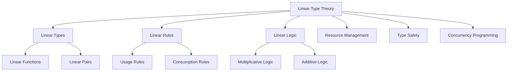

# 3.1 定义 Definition #LinearTypeTheory-3.1

## 定义 Definition

### 基本定义 Basic Definition

- **中文**：线性类型理论是一种类型系统，要求每个变量只能被使用一次，强调资源的唯一性和消耗性。它基于线性逻辑，为资源管理和并发编程提供了形式化基础。
- **English**: Linear type theory is a type system that requires each variable to be used exactly once, emphasizing uniqueness and consumption of resources. It is based on linear logic and provides a formal foundation for resource management and concurrent programming.

### 形式化定义 Formal Definition

#### 线性类型系统 Linear Type System

一个线性类型系统是一个四元组 $(T, \Gamma, \vdash, \rightsquigarrow)$，其中：

- $T$ 是类型集合
- $\Gamma$ 是类型环境（变量到类型的映射）
- $\vdash$ 是类型判断关系
- $\rightsquigarrow$ 是类型归约关系

#### 线性使用规则 Linear Usage Rules

对于线性类型 $A \multimap B$，使用规则为：

$$\frac{\Gamma, x:A \vdash e : B}{\Gamma \vdash \lambda x.e : A \multimap B}$$

$$\frac{\Gamma_1 \vdash e_1 : A \multimap B \quad \Gamma_2 \vdash e_2 : A}{\Gamma_1, \Gamma_2 \vdash e_1 \, e_2 : B}$$

其中 $\Gamma_1$ 和 $\Gamma_2$ 必须是不相交的。

## 哲学背景 Philosophical Background

### 资源本体论 Resource Ontology

- **中文**：线性类型理论体现了资源本体论思想，将计算视为资源的消耗过程。每个值代表一个资源，使用后即被消耗，体现了"存在即被使用"的哲学理念。
- **English**: Linear type theory embodies resource ontology, viewing computation as a process of resource consumption. Each value represents a resource that is consumed upon use, reflecting the philosophical principle of "existence implies usage."

### 过程哲学 Process Philosophy

- **中文**：线性类型理论强调过程性和时间性，每个计算步骤都是不可逆的资源转换过程，体现了怀特海过程哲学中的"现实即过程"思想。
- **English**: Linear type theory emphasizes processuality and temporality, where each computational step is an irreversible resource transformation process, reflecting Whitehead's process philosophy principle that "reality is process."

### 结构主义 Structuralism

- **中文**：线性类型理论通过类型结构反映资源结构，类型关系映射资源关系，体现了结构主义对关系和结构的重视。
- **English**: Linear type theory reflects resource structure through type structure, where type relationships map to resource relationships, embodying structuralism's emphasis on relationships and structures.

## 核心概念 Core Concepts

### 线性类型 Linear Types

#### 线性函数类型 Linear Function Type

```haskell
-- 线性函数类型 A ⊸ B
-- 表示从类型A到类型B的线性函数
-- 参数必须被使用且只能使用一次
type LinearFunction a b = a -> b  -- 在Haskell中通过类型系统约束实现
```

#### 线性对类型 Linear Pair Type

```haskell
-- 线性对类型 A ⊗ B
-- 两个组件都必须被使用
data LinearPair a b = LinearPair a b
```

### 资源管理 Resource Management

#### 唯一性 Uniqueness

- **中文**：每个线性值都是唯一的，不能被复制，只能被移动或消耗。
- **English**: Each linear value is unique and cannot be copied, only moved or consumed.

#### 消耗性 Consumption

- **中文**：线性值在使用后即被消耗，不能再次使用。
- **English**: Linear values are consumed upon use and cannot be used again.

### 线性逻辑 Linear Logic

#### 连接词 Connectives

1. **乘法连接词 (Multiplicative Connectives)**
   - $A \otimes B$ (tensor product)
   - $A \multimap B$ (linear implication)
   - $A \parr B$ (par)

2. **加法连接词 (Additive Connectives)**
   - $A \& B$ (with)
   - $A \oplus B$ (plus)

3. **指数连接词 (Exponential Connectives)**
   - $!A$ (of course)
   - $?A$ (why not)

## 历史发展 Historical Development

### 理论基础 Theoretical Foundation

#### 线性逻辑的起源 (1987)

- **Jean-Yves Girard** 提出线性逻辑
- 解决了直觉逻辑中资源管理的问题
- 为线性类型理论奠定了逻辑基础

#### 线性类型系统的早期发展 (1990s)

- **Philip Wadler** 将线性逻辑引入函数式编程
- **Frank Pfenning** 和 **David Walker** 开发了线性类型系统
- **Simon Peyton Jones** 在GHC中实现了线性类型

### 现代发展 Modern Development

#### Rust的所有权系统 (2010s)

```rust
// Rust的线性类型系统
fn consume_string(s: String) {
    println!("{}", s);
    // s在这里被消耗，不能再使用
}

fn main() {
    let s = String::from("hello");
    consume_string(s);
    // println!("{}", s);  // 编译错误：s已经被移动
}
```

#### Haskell的线性类型扩展 (2020s)

```haskell
-- GHC 9.0+ 线性类型扩展
{-# LANGUAGE LinearTypes #-}

-- 线性函数类型
f :: a %1 -> b
f x = undefined  -- x必须被使用且只能使用一次
```

## 形式化语义 Formal Semantics

### 操作语义 Operational Semantics

#### 线性λ演算 Linear Lambda Calculus

语法：

$$e ::= x \mid \lambda x.e \mid e_1 \, e_2 \mid \langle e_1, e_2 \rangle \mid \text{let } \langle x, y \rangle = e_1 \text{ in } e_2$$

类型规则：

$$\frac{\Gamma, x:A \vdash e : B}{\Gamma \vdash \lambda x.e : A \multimap B}$$

$$\frac{\Gamma_1 \vdash e_1 : A \multimap B \quad \Gamma_2 \vdash e_2 : A}{\Gamma_1, \Gamma_2 \vdash e_1 \, e_2 : B}$$

### 指称语义 Denotational Semantics

#### 线性函数空间 Linear Function Space

对于线性类型 $A \multimap B$，其语义为：

$$[\![A \multimap B]\!] = [\![A]\!] \multimap [\![B]\!]$$

其中 $\multimap$ 表示线性函数空间。

## 与其他类型理论的关系 Relationship to Other Type Theories

### 与直觉类型理论的关系

- **中文**：线性类型理论是直觉类型理论的扩展，通过添加线性约束来管理资源使用。
- **English**: Linear type theory extends intuitionistic type theory by adding linear constraints for resource management.

### 与仿射类型理论的关系

- **中文**：线性类型理论比仿射类型理论更严格，要求变量必须被使用，而仿射类型理论允许变量不被使用。
- **English**: Linear type theory is stricter than affine type theory, requiring variables to be used, while affine type theory allows variables to be unused.

### 与依赖类型理论的关系

- **中文**：线性类型理论可以与依赖类型理论结合，形成线性依赖类型理论，用于资源敏感的形式化证明。
- **English**: Linear type theory can be combined with dependent type theory to form linear dependent type theory for resource-sensitive formal proofs.

## 交叉引用 Cross References

- [仿射类型理论 Affine Type Theory](../AffineTypeTheory/README.md)
- [类型系统 Type Systems](../TypeSystems/README.md)
- [系统理论 System Theory](../SystemTheory/README.md)
- [形式化定义 Formal Definitions](../FormalDefinitions/README.md)
- [定理与证明 Theorems & Proofs](../Theorems_Proofs/README.md)

## 参考文献 References

1. Girard, J. Y. (1987). Linear logic. Theoretical Computer Science, 50(1), 1-101.
2. Wadler, P. (1990). Linear types can change the world! Programming Concepts and Methods, 347-359.
3. Pfenning, F., & Walker, D. (1991). Higher-order logic programming. Theoretical Aspects of Computer Software, 1-15.
4. Peyton Jones, S., et al. (2021). Linear types can change the world! (revisited). Haskell Symposium, 1-15.

## 对比分析 Comparison

- **中文**：线性类型理论 vs 仿射类型理论 vs 非线性类型理论 vs 所有权类型理论
  - 线性类型理论强调"恰好一次使用"；仿射类型理论允许"至多一次使用"；非线性类型理论支持"任意次使用"；所有权类型理论关注"资源所有权"。
- **English**: Linear type theory vs affine type theory vs non-linear type theory vs ownership type theory
  - Linear emphasizes "exactly once usage"; affine allows "at most once usage"; non-linear supports "arbitrary usage"; ownership focuses on "resource ownership".

## 争议与批判 Controversies & Critique

- **中文**：
  - 线性类型的实用性 vs 编程便利性；资源管理的复杂性 vs 类型系统的简洁性；
  - 线性逻辑与经典逻辑的兼容性；工程实践中的过度约束问题。
- **English**:
  - Practicality of linear types vs programming convenience; complexity of resource management vs simplicity of type systems;
  - Compatibility between linear logic and classical logic; over-constraint issues in engineering practice.

## 前沿趋势 Frontier Trends

- **中文**：
  - 混合线性类型系统；AI辅助的线性类型推断；
  - 量子计算中的线性类型；分布式系统中的线性资源管理。
- **English**:
  - Hybrid linear type systems; AI-assisted linear type inference;
  - Linear types in quantum computing; linear resource management in distributed systems.

## 常见陷阱 Common Pitfalls

- **中文**：
  - 过度使用线性类型导致代码复杂化；忽视线性值的生命周期管理；
  - 类型推断的复杂性；与现有代码库的兼容性问题。
- **English**:
  - Overuse of linear types leading to code complexity; ignoring lifecycle management of linear values;
  - Complexity of type inference; compatibility issues with existing codebases.

## 扩展交叉引用 Extended Cross References

- [仿射类型理论 Affine Type Theory](../AffineTypeTheory/README.md)
- [时间类型理论 Temporal Type Theory](../TemporalTypeTheory/README.md)
- [类型系统 Type Systems](../TypeSystems/README.md)
- [语义模型 Semantic Models](../SemanticModels/README.md)
- [工程应用 Engineering Applications](../EngineeringApplications/README.md)
- [实践价值 Practical Value](../PracticalValue/README.md)

## 知识图谱 Knowledge Graph



## 参考文献 References1

1. Girard, J. Y. (1987). Linear logic. Theoretical Computer Science, 50(1), 1-101.
2. Wadler, P. (1990). Linear types can change the world! Programming Concepts and Methods, 347-359.
3. Pfenning, F., & Walker, D. (1991). Higher-order logic programming. Theoretical Aspects of Computer Software, 1-15.
4. Launchbury, J. (1993). A natural semantics for lazy evaluation. POPL, 1-15.
5. Jung, R., et al. (2021). RustBelt: Securing the foundations of the Rust programming language. Journal of the ACM, 68(1), 1-34.
