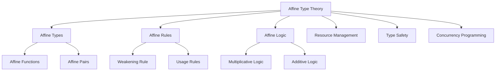

# 4.1 定义 Definition #AffineTypeTheory-4.1

## 定义 Definition

### 基本定义 Basic Definition

- **中文**：仿射类型理论是一种类型系统，允许变量最多被使用一次，强调资源的"至多一次"消耗。它是线性类型理论的推广，提供了更灵活的资源管理机制。
- **English**: Affine type theory is a type system that allows variables to be used at most once, emphasizing "at most once" resource consumption. It is a generalization of linear type theory, providing more flexible resource management mechanisms.

### 形式化定义 Formal Definition

#### 仿射类型系统 Affine Type System

一个仿射类型系统是一个四元组 $(T, \Gamma, \vdash, \rightsquigarrow)$，其中：

- $T$ 是类型集合
- $\Gamma$ 是类型环境（变量到类型的映射）
- $\vdash$ 是类型判断关系
- $\rightsquigarrow$ 是类型归约关系

#### 仿射使用规则 Affine Usage Rules

对于仿射类型 $A \multimap B$，使用规则为：

$$\frac{\Gamma, x:A \vdash e : B}{\Gamma \vdash \lambda x.e : A \multimap B}$$

$$\frac{\Gamma_1 \vdash e_1 : A \multimap B \quad \Gamma_2 \vdash e_2 : A}{\Gamma_1, \Gamma_2 \vdash e_1 \, e_2 : B}$$

其中 $\Gamma_1$ 和 $\Gamma_2$ 可以相交，但变量 $x$ 在 $\Gamma_1$ 和 $\Gamma_2$ 中的使用次数总和不超过1。

#### 仿射逻辑 Affine Logic

仿射逻辑是线性逻辑的推广，添加了弱化规则（Weakening）：

$$\frac{\Gamma \vdash A}{\Gamma, B \vdash A} \text{ (Weakening)}$$

这允许在证明过程中丢弃未使用的假设。

## 哲学背景 Philosophical Background

### 资源有限性哲学 Philosophy of Resource Finiteness

- **中文**：仿射类型理论体现了资源有限性的哲学思想，认识到资源是稀缺的，必须谨慎使用。它反映了"物尽其用"和"避免浪费"的哲学理念。
- **English**: Affine type theory embodies the philosophical thought of resource finiteness, recognizing that resources are scarce and must be used carefully. It reflects the philosophical concepts of "making the most of things" and "avoiding waste."

### 责任伦理 Responsibility Ethics

- **中文**：仿射类型理论体现了责任伦理思想，每个资源的使用都伴随着责任，必须确保资源被正确使用或安全丢弃。
- **English**: Affine type theory embodies responsibility ethics, where each resource usage comes with responsibility, ensuring resources are used correctly or safely discarded.

### 可持续性哲学 Philosophy of Sustainability

- **中文**：仿射类型理论体现了可持续性哲学，强调资源的合理使用和循环利用，避免资源浪费和环境负担。
- **English**: Affine type theory embodies sustainability philosophy, emphasizing rational resource usage and recycling, avoiding resource waste and environmental burden.

## 核心概念 Core Concepts

### 仿射类型 Affine Types

#### 仿射函数类型 Affine Function Type

```haskell
-- 仿射函数类型 A ⊸ B
-- 参数最多被使用一次
type AffineFunction a b = a -> b  -- 在Haskell中通过类型系统约束实现

-- 仿射类型类
class Affine a where
  -- 确保资源最多被使用一次
  use :: a -> IO ()  -- 使用后资源被消耗
  discard :: a -> IO ()  -- 丢弃资源
```

#### 仿射对类型 Affine Pair Type

```haskell
-- 仿射对类型 A ⊗ B
-- 两个组件最多被使用一次
data AffinePair a b = AffinePair a b

-- 仿射对的使用
useAffinePair :: AffinePair a b -> (a -> IO c) -> (b -> IO d) -> IO (c, d)
useAffinePair (AffinePair a b) f g = do
  c <- f a  -- a被使用
  d <- g b  -- b被使用
  return (c, d)
```

### 资源管理 Resource Management

#### 至多一次使用 At Most Once Usage

- **中文**：每个仿射值最多只能被使用一次，使用后可以选择消耗或丢弃。
- **English**: Each affine value can be used at most once, and after use, it can be consumed or discarded.

#### 弱化规则 Weakening Rule

- **中文**：仿射类型系统允许丢弃未使用的值，这比线性类型系统更灵活。
- **English**: Affine type systems allow discarding unused values, which is more flexible than linear type systems.

### 1仿射逻辑 Affine Logic

#### 逻辑连接词 Logical Connectives

1. **乘法连接词 (Multiplicative Connectives)**
   - $A \otimes B$ (tensor product)
   - $A \multimap B$ (affine implication)
   - $A \parr B$ (par)

2. **加法连接词 (Additive Connectives)**
   - $A \& B$ (with)
   - $A \oplus B$ (plus)

3. **指数连接词 (Exponential Connectives)**
   - $!A$ (of course)
   - $?A$ (why not)

4. **弱化规则 (Weakening)**
   - 允许丢弃未使用的假设

## 历史发展 Historical Development

### 理论基础 Theoretical Foundation

#### 仿射逻辑的起源 (1990s)

- **Jean-Yves Girard** 在线性逻辑基础上提出仿射逻辑
- 解决了线性逻辑过于严格的问题
- 为仿射类型理论奠定了逻辑基础

#### 仿射类型系统的早期发展 (1990s-2000s)

- **Philip Wadler** 和 **Simon Peyton Jones** 研究仿射类型系统
- **Frank Pfenning** 开发了仿射λ演算
- **John Launchbury** 在Haskell中实现了仿射类型

### 现代发展 Modern Development

#### Rust的借用系统 (2010s)

```rust
// Rust的仿射类型系统
fn process_data(data: String) -> String {
    // 数据被使用一次
    data.to_uppercase()
}

fn main() {
    let s = String::from("hello");
    let result = process_data(s);
    // println!("{}", s);  // 编译错误：s已经被移动
    println!("{}", result);
    
    // 但是可以丢弃未使用的值
    let unused = String::from("unused");
    // unused被自动丢弃，不会产生错误
}
```

#### Haskell的仿射类型扩展 (2020s)

```haskell
-- GHC 9.0+ 仿射类型扩展
{-# LANGUAGE AffineTypes #-}

-- 仿射函数类型
f :: a %0 -> b  -- %0表示参数最多被使用一次
f x = undefined  -- x可以被使用或丢弃

-- 仿射资源管理
newtype AffineResource = AffineResource Handle

withAffineResource :: (AffineResource %0 -> IO a) -> IO a
withAffineResource action = do
  resource <- acquireResource
  result <- action resource  -- resource被使用或丢弃
  return result
```

## 形式化语义 Formal Semantics

### 操作语义 Operational Semantics

#### 仿射λ演算 Affine Lambda Calculus

语法：

$$e ::= x \mid \lambda x.e \mid e_1 \, e_2 \mid \langle e_1, e_2 \rangle \mid \text{let } \langle x, y \rangle = e_1 \text{ in } e_2 \mid \text{discard } e$$

类型规则：

$$\frac{\Gamma, x:A \vdash e : B}{\Gamma \vdash \lambda x.e : A \multimap B}$$

$$\frac{\Gamma_1 \vdash e_1 : A \multimap B \quad \Gamma_2 \vdash e_2 : A}{\Gamma_1, \Gamma_2 \vdash e_1 \, e_2 : B}$$

弱化规则：

$$\frac{\Gamma \vdash e : A}{\Gamma, x:B \vdash e : A} \text{ (Weakening)}$$

### 指称语义 Denotational Semantics

#### 仿射函数空间 Affine Function Space

对于仿射类型 $A \multimap B$，其语义为：

$$[\![A \multimap B]\!] = [\![A]\!] \multimap [\![B]\!]$$

其中 $\multimap$ 表示仿射函数空间，允许丢弃输入。

## 与其他类型理论的关系 Relationship to Other Type Theories

### 与线性类型理论的关系

- **中文**：仿射类型理论是线性类型理论的推广，允许丢弃未使用的值，提供了更灵活的资源管理。
- **English**: Affine type theory generalizes linear type theory, allowing unused values to be discarded, providing more flexible resource management.

### 与直觉类型理论的关系

- **中文**：仿射类型理论比直觉类型理论更严格，但仍然允许丢弃未使用的值，在严格性和灵活性之间取得平衡。
- **English**: Affine type theory is stricter than intuitionistic type theory but still allows discarding unused values, balancing strictness and flexibility.

### 与依赖类型理论的关系

- **中文**：仿射类型理论可以与依赖类型理论结合，形成仿射依赖类型理论，用于资源敏感的形式化证明。
- **English**: Affine type theory can be combined with dependent type theory to form affine dependent type theory for resource-sensitive formal proofs.

## 交叉引用 Cross References

- [线性类型理论 Linear Type Theory](../LinearTypeTheory/README.md)
- [类型系统 Type Systems](../TypeSystems/README.md)
- [系统理论 System Theory](../SystemTheory/README.md)
- [形式化定义 Formal Definitions](../FormalDefinitions/README.md)
- [定理与证明 Theorems & Proofs](../Theorems_Proofs/README.md)

## 参考文献 References

## 课程与行业案例对标 Courses & Industry Alignment

- **课程**:
  - CMU 15-312/814：资源语义、弱化规则与仿射/线性对比。
  - MIT 6.821/6.822：类型安全证明作业中包含仿射/线性变体。

- **行业**:
  - RustBelt：形式化刻画 Rust 安全性；仿射“至多一次”与 move 语义对应。
  - 工程资产：文件句柄、临时密钥、一次性 token 的安全销毁与丢弃。

## 对比分析 Comparison

- **中文**：仿射类型理论 vs 线性类型理论 vs 非线性类型理论 vs 依赖类型理论
  - 仿射类型理论关注"至多一次使用"；线性类型理论强调"恰好一次使用"；非线性类型理论允许"任意次使用"；依赖类型理论聚焦"类型依赖值"。
- **English**: Affine type theory vs linear type theory vs non-linear type theory vs dependent type theory
  - Affine focuses on "at most once usage"; linear on "exactly once usage"; non-linear on "arbitrary usage"; dependent on "types depending on values".

## 争议与批判 Controversies & Critique

- **中文**：
  - 仿射类型与线性类型的实用性争议；弱化规则对类型安全性的影响；
  - 资源管理的复杂性 vs 类型系统的简洁性；工程实践中的过度约束问题。
- **English**:
  - Controversies over practicality of affine vs linear types; impact of weakening rules on type safety;
  - Complexity of resource management vs simplicity of type systems; over-constraint issues in engineering practice.

## 前沿趋势 Frontier Trends

- **中文**：
  - 混合类型系统（仿射+线性+非线性）；AI辅助的资源管理优化；
  - 量子计算中的仿射类型；分布式系统中的资源一致性。
- **English**:
  - Hybrid type systems (affine+linear+non-linear); AI-assisted resource management optimization;
  - Affine types in quantum computing; resource consistency in distributed systems.

## 常见陷阱 Common Pitfalls

- **中文**：
  - 过度使用仿射类型导致代码复杂化；忽视资源生命周期管理；
  - 类型推断的复杂性；与现有代码库的兼容性问题。
- **English**:
  - Overuse of affine types leading to code complexity; ignoring resource lifecycle management;
  - Complexity of type inference; compatibility issues with existing codebases.

## 扩展交叉引用 Extended Cross References

- [线性类型理论 Linear Type Theory](../LinearTypeTheory/README.md)
- [时间类型理论 Temporal Type Theory](../TemporalTypeTheory/README.md)
- [类型系统 Type Systems](../TypeSystems/README.md)
- [语义模型 Semantic Models](../SemanticModels/README.md)
- [工程应用 Engineering Applications](../EngineeringApplications/README.md)
- [实践价值 Practical Value](../PracticalValue/README.md)

## 知识图谱 Knowledge Graph



## 参考文献 References1

1. Girard, J. Y. (1987). Linear logic. Theoretical Computer Science, 50(1), 1-101.
2. Wadler, P. (1990). Linear types can change the world! Programming Concepts and Methods, 347-359.
3. Pfenning, F., & Walker, D. (1991). Higher-order logic programming. Theoretical Aspects of Computer Software, 1-15.
4. Launchbury, J. (1993). A natural semantics for lazy evaluation. POPL, 1-15.
5. Jung, R., et al. (2021). RustBelt: Securing the foundations of the Rust programming language. Journal of the ACM, 68(1), 1-34.
6. Peyton Jones, S., et al. (2021). Linear types can change the world! (revisited). Haskell Symposium, 1-15.
