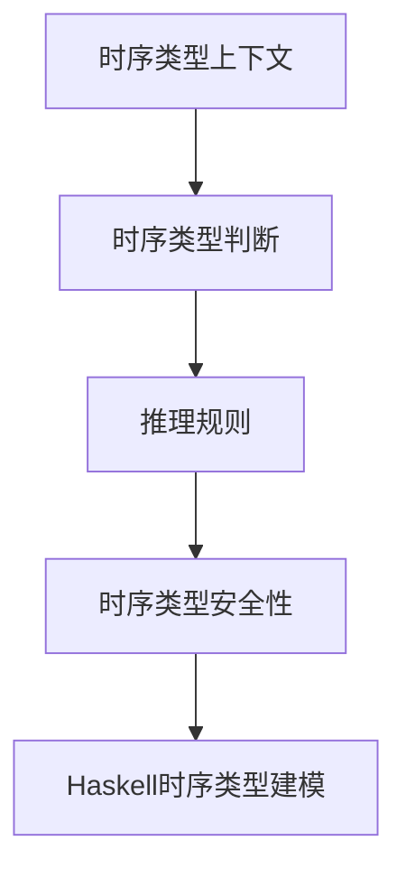

# 01. 时序类型理论基础（Temporal Type Theory Foundation）

> **中英双语核心定义 | Bilingual Core Definitions**

## 1.1 时序类型理论简介（Introduction to Temporal Type Theory）

- **定义（Definition）**：
  - **中文**：时序类型理论是一种将时间维度引入类型系统的理论，能够描述和验证程序在不同时间点的行为和属性，广泛用于实时系统、嵌入式系统和时序逻辑建模。
  - **English**: Temporal type theory is a type system that incorporates the time dimension, enabling the description and verification of program behaviors and properties at different time points. It is widely used in real-time systems, embedded systems, and temporal logic modeling.

- **Wiki风格国际化解释（Wiki-style Explanation）**：
  - 时序类型理论为时序逻辑、实时系统建模、Haskell等函数式语言的时序扩展提供理论基础。
  - Temporal type theory underpins temporal logic, real-time system modeling, and temporal extensions in functional languages like Haskell.

## 1.2 时序类型系统基本结构（Basic Structure of Temporal Type Systems）

- **时序类型上下文（Temporal Type Context）**
  - $\Gamma : \text{Var} \rightarrow \text{Type} \times \text{Time}$
  - **中文**：时序类型上下文为每个变量分配类型和时间信息。
  - **English**: Temporal type context assigns both type and time information to each variable.

- **时序类型构造（Temporal Type Constructors）**
  - $\tau ::= \text{Base} \mid \tau_1 \rightarrow \tau_2 \mid \diamond \tau \mid \square \tau \mid \tau_1 \mathcal{U} \tau_2$
  - $\diamond$：可能性类型（eventually type）
  - $\square$：必然性类型（always type）
  - $\mathcal{U}$：直到类型（until type）

- **推理规则（Inference Rules）**

| 规则 | 数学形式 | 中文 | English |
|------|----------|------|---------|
| 变量 | $\frac{x : (\tau, t) \in \Gamma}{\Gamma \vdash x : \tau}$ | 变量类型 | Variable type |
| 时序抽象 | $\frac{\Gamma, x : (\tau_1, t) \vdash e : \tau_2}{\Gamma \vdash \lambda x.e : \tau_1 \rightarrow \tau_2}$ | 时序函数抽象 | Temporal function abstraction |
| 时序应用 | $\frac{\Gamma_1 \vdash e_1 : \tau_1 \rightarrow \tau_2 \quad \Gamma_2 \vdash e_2 : \tau_1}{\Gamma_1, \Gamma_2 \vdash e_1 e_2 : \tau_2}$ | 时序函数应用 | Temporal function application |
| 可能性引入 | $\frac{\Gamma \vdash e : \tau}{\Gamma \vdash e : \diamond \tau}$ | 可能性引入 | Eventually introduction |
| 必然性引入 | $\frac{\Gamma \vdash e : \tau \text{ for all } t' \geq t}{\Gamma \vdash e : \square \tau}$ | 必然性引入 | Always introduction |

## 1.3 Haskell时序类型系统与语义模型（Haskell Temporal Type System & Semantic Model）

- **Haskell中的时序类型思想**
  - Haskell可通过类型标记、GADT等方式表达时序约束。

```haskell
data Time = T0 | T1 | T2 deriving (Eq, Ord, Show)

data Temporal a = At Time a | Always a | Eventually a

-- 示例：在T1时刻执行操作
atT1 :: Temporal Int -> Maybe Int
atT1 (At T1 x) = Just x
atT1 _ = Nothing
```

- **时序约束与类型安全**
  - 通过类型系统保证操作在指定时间点或区间内执行。

## 1.4 形式化证明与论证（Formal Proofs & Reasoning）

- **时序类型保持性证明（Preservation Proof）**
  - **中文**：对每个推理规则，证明时序类型在归约后保持不变。
  - **English**: For each inference rule, prove that the temporal type is preserved after reduction.

- **时序进展性证明（Progress Proof）**
  - **中文**：对每个语法构造，证明要么是值，要么可以继续归约。
  - **English**: For each syntactic construct, prove it is either a value or can be further reduced.

## 1.5 多表征与本地跳转（Multi-representation & Local Reference）

- **时序类型系统结构图（Temporal Type System Structure Diagram）**



- **相关主题跳转**：
  - [类型理论 Type Theory](../01-Type-Theory/01-Type-Theory-Foundation.md)
  - [线性类型理论 Linear Type Theory](../02-Linear-Type-Theory/01-Linear-Type-Theory-Foundation.md)
  - [仿射类型理论 Affine Type Theory](../03-Affine-Type-Theory/01-Affine-Type-Theory-Foundation.md)

---

## 1.6 历史与发展 History & Development

- **中文**：时序类型理论源自时序逻辑和实时系统建模，20世纪后期发展起来，广泛应用于嵌入式、实时和分布式系统。Haskell等函数式语言通过类型系统扩展和GADT等机制支持时序建模。
- **English**: Temporal type theory originated from temporal logic and real-time system modeling, developed in the late 20th century, and is widely used in embedded, real-time, and distributed systems. Functional languages like Haskell support temporal modeling via type system extensions and GADTs.

## 1.7 Haskell 相关特性 Haskell Features

### 经典特性 Classic Features

- GADTs、类型类、不可变数据结构、类型安全的状态建模等。
- GADTs, type classes, immutable data structures, type-safe state modeling, etc.

### 最新特性 Latest Features

- **Type-level Programming**：类型级时序建模与约束。
- **Dependent Types**：实验性支持，类型依赖于时间参数。
- **GHC 2021/2022**：标准化时序相关类型系统扩展。

- **English**:
  - Type-level programming: Type-level temporal modeling and constraints.
  - Dependent Types: Experimental support, types depending on time parameters.
  - GHC 2021/2022: Standardizes temporal type system extensions.

## 1.8 应用 Applications

- **中文**：实时系统、嵌入式系统、分布式系统、时序逻辑建模、类型安全的时序API等。
- **English**: Real-time systems, embedded systems, distributed systems, temporal logic modeling, type-safe temporal APIs, etc.

## 1.9 例子 Examples

```haskell
data Time = T0 | T1 | T2 deriving (Eq, Ord, Show)
data Temporal a = At Time a | Always a | Eventually a

-- 在T1时刻执行操作
temporalAtT1 :: Temporal Int -> Maybe Int
temporalAtT1 (At T1 x) = Just x
temporalAtT1 _ = Nothing
```

## 1.10 相关理论 Related Theories

- 时序逻辑（Temporal Logic）
- 实时系统理论（Real-Time System Theory）
- 状态机建模（State Machine Modeling）
- 形式化验证（Formal Verification）

## 1.11 参考文献 References

- [Wikipedia: Temporal Logic](https://en.wikipedia.org/wiki/Temporal_logic)
- [GHC User's Guide](https://downloads.haskell.org/ghc/latest/docs/html/users_guide/)
- [Types and Programming Languages, Benjamin C. Pierce]
- [Learn You a Haskell for Great Good!](http://learnyouahaskell.com/)

> 本文档为时序类型理论基础的中英双语、Haskell语义模型与形式化证明规范化输出，适合学术研究与工程实践参考。
