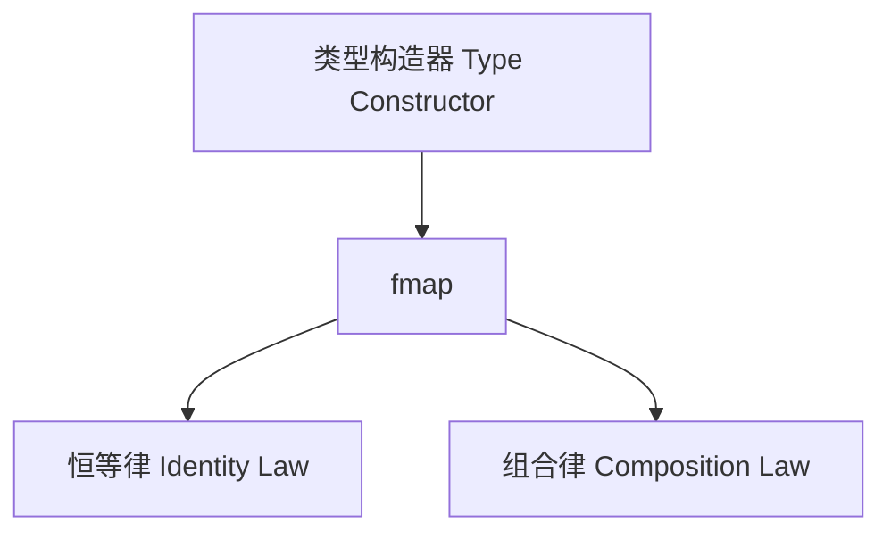

# 01. 函子与Haskell类型系统（Functor and Haskell Type System）

> **中英双语核心定义 | Bilingual Core Definitions**

## 1.1 函子简介（Introduction to Functor）

- **定义（Definition）**：
  - **中文**：在范畴论中，函子是范畴之间的结构保持映射，将一个范畴的对象和态射映射到另一个范畴，并保持恒等和组合结构。Haskell中的Functor是类型构造器的抽象，支持对容器内元素的映射。
  - **English**: In category theory, a functor is a structure-preserving mapping between categories, mapping objects and morphisms from one category to another while preserving identity and composition. In Haskell, a Functor is an abstraction of type constructors that supports mapping over elements inside a container.

- **Wiki风格国际化解释（Wiki-style Explanation）**：
  - 函子是Haskell类型系统中最基础的抽象之一，广泛用于数据结构、函数式编程模式和高阶抽象。
  - Functor is one of the most fundamental abstractions in Haskell's type system, widely used in data structures, functional programming patterns, and higher-order abstractions.

## 1.2 Haskell中的Functor类型类（Functor Typeclass in Haskell）

- **类型类定义（Typeclass Definition）**

```haskell
class Functor f where
  fmap :: (a -> b) -> f a -> f b
```

- **范畴论建模（Category-Theoretic Modeling）**
  - 对象：类型构造器`f`
  - 态射：`fmap`将`a -> b`提升为`f a -> f b`
  - 保持恒等：`fmap id = id`
  - 保持组合：`fmap (g . f) = fmap g . fmap f`

- **Haskell代码示例**

```haskell
instance Functor Maybe where
  fmap _ Nothing  = Nothing
  fmap f (Just x) = Just (f x)

instance Functor [] where
  fmap = map
```

## 1.3 范畴论结构与类型系统的映射（Mapping Category Structure to Functor）

- **映射关系表（Mapping Table）**

| 范畴论概念 | Haskell概念 | 代码示例 | 中文解释 |
|---------|-------------|----------|----------|
| 对象    | 类型构造器  | `Maybe`, `[]` | 类型级容器 |
| 态射    | `fmap`      | `fmap (+1) (Just 2)` | 元素级映射 |
| 恒等    | `fmap id = id` | `fmap id (Just x) == Just x` | 保持恒等 |
| 组合    | `fmap (g . f) = fmap g . fmap f` | `fmap (negate . (+1)) (Just 2)` | 保持组合 |

## 1.4 形式化证明与论证（Formal Proofs & Reasoning）

- **函子公理在Haskell中的体现**
  - **恒等律（Identity Law）**：
    - $fmap\ id = id$
    - Haskell中：`fmap id xs == xs`
  - **组合律（Composition Law）**：
    - $fmap\ (g \circ f) = fmap\ g \circ fmap\ f$
    - Haskell中：`fmap (g . f) xs == (fmap g . fmap f) xs`

- **证明示例（Proof Example）**

```haskell
-- 恒等律证明
fmap id (Just 3) == Just 3  -- True
fmap id [1,2,3] == [1,2,3]  -- True

-- 组合律证明
let f = (+1)
let g = (*2)
fmap (g . f) [1,2,3] == (fmap g . fmap f) [1,2,3]  -- True
```

## 1.5 多表征与本地跳转（Multi-representation & Local Reference）

- **函子结构图（Functor Structure Diagram）**



- **相关主题跳转**：
  - [范畴论与Haskell类型系统 Category Theory and Haskell Type System](../01-Category-Theory-and-Haskell-Type-System.md)
  - [单子 Monad](../03-Monad/01-Monad-and-Haskell.md)
  - [自然变换 Natural Transformation](../04-Natural-Transformation/01-Natural-Transformation-and-Haskell.md)

---

## 1.6 历史与发展 History & Development

- **中文**：函子（Functor）概念源自范畴论，20世纪中叶提出。Haskell自设计之初即引入Functor类型类，成为函数式编程中最基础的抽象之一。GHC不断扩展Functor相关特性，如派生、泛型编程、Higher-Kinded Types等。
- **English**: The concept of functor originates from category theory, introduced in the mid-20th century. Haskell has included the Functor type class since its inception, making it one of the most fundamental abstractions in functional programming. GHC has continuously extended Functor-related features, such as deriving, generic programming, and higher-kinded types.

## 1.7 Haskell 相关特性 Haskell Features

### 经典特性 Classic Features

- Functor类型类、fmap、派生实例、容器抽象。
- Functor type class, fmap, deriving instances, container abstraction.

### 最新特性 Latest Features

- **Higher-Kinded Types（高阶类型）**
- **DerivingVia/DerivingStrategies**
- **QuantifiedConstraints/RankNTypes**
- **GHC 2021/2022**：标准化更多Functor相关扩展。

- **English**:
  - Higher-Kinded Types
  - DerivingVia/DerivingStrategies
  - QuantifiedConstraints/RankNTypes
  - GHC 2021/2022: Standardizes more Functor extensions

## 1.8 应用 Applications

- **中文**：数据结构抽象、泛型编程、函数式设计模式、DSL、并发与异步编程等。
- **English**: Data structure abstraction, generic programming, functional design patterns, DSLs, concurrency and asynchronous programming, etc.

## 1.9 例子 Examples

```haskell
{-# LANGUAGE DeriveFunctor #-}
data Tree a = Leaf a | Node (Tree a) (Tree a) deriving (Functor)

-- 使用fmap对Tree结构映射
exampleTree :: Tree Int
exampleTree = Node (Leaf 1) (Leaf 2)

mappedTree :: Tree String
mappedTree = fmap show exampleTree
```

## 1.10 相关理论 Related Theories

- 范畴论（Category Theory）
- 类型类（Type Classes）
- 泛型编程（Generic Programming）
- 代数数据类型（Algebraic Data Types）

## 1.11 参考文献 References

- [Wikipedia: Functor (category theory)](https://en.wikipedia.org/wiki/Functor_(category_theory))
- [GHC User's Guide](https://downloads.haskell.org/ghc/latest/docs/html/users_guide/)
- [Learn You a Haskell for Great Good!](http://learnyouahaskell.com/)
- [Category Theory for Programmers](https://bartoszmilewski.com/category/category-theory/)

> 本文档为函子与Haskell类型系统的中英双语、Haskell语义模型与形式化证明规范化输出，适合学术研究与工程实践参考。
