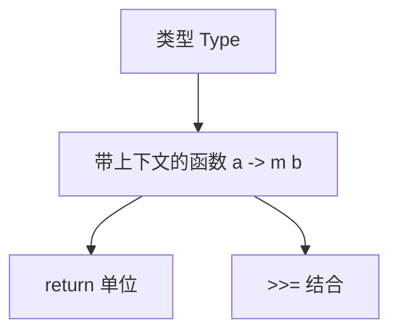

# 01. 单子与Haskell类型系统（Monad and Haskell Type System）

> **中英双语核心定义 | Bilingual Core Definitions**

## 1.1 单子简介（Introduction to Monad）

- **定义（Definition）**：
  - **中文**：在范畴论中，单子是一种在范畴上定义的三元组 $(T, \eta, \mu)$，用于描述带有上下文的计算和效应。Haskell中的Monad是对带有副作用的计算的抽象，支持顺序组合和上下文传递。
  - **English**: In category theory, a monad is a triple $(T, \eta, \mu)$ defined on a category, used to describe computations with context and effects. In Haskell, a Monad abstracts computations with effects, supporting sequential composition and context propagation.

- **Wiki风格国际化解释（Wiki-style Explanation）**：
  - 单子是Haskell类型系统中处理副作用、顺序计算和上下文传递的核心抽象。
  - Monad is the core abstraction in Haskell's type system for handling effects, sequential computation, and context propagation.

## 1.2 Haskell中的Monad类型类（Monad Typeclass in Haskell）

- **类型类定义（Typeclass Definition）**

```haskell
class Applicative m => Monad m where
  (>>=)  :: m a -> (a -> m b) -> m b
  return :: a -> m a
```

- **Kleisli范畴建模（Kleisli Category Modeling）**
  - 对象：类型 $a$
  - 态射：$a \to M b$
  - 单位：$return :: a \to M a$
  - 结合律：$(m >>= f) >>= g = m >>= (\x -> f x >>= g)$

- **Haskell代码示例**

```haskell
instance Monad Maybe where
  Nothing  >>= _ = Nothing
  (Just x) >>= f = f x
  return = Just

instance Monad [] where
  xs >>= f = concat (map f xs)
  return x = [x]
```

## 1.3 范畴论结构与类型系统的映射（Mapping Category Structure to Monad）

- **映射关系表（Mapping Table）**

| 范畴论概念 | Haskell概念 | 代码示例 | 中文解释 |
|---------|-------------|----------|----------|
| 对象    | 类型        | `Int`, `Maybe a` | 类型 |
| 态射    | `a -> m b`  | `\x -> Just (x+1)` | 带上下文的函数 |
| 单位    | `return`    | `return 3 :: Maybe Int` | 单位操作 |
| 结合    | `(>>=)`     | `Just 2 >>= (\x -> Just (x+1))` | 顺序组合 |

## 1.4 形式化证明与论证（Formal Proofs & Reasoning）

- **单子公理在Haskell中的体现**
  - **左单位律（Left Identity）**：
    - $return\ a >>= f = f\ a$
    - Haskell中：`return 3 >>= f == f 3`
  - **右单位律（Right Identity）**：
    - $m >>= return = m$
    - Haskell中：`m >>= return == m`
  - **结合律（Associativity）**：
    - $(m >>= f) >>= g = m >>= (\x -> f x >>= g)$
    - Haskell中：`((m >>= f) >>= g) == (m >>= (\x -> f x >>= g))`

- **证明示例（Proof Example）**

```haskell
-- 左单位律证明
let f x = Just (x + 1)
return 3 >>= f == f 3  -- True

-- 右单位律证明
Just 3 >>= return == Just 3  -- True

-- 结合律证明
let m = Just 2
let f x = Just (x + 1)
let g x = Just (x * 2)
((m >>= f) >>= g) == (m >>= (\x -> f x >>= g))  -- True
```

## 1.5 多表征与本地跳转（Multi-representation & Local Reference）

- **单子结构图（Monad Structure Diagram）**



- **相关主题跳转**：
  - [范畴论与Haskell类型系统 Category Theory and Haskell Type System](../01-Category-Theory-and-Haskell-Type-System.md)
  - [函子 Functor](../02-Functor/01-Functor-and-Haskell.md)
  - [自然变换 Natural Transformation](../04-Natural-Transformation/01-Natural-Transformation-and-Haskell.md)

---

## 1.6 历史与发展 History & Development

- **中文**：单子（Monad）概念源自范畴论，20世纪中叶提出。Eugenio Moggi于1989年首次将单子引入计算机科学，随后Wadler等人将其引入Haskell，成为处理副作用和顺序计算的核心抽象。GHC不断扩展Monad相关特性，如MonadFail、MonadComprehensions、Monad Transformers等。
- **English**: The concept of monad originates from category theory, introduced in the mid-20th century. Eugenio Moggi brought monads into computer science in 1989, and Wadler et al. introduced them into Haskell, making them the core abstraction for handling effects and sequential computation. GHC has continuously extended Monad-related features, such as MonadFail, MonadComprehensions, and Monad Transformers.

## 1.7 Haskell 相关特性 Haskell Features

### 经典特性 Classic Features

- Monad类型类、(>>=)、return、do语法、Kleisli范畴。
- Monad type class, (>>=), return, do-notation, Kleisli category.

### 最新特性 Latest Features

- **MonadFail/MonadComprehensions**
- **Monad Transformers**
- **QuantifiedConstraints/RankNTypes**
- **GHC 2021/2022**：标准化更多Monad相关扩展。

- **English**:
  - MonadFail/MonadComprehensions
  - Monad Transformers
  - QuantifiedConstraints/RankNTypes
  - GHC 2021/2022: Standardizes more Monad extensions

## 1.8 应用 Applications

- **中文**：副作用建模、异步与并发、解析器组合器、DSL、资源管理、错误处理等。
- **English**: Effect modeling, async and concurrency, parser combinators, DSLs, resource management, error handling, etc.

## 1.9 例子 Examples

```haskell
-- Monad Transformer 例子
import Control.Monad.Trans.Maybe
import Control.Monad.Trans.Class

example :: MaybeT IO String
example = do
  lift $ putStrLn "Enter something:"
  x <- lift getLine
  if null x then MaybeT (return Nothing) else return x
```

## 1.10 相关理论 Related Theories

- 范畴论（Category Theory）
- Kleisli范畴（Kleisli Category）
- 类型类（Type Classes）
- 代数效应（Algebraic Effects）

## 1.11 参考文献 References

- [Wikipedia: Monad (category theory)](https://en.wikipedia.org/wiki/Monad_(category_theory))
- [Wikipedia: Monad (functional programming)](https://en.wikipedia.org/wiki/Monad_(functional_programming))
- [GHC User's Guide](https://downloads.haskell.org/ghc/latest/docs/html/users_guide/)
- [Learn You a Haskell for Great Good!](http://learnyouahaskell.com/)
- [Category Theory for Programmers](https://bartoszmilewski.com/category/category-theory/)

> 本文档为单子与Haskell类型系统的中英双语、Haskell语义模型与形式化证明规范化输出，适合学术研究与工程实践参考。
