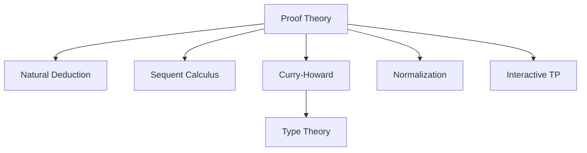

# 7.1 证明论的定义 Definition of Proof Theory #ProofTheory-7.1

## 定义 Definition

### 基本定义 Basic Definition

- **中文**：证明论是数理逻辑的一个分支，研究数学证明的形式结构、推理规则与证明过程的本质。它关注于证明的构造、可计算性、归纳性、以及证明与算法之间的关系。
- **English**: Proof theory is a branch of mathematical logic that studies the formal structure of mathematical proofs, inference rules, and the essence of the proving process. It focuses on the construction, computability, induction, and the relationship between proofs and algorithms.

### 形式化定义 Formal Definition

#### 证明系统 Proof System

一个证明系统是一个四元组 $(\mathcal{L}, \mathcal{A}, \mathcal{R}, \vdash)$，其中：

- $\mathcal{L}$ 是形式语言
- $\mathcal{A}$ 是公理集合
- $\mathcal{R}$ 是推理规则集合
- $\vdash$ 是证明关系

#### 证明 Proof

一个证明是从公理出发，通过有限次应用推理规则，得到结论的有限序列：

$$\frac{A_1 \quad A_2 \quad \cdots \quad A_n}{B} \text{ (Rule Name)}$$

其中 $A_1, A_2, \ldots, A_n$ 是前提，$B$ 是结论。

#### 自然演绎 Natural Deduction

自然演绎系统包含以下规则：

1. **引入规则 (Introduction Rules)**
   - $\land$-I: $\frac{A \quad B}{A \land B}$
   - $\lor$-I: $\frac{A}{A \lor B}$ 或 $\frac{B}{A \lor B}$
   - $\to$-I: $\frac{[A] \quad B}{A \to B}$

2. **消除规则 (Elimination Rules)**
   - $\land$-E: $\frac{A \land B}{A}$ 或 $\frac{A \land B}{B}$
   - $\lor$-E: $\frac{A \lor B \quad A \to C \quad B \to C}{C}$
   - $\to$-E: $\frac{A \to B \quad A}{B}$

## 哲学背景 Philosophical Background

### 构造主义哲学 Constructivist Philosophy

- **中文**：证明论体现了构造主义哲学思想，强调数学对象必须通过构造性证明来建立其存在性，反对纯粹的存在性证明。
- **English**: Proof theory embodies constructivist philosophy, emphasizing that mathematical objects must be established through constructive proofs, opposing purely existential proofs.

### 形式主义哲学 Formalist Philosophy

- **中文**：证明论体现了形式主义哲学，将数学视为形式系统的游戏，通过严格的推理规则来保证数学的严谨性。
- **English**: Proof theory embodies formalist philosophy, viewing mathematics as a game of formal systems, ensuring mathematical rigor through strict inference rules.

### 直觉主义哲学 Intuitionist Philosophy

- **中文**：证明论体现了直觉主义哲学，强调数学证明必须基于直觉上可接受的构造过程。
- **English**: Proof theory embodies intuitionist philosophy, emphasizing that mathematical proofs must be based on intuitively acceptable constructive processes.

## 核心概念 Core Concepts

### 证明对象 Proof Objects

#### Curry-Howard对应 Curry-Howard Correspondence

```haskell
-- 证明作为程序
-- 命题对应类型，证明对应程序
data Proof a where
  Axiom :: a -> Proof a
  ModusPonens :: Proof (a -> b) -> Proof a -> Proof b
  AndIntro :: Proof a -> Proof b -> Proof (a, b)
  AndElim1 :: Proof (a, b) -> Proof a
  AndElim2 :: Proof (a, b) -> Proof b

-- 证明的构造
proveAnd :: Proof a -> Proof b -> Proof (a, b)
proveAnd p1 p2 = AndIntro p1 p2

-- 证明的使用
useAnd :: Proof (a, b) -> (Proof a, Proof b)
useAnd p = (AndElim1 p, AndElim2 p)
```

#### 证明项 Proof Terms

```haskell
-- λ演算中的证明项
data ProofTerm where
  Var :: String -> ProofTerm
  Lam :: String -> ProofTerm -> ProofTerm
  App :: ProofTerm -> ProofTerm -> ProofTerm
  Pair :: ProofTerm -> ProofTerm -> ProofTerm
  Fst :: ProofTerm -> ProofTerm
  Snd :: ProofTerm -> ProofTerm

-- 类型化的证明项
data TypedProofTerm a where
  TypedVar :: String -> TypedProofTerm a
  TypedLam :: String -> TypedProofTerm b -> TypedProofTerm (a -> b)
  TypedApp :: TypedProofTerm (a -> b) -> TypedProofTerm a -> TypedProofTerm b
```

### 推理规则 Inference Rules

#### 自然演绎规则 Natural Deduction Rules

```haskell
-- 自然演绎规则
class NaturalDeduction a where
  -- 合取引入
  andIntro :: Proof a -> Proof b -> Proof (a, b)
  -- 合取消除
  andElim1 :: Proof (a, b) -> Proof a
  andElim2 :: Proof (a, b) -> Proof b
  -- 析取引入
  orIntro1 :: Proof a -> Proof (Either a b)
  orIntro2 :: Proof b -> Proof (Either a b)
  -- 析取消除
  orElim :: Proof (Either a b) -> (Proof a -> Proof c) -> (Proof b -> Proof c) -> Proof c
  -- 蕴含引入
  implIntro :: (Proof a -> Proof b) -> Proof (a -> b)
  -- 蕴含消除
  implElim :: Proof (a -> b) -> Proof a -> Proof b
```

#### 序列演算规则 Sequent Calculus Rules

```haskell
-- 序列演算
data Sequent a b = Sequent [a] [b]  -- Γ ⊢ Δ

-- 左规则 (Left Rules)
leftAnd :: Sequent (a, b) c -> Sequent a (b -> c)
leftOr :: Sequent (Either a b) c -> (Sequent a c, Sequent b c)
leftImpl :: Sequent (a -> b) c -> (Sequent b c, Sequent c a)

-- 右规则 (Right Rules)
rightAnd :: (Sequent a b, Sequent a c) -> Sequent a (b, c)
rightOr :: Sequent a (Either b c) -> Either (Sequent a b) (Sequent a c)
rightImpl :: Sequent (a, b) c -> Sequent a (b -> c)
```

### 证明搜索 Proof Search

#### 证明搜索算法

```haskell
-- 证明搜索
class ProofSearch a where
  searchProof :: a -> Maybe (Proof a)
  
-- 深度优先搜索
depthFirstSearch :: a -> Maybe (Proof a)
depthFirstSearch goal = undefined

-- 广度优先搜索
breadthFirstSearch :: a -> Maybe (Proof a)
breadthFirstSearch goal = undefined

-- 启发式搜索
heuristicSearch :: a -> (a -> Int) -> Maybe (Proof a)
heuristicSearch goal heuristic = undefined
```

## 历史发展 Historical Development

### 理论基础 Theoretical Foundation

#### 证明论的起源 (1930s)

- **Gerhard Gentzen** 创立证明论
- 1934年发表《Untersuchungen über das logische Schließen》
- 引入自然演绎和序列演算

#### 早期发展 (1940s-1960s)

- **Alonzo Church** 发展λ演算
- **Per Martin-Löf** 开发直觉类型论
- **Jean-Yves Girard** 引入线性逻辑

### 现代发展 Modern Development

#### 构造演算 (1970s-1980s)

```haskell
-- 构造演算 (Calculus of Constructions)
data CoC where
  Prop :: CoC  -- 命题类型
  Type :: CoC  -- 类型类型
  Var :: String -> CoC
  Pi :: String -> CoC -> CoC -> CoC  -- 依赖函数类型
  Lam :: String -> CoC -> CoC -> CoC  -- λ抽象
  App :: CoC -> CoC -> CoC  -- 函数应用

-- 类型检查
typeCheck :: CoC -> Maybe CoC
typeCheck = undefined
```

#### 现代证明助手 (1990s-2000s)

```haskell
-- Coq中的证明
-- Theorem plus_O_n : forall n : nat, 0 + n = n.
-- Proof.
--   intros n.
--   simpl.
--   reflexivity.
-- Qed.

-- 在Haskell中的对应
provePlusZero :: forall n. Nat n -> Equal (Plus Zero n) n
provePlusZero n = undefined  -- 需要构造性证明
```

## 形式化语义 Formal Semantics

### 证明语义 Proof Semantics

#### 证明作为函数 Proofs as Functions

对于证明 $p : A \to B$，其语义为：

$$[\![p]\!] : [\![A]\!] \to [\![B]\!]$$

其中 $[\![A]\!]$ 和 $[\![B]\!]$ 是类型 $A$ 和 $B$ 的语义。

#### 证明归约 Proof Reduction

```haskell
-- β归约
betaReduce :: ProofTerm -> ProofTerm
betaReduce (App (Lam x body) arg) = substitute x arg body
betaReduce term = term

-- η归约
etaReduce :: ProofTerm -> ProofTerm
etaReduce (Lam x (App f (Var x'))) | x == x' = f
etaReduce term = term
```

### 证明规范化 Proof Normalization

#### 强规范化 Strong Normalization

```haskell
-- 证明规范化
normalize :: ProofTerm -> ProofTerm
normalize term = 
  let reduced = betaReduce term
  in if reduced == term 
     then term 
     else normalize reduced

-- 规范化定理：所有证明项都能在有限步内归约到范式
normalizationTheorem :: ProofTerm -> Bool
normalizationTheorem term = isNormalForm (normalize term)
```

## 与其他理论的关系 Relationship to Other Theories

### 与类型理论的关系

- **中文**：证明论与类型理论通过Curry-Howard对应紧密联系，证明对应程序，命题对应类型。
- **English**: Proof theory is closely related to type theory through the Curry-Howard correspondence, where proofs correspond to programs and propositions correspond to types.

### 与模型论的关系

- **中文**：证明论研究证明的语法结构，而模型论研究语义解释，两者互补。
- **English**: Proof theory studies the syntactic structure of proofs, while model theory studies semantic interpretations, with the two being complementary.

### 与递归论的关系

- **中文**：证明论中的可计算性概念与递归论密切相关，构造性证明对应可计算函数。
- **English**: The computability concepts in proof theory are closely related to recursion theory, with constructive proofs corresponding to computable functions.

## 交叉引用 Cross References

- [类型理论 Type Theory](../TypeTheory/README.md)
- [模型论 Model Theory](../ModelTheory/README.md)
- [形式化定义 Formal Definitions](../FormalDefinitions/README.md)
- [定理与证明 Theorems & Proofs](../Theorems_Proofs/README.md)

## 对比分析 Comparison

- **中文**：证明论 vs 模型论 vs 语义模型 vs 类型理论
  - 证明论侧重语法层面的推理规则与构造；模型论给出语义解释；语义模型给出程序含义；类型理论建立命题-程序同构。
- **English**: Proof theory vs model theory vs semantic models vs type theory
  - Proof theory focuses on syntactic inference and construction; model theory on semantic interpretation; semantic models on program meaning; type theory on propositions-as-types.

## 争议与批判 Controversies & Critique

- **中文**：
  - 语法主义 vs 语义主义之争；强规范化假设与可计算性界限；
  - 证明复杂度与可读性；自动化证明的可解释性。
- **English**:
  - Syntactic vs semantic primacy; strong normalization assumptions vs computability limits;
  - Proof complexity and readability; explainability of automated proofs.

## 前沿趋势 Frontier Trends

- **中文**：
  - 交互式定理证明（ITP）与自动定理证明（ATP）的协同；
  - 依赖类型与证明重用；程序合成与证据携带代码；概率证明与可验证机器学习。
- **English**:
  - Synergy of ITP and ATP; dependent types and proof reuse; program synthesis and proof-carrying code; probabilistic proofs and verifiable ML.

## 常见陷阱 Common Pitfalls

- **中文**：
  - 漏掉结构规则或侧条件；混淆自然演绎与序列演算；
  - 证明归约与等价的混用；未区分内在证明与外在证明。
- **English**:
  - Missing structural rules or side conditions; conflating natural deduction with sequent calculus;
  - Mixing proof reduction with equivalence; not distinguishing intrinsic vs extrinsic proofs.

## 扩展交叉引用 Extended Cross References

- [类型理论 Type Theory](../TypeTheory/README.md)
- [模型论 Model Theory](../ModelTheory/README.md)
- [语义模型 Semantic Models](../SemanticModels/README.md)
- [程序验证 Program Verification](../ProgramVerification/README.md)

## 知识图谱 Knowledge Graph



## 参考文献 References

1. Gentzen, G. (1934). Untersuchungen über das logische Schließen. Mathematische Zeitschrift, 39(1), 176-210.
2. Prawitz, D. (1965). Natural deduction: A proof-theoretical study. Almqvist & Wiksell.
3. Girard, J. Y. (1987). Linear logic. Theoretical Computer Science, 50(1), 1-101.
4. Martin-Löf, P. (1984). Intuitionistic type theory. Bibliopolis.
5. Coquand, T., & Huet, G. (1988). The calculus of constructions. Information and Computation, 76(2-3), 95-120.
6. Howard, W. A. (1980). The formulae-as-types notion of construction. To H. B. Curry: Essays on Combinatory Logic, Lambda Calculus and Formalism, 479-490.
7. Curry, H. B., & Feys, R. (1958). Combinatory logic. North-Holland.
8. Troelstra, A. S., & Schwichtenberg, H. (2000). Basic proof theory. Cambridge University Press.
