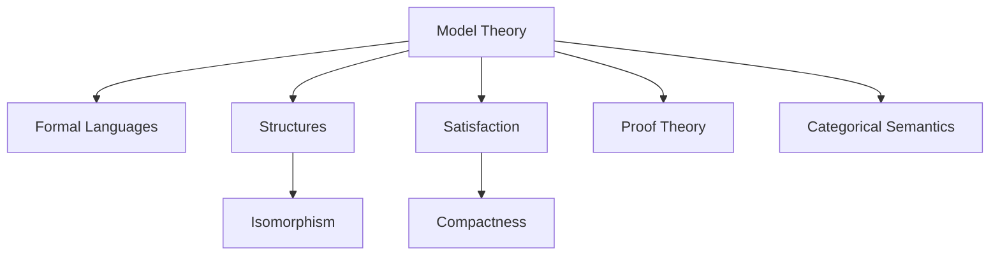
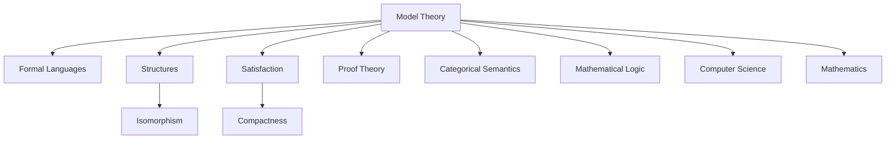

# 8.1 模型论的定义 Definition of Model Theory #ModelTheory-8.1

## 定义 Definition

### 基本定义 Basic Definition

- **中文**：模型论是数理逻辑的一个分支，研究形式语言与其解释（模型）之间的关系。它关注结构、解释、满足性、同构、紧致性等核心概念，为数学和计算机科学提供语义基础。
- **English**: Model theory is a branch of mathematical logic that studies the relationship between formal languages and their interpretations (models). It focuses on structures, interpretations, satisfiability, isomorphism, compactness, and other core concepts, providing semantic foundations for mathematics and computer science.

### 形式化定义 Formal Definition

#### 形式语言 Formal Language

一个形式语言 $\mathcal{L}$ 是一个三元组 $(C, F, R)$，其中：

- $C$ 是常量符号集合
- $F$ 是函数符号集合
- $R$ 是关系符号集合

#### 结构 Structure

一个 $\mathcal{L}$-结构 $\mathcal{M}$ 是一个四元组 $(M, c^{\mathcal{M}}, f^{\mathcal{M}}, r^{\mathcal{M}})$，其中：

- $M$ 是非空集合（论域）
- $c^{\mathcal{M}} \in M$ 是常量 $c$ 的解释
- $f^{\mathcal{M}} : M^n \to M$ 是函数符号 $f$ 的解释
- $r^{\mathcal{M}} \subseteq M^n$ 是关系符号 $r$ 的解释

#### 满足关系 Satisfaction Relation

对于公式 $\phi$ 和结构 $\mathcal{M}$，满足关系定义为：

$$\mathcal{M} \models \phi$$

读作"$\mathcal{M}$ 满足 $\phi$"。

#### 模型 Model

如果 $\mathcal{M} \models \phi$，则称 $\mathcal{M}$ 是 $\phi$ 的模型。

## 哲学背景 Philosophical Background

### 语义哲学 Philosophy of Semantics

- **中文**：模型论体现了语义哲学思想，强调语言的意义在于其解释，形式系统需要通过具体结构来获得意义。
- **English**: Model theory embodies the philosophy of semantics, emphasizing that the meaning of language lies in its interpretation, and formal systems need concrete structures to acquire meaning.

### 结构主义哲学 Structuralist Philosophy

- **中文**：模型论体现了结构主义哲学，将数学对象视为结构，通过结构间的关系来理解数学的本质。
- **English**: Model theory embodies structuralist philosophy, viewing mathematical objects as structures and understanding the essence of mathematics through relationships between structures.

### 解释学哲学 Hermeneutic Philosophy

- **中文**：模型论体现了解释学哲学，强调理解过程的重要性，模型作为解释工具帮助理解形式语言。
- **English**: Model theory embodies hermeneutic philosophy, emphasizing the importance of the understanding process, with models serving as interpretive tools to understand formal languages.

## 核心概念 Core Concepts

### 结构 Structures

#### 代数结构 Algebraic Structures

```haskell
-- 群结构
data Group a = Group
  { carrier :: Set a
  , operation :: a -> a -> a
  , identity :: a
  , inverse :: a -> a
  }

-- 群公理
class GroupAxioms a where
  -- 结合律
  associativity :: Group a -> a -> a -> a -> Bool
  associativity g x y z = 
    operation g (operation g x y) z == operation g x (operation g y z)
  
  -- 单位元
  identityLaw :: Group a -> a -> Bool
  identityLaw g x = 
    operation g (identity g) x == x && operation g x (identity g) == x
  
  -- 逆元
  inverseLaw :: Group a -> a -> Bool
  inverseLaw g x = 
    operation g x (inverse g x) == identity g && 
    operation g (inverse g x) x == identity g
```

#### 序结构 Order Structures

```haskell
-- 偏序结构
data PartialOrder a = PartialOrder
  { domain :: Set a
  , relation :: a -> a -> Bool
  }

-- 偏序公理
class PartialOrderAxioms a where
  -- 自反性
  reflexivity :: PartialOrder a -> a -> Bool
  reflexivity po x = relation po x x
  
  -- 反对称性
  antisymmetry :: PartialOrder a -> a -> a -> Bool
  antisymmetry po x y = 
    relation po x y && relation po y x ==> x == y
  
  -- 传递性
  transitivity :: PartialOrder a -> a -> a -> a -> Bool
  transitivity po x y z = 
    relation po x y && relation po y z ==> relation po x z
```

### 解释 Interpretations

#### 符号解释 Symbol Interpretation

```haskell
-- 符号解释
data Interpretation a b = Interpretation
  { constantMap :: Map String a
  , functionMap :: Map String (b -> a)
  , relationMap :: Map String (b -> Bool)
  }

-- 项的解释
interpretTerm :: Interpretation a b -> Term -> a
interpretTerm interp (Constant c) = 
  fromJust $ lookup c (constantMap interp)
interpretTerm interp (Function f args) = 
  let func = fromJust $ lookup f (functionMap interp)
  in func (map (interpretTerm interp) args)
```

#### 公式解释 Formula Interpretation

```haskell
-- 公式解释
interpretFormula :: Interpretation a b -> Formula -> Bool
interpretFormula interp (Atomic r args) = 
  let rel = fromJust $ lookup r (relationMap interp)
  in rel (map (interpretTerm interp) args)
interpretFormula interp (And phi psi) = 
  interpretFormula interp phi && interpretFormula interp psi
interpretFormula interp (Or phi psi) = 
  interpretFormula interp phi || interpretFormula interp psi
interpretFormula interp (Not phi) = 
  not (interpretFormula interp phi)
interpretFormula interp (Forall x phi) = 
  all (\val -> interpretFormula (extend interp x val) phi) (domain interp)
```

### 同构 Isomorphism

#### 结构同构 Structure Isomorphism

```haskell
-- 结构同构
data Isomorphism a b = Isomorphism
  { map :: a -> b
  , inverse :: b -> a
  , preservesConstants :: Bool
  , preservesFunctions :: Bool
  , preservesRelations :: Bool
  }

-- 同构检查
isIsomorphic :: (Eq a, Eq b) => Structure a -> Structure b -> Isomorphism a b -> Bool
isIsomorphic s1 s2 iso = 
  preservesConstants iso &&
  preservesFunctions iso &&
  preservesRelations iso &&
  isBijection (map iso) (inverse iso)
```

#### 同构性质 Isomorphism Properties

```haskell
-- 同构的基本性质
class IsomorphismProperties a b where
  -- 自同构
  identityIsomorphism :: a -> Isomorphism a a
  identityIsomorphism x = Isomorphism id id True True True
  
  -- 同构的逆
  inverseIsomorphism :: Isomorphism a b -> Isomorphism b a
  inverseIsomorphism iso = Isomorphism 
    (inverse iso) (map iso) 
    (preservesConstants iso) 
    (preservesFunctions iso) 
    (preservesRelations iso)
  
  -- 同构的复合
  composeIsomorphism :: Isomorphism a b -> Isomorphism b c -> Isomorphism a c
  composeIsomorphism iso1 iso2 = Isomorphism
    (map iso2 . map iso1)
    (inverse iso1 . inverse iso2)
    (preservesConstants iso1 && preservesConstants iso2)
    (preservesFunctions iso1 && preservesFunctions iso2)
    (preservesRelations iso1 && preservesRelations iso2)
```

### 紧致性 Compactness

#### 紧致性定理 Compactness Theorem

```haskell
-- 紧致性定理
compactnessTheorem :: [Formula] -> Bool
compactnessTheorem formulas = 
  -- 如果每个有限子集都有模型，那么整个集合也有模型
  all hasModel (finiteSubsets formulas) ==> hasModel formulas

-- 有限子集
finiteSubsets :: [a] -> [[a]]
finiteSubsets xs = [subset | subset <- subsequences xs, not (null subset)]

-- 模型存在性检查
hasModel :: [Formula] -> Bool
hasModel formulas = undefined  -- 需要实现模型检查算法
```

## 历史发展 Historical Development

### 理论基础 Theoretical Foundation

#### 模型论的起源 (1920s-1930s)

- **Alfred Tarski** 创立模型论
- 1933年发表《The concept of truth in formalized languages》
- 引入满足关系和真值定义

#### 早期发展 (1940s-1960s)

- **Abraham Robinson** 发展非标准分析
- **Alfred Tarski** 和 **Robert Vaught** 证明紧致性定理
- **Leon Henkin** 证明完全性定理

### 现代发展 Modern Development

#### 稳定性理论 (1960s-1980s)

```haskell
-- 稳定性理论
data StabilityTheory a = StabilityTheory
  { theory :: [Formula]
  , cardinal :: Cardinal
  , stable :: Bool
  }

-- 稳定性检查
isStable :: StabilityTheory a -> Bool
isStable st = undefined  -- 需要实现稳定性检查算法
```

#### 现代模型论应用 (1990s-2020s)

```haskell
-- 模型论在计算机科学中的应用
-- 程序语义
data ProgramSemantics = ProgramSemantics
  { syntax :: Syntax
  , semantics :: Semantics
  , model :: Model
  }

-- 模型检查
modelCheck :: ProgramSemantics -> Formula -> Bool
modelCheck ps formula = undefined  -- 需要实现模型检查算法
```

## 形式化语义 Formal Semantics

### 语义语义 Semantic Semantics

#### 指称语义 Denotational Semantics

对于项 $t$ 和结构 $\mathcal{M}$，其指称语义为：

$$[\![t]\!]^{\mathcal{M}} : M$$

对于公式 $\phi$，其指称语义为：

$$[\![\phi]\!]^{\mathcal{M}} : \{\text{True}, \text{False}\}$$

#### 操作语义 Operational Semantics

```haskell
-- 操作语义
data OperationalSemantics a = OperationalSemantics
  { evaluation :: a -> a
  , reduction :: a -> a
  , normalForm :: a -> Bool
  }

-- 归约关系
reduce :: OperationalSemantics a -> a -> a
reduce os term = 
  if normalForm os term 
  then term 
  else reduce os (reduction os term)
```

### 模型论语义 Model-Theoretic Semantics

#### 类型语义 Type Semantics

```haskell
-- 类型语义
data TypeSemantics a = TypeSemantics
  { typeDomain :: Map Type (Set a)
  , typeInterpretation :: Type -> Set a
  }

-- 类型检查
typeCheck :: TypeSemantics a -> Term -> Type -> Bool
typeCheck ts term typ = 
  interpretTerm ts term `elem` typeInterpretation ts typ
```

## 与其他理论的关系 Relationship to Other Theories

### 与证明论的关系

- **中文**：模型论与证明论互补，模型论研究语义解释，证明论研究语法推导。
- **English**: Model theory and proof theory are complementary, with model theory studying semantic interpretations and proof theory studying syntactic derivations.

### 与集合论的关系

- **中文**：模型论以集合论为基础，使用集合论的语言来描述结构和解释。
- **English**: Model theory is based on set theory, using set-theoretic language to describe structures and interpretations.

### 与代数几何的关系

- **中文**：模型论在代数几何中有重要应用，通过模型论方法研究代数簇的结构。
- **English**: Model theory has important applications in algebraic geometry, studying the structure of algebraic varieties through model-theoretic methods.

## 交叉引用 Cross References

- [证明论 Proof Theory](../ProofTheory/README.md)
- [类型理论 Type Theory](../TypeTheory/README.md)
- [形式化定义 Formal Definitions](../FormalDefinitions/README.md)
- [定理与证明 Theorems & Proofs](../Theorems_Proofs/README.md)

## 参考文献 References

1. Tarski, A. (1933). The concept of truth in formalized languages. Logic, semantics, metamathematics, 152-278.
2. Chang, C. C., & Keisler, H. J. (2012). Model theory. Elsevier.
3. Hodges, W. (1997). A shorter model theory. Cambridge University Press.
4. Marker, D. (2002). Model theory: An introduction. Springer.
5. Robinson, A. (1996). Non-standard analysis. Princeton University Press.
6. Vaught, R. L. (1974). Model theory before 1945. Model theory and algebra, 153-172.
7. Henkin, L. (1949). The completeness of the first-order functional calculus. The Journal of Symbolic Logic, 14(3), 159-166.
8. Shelah, S. (1990). Classification theory and the number of non-isomorphic models. Elsevier.

## 对比分析 Comparison

- **中文**：模型论 vs 证明论 vs 范畴语义
  - 关注点：模型论强调语义与满足关系；证明论关注推导与可证性；范畴语义强调结构与态射。
  - 方法论：模型存在性与紧致性技术；归纳/共归纳证明；函子/自然变换。
- **English**: Model Theory vs Proof Theory vs Categorical Semantics
  - Focus: semantics/satisfaction vs derivability vs structure/morphisms.
  - Methods: compactness/existence vs induction/coinduction vs functors/natural transformations.

## 争议与批判 Controversies & Critique

- **中文**：
  - 现实系统中的可判定性与可计算边界；
  - 语义与实现间的鸿沟（理想模型假设 vs 工程约束）。
- **English**:
  - Decidability and computability limits in real systems;
  - Gap between semantic ideals and engineering constraints.

## 前沿趋势 Frontier Trends

- **中文**：
  - 可验证编译、形式化规范到实现的一致性（refinement-based semantics）。
  - 与类型理论/HoTT 的交叉：语义等价、同伦语义。
  - SMT/定理证明器与模型构造自动化。
- **English**:
  - Verified compilation and refinement-based semantics.
  - Crossovers with type theory/HoTT: semantic equivalence and homotopy semantics.
  - Automation via SMT/provers for model construction.

## 常见陷阱 Common Pitfalls

- **中文**：
  - 将语法等价混同为语义等价；忽视域大小假设对定理的影响；遗漏 Skolem 化前提。
- **English**:
  - Confusing syntactic and semantic equivalence; ignoring domain-size assumptions; missing Skolemization preconditions.

## 知识图谱 Knowledge Graph



## 对比分析 Comparison1

- **中文**：模型论 vs 证明论 vs 递归论 vs 集合论
  - 模型论关注"语言与结构的关系"；证明论聚焦"形式推理系统"；递归论强调"可计算性"；集合论注重"数学基础"。
- **English**: Model theory vs proof theory vs recursion theory vs set theory
  - Model theory focuses on "relationship between language and structures"; proof theory on "formal reasoning systems"; recursion theory on "computability"; set theory on "mathematical foundations".

## 争议与批判 Controversies & Critique1

- **中文**：
  - 模型论与证明论的关系争议；语义 vs 语法的优先性；
  - 紧致性定理的哲学意义；模型论在数学基础中的作用。
- **English**:
  - Controversies over relationship between model theory and proof theory; priority of semantics vs syntax;
  - Philosophical significance of compactness theorem; role of model theory in mathematical foundations.

## 前沿趋势 Frontier Trends1

- **中文**：
  - 模型论在计算机科学中的应用；范畴模型论；
  - 模型论与类型理论的结合；量子模型论。
- **English**:
  - Applications of model theory in computer science; categorical model theory;
  - Integration of model theory with type theory; quantum model theory.

## 常见陷阱 Common Pitfalls1

- **中文**：
  - 混淆模型与结构；忽视语言的表达能力限制；
  - 过度依赖紧致性；模型论方法的适用范围。
- **English**:
  - Confusing models with structures; ignoring expressiveness limitations of languages;
  - Over-reliance on compactness; scope of applicability of model-theoretic methods.

## 扩展交叉引用 Extended Cross References

- [证明论 Proof Theory](../ProofTheory/README.md)
- [递归与可计算性理论 Recursion & Computability Theory](../Recursion_Computability_Theory/README.md)
- [语义模型 Semantic Models](../SemanticModels/README.md)
- [工程应用 Engineering Applications](../EngineeringApplications/README.md)
- [实践价值 Practical Value](../PracticalValue/README.md)
- [系统理论 System Theory](../SystemTheory/README.md)

## 知识图谱 Knowledge Graph1


