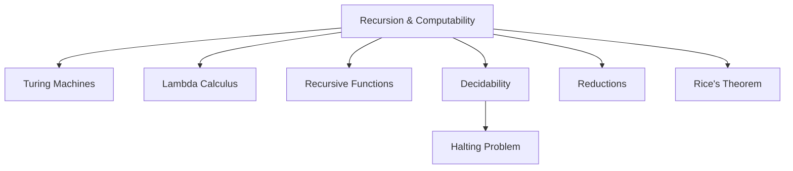
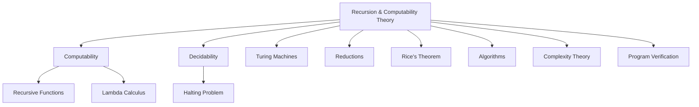

# 12.1 递归-可计算理论的定义 Definition of Recursion & Computability Theory #RecursionComputabilityTheory-12.1

## 目录 Table of Contents

- 12.1 定义 Definition
- 12.2 哲学背景 Philosophical Background
- 12.3 核心概念 Core Concepts
- 12.4 历史发展 Historical Development
- 12.5 形式化语义 Formal Semantics
- 12.6 定义-属性-关系-解释-论证-形式化证明骨架
- 12.7 课程与行业案例对齐 Courses & Industry Alignment
- 12.8 与其他理论的关系 Relationship to Other Theories
- 12.9 交叉引用 Cross References
- 12.10 参考文献 References

## 定义 Definition

### 基本定义 Basic Definition

- **中文**：递归-可计算理论是数理逻辑和理论计算机科学的分支，研究可计算函数、递归过程、算法的本质与极限。它关注于可计算性、可判定性、图灵机、λ演算、递归函数、不可判定问题等核心概念，为计算理论和编程语言提供理论基础。
- **English**: Recursion & Computability Theory is a branch of mathematical logic and theoretical computer science that studies computable functions, recursive processes, and the nature and limits of algorithms. It focuses on computability, decidability, Turing machines, lambda calculus, recursive functions, and undecidable problems, providing theoretical foundations for computation theory and programming languages.

### 形式化定义 Formal Definition

#### 可计算函数 Computable Function

一个函数 $f: \mathbb{N}^n \rightarrow \mathbb{N}$ 是可计算的，当且仅当存在图灵机 $M$ 使得：

$$\forall x \in \mathbb{N}^n. M(x) = f(x)$$

其中 $M(x)$ 表示图灵机 $M$ 在输入 $x$ 上的输出。

#### 递归函数 Recursive Function

递归函数类 $\mathcal{R}$ 是最小的函数类，满足：

1. **基本函数**：零函数、后继函数、投影函数
2. **复合**：若 $f, g_1, \ldots, g_n$ 是递归的，则 $f(g_1, \ldots, g_n)$ 是递归的
3. **原始递归**：若 $f, g$ 是递归的，则 $h$ 是递归的，其中：
   $$h(0, x) = f(x)$$
   $$h(n+1, x) = g(n, h(n, x), x)$$
4. **μ递归**：若 $f$ 是递归的，则 $\mu y[f(y, x) = 0]$ 是递归的

#### λ演算 Lambda Calculus

λ演算的语法定义为：

$$M ::= x \mid \lambda x.M \mid M \, M$$

其中 $x$ 是变量，$\lambda x.M$ 是抽象，$M \, M$ 是应用。

## 哲学背景 Philosophical Background

### 计算哲学 Philosophy of Computation

- **中文**：递归-可计算理论体现了计算哲学思想，探讨计算的本质和极限，以及计算与思维、逻辑的关系。它反映了形式化方法在理解计算过程中的作用。
- **English**: Recursion & Computability Theory embodies the philosophy of computation, exploring the essence and limits of computation, and the relationship between computation, thinking, and logic. It reflects the role of formal methods in understanding computational processes.

### 机械哲学 Mechanical Philosophy

- **中文**：递归-可计算理论体现了机械哲学思想，将计算过程视为机械化的符号操作，通过有限的状态和规则来描述无限的计算能力。
- **English**: Recursion & Computability Theory embodies mechanical philosophy, viewing computational processes as mechanized symbolic operations, describing infinite computational power through finite states and rules.

### 极限哲学 Philosophy of Limits

- **中文**：递归-可计算理论体现了极限哲学思想，认识到计算能力的边界，以及不可计算性、不可判定性等根本限制。
- **English**: Recursion & Computability Theory embodies the philosophy of limits, recognizing the boundaries of computational power and fundamental limitations such as uncomputability and undecidability.

## 核心概念 Core Concepts

### 图灵机 Turing Machine

#### 标准图灵机 Standard Turing Machine

```haskell
-- 图灵机
data TuringMachine = TuringMachine
  { states :: Set State
  , alphabet :: Set Symbol
  , tapeAlphabet :: Set Symbol
  , transitions :: Map (State, Symbol) (State, Symbol, Direction)
  , startState :: State
  , blankSymbol :: Symbol
  , acceptStates :: Set State
  , rejectStates :: Set State
  }

data Direction = Left | Right | Stay

-- 图灵机配置
data TMConfig = TMConfig
  { currentState :: State
  , tape :: [Symbol]
  , headPosition :: Int
  }

-- 图灵机执行
runTuringMachine :: TuringMachine -> [Symbol] -> Bool
runTuringMachine tm input = 
  let initialConfig = TMConfig (startState tm) (input ++ repeat (blankSymbol tm)) 0
      finalConfig = runUntilHalt tm initialConfig
  in currentState finalConfig `elem` acceptStates tm

-- 运行直到停机
runUntilHalt :: TuringMachine -> TMConfig -> TMConfig
runUntilHalt tm config = 
  case stepTM tm config of
    Just nextConfig -> runUntilHalt tm nextConfig
    Nothing -> config

-- 图灵机步骤
stepTM :: TuringMachine -> TMConfig -> Maybe TMConfig
stepTM tm (TMConfig state tape pos) = 
  let currentSymbol = tape !! pos
  in case lookup (state, currentSymbol) (transitions tm) of
    Just (newState, newSymbol, direction) -> 
      let newTape = updateAt pos newSymbol tape
          newPos = case direction of
            Left -> max 0 (pos - 1)
            Right -> pos + 1
            Stay -> pos
      in Just (TMConfig newState newTape newPos)
    Nothing -> Nothing
```

#### 通用图灵机 Universal Turing Machine

```haskell
-- 通用图灵机
data UniversalTuringMachine = UniversalTuringMachine
  { encoding :: TuringMachine -> [Symbol]
  , decoding :: [Symbol] -> Maybe TuringMachine
  , simulation :: [Symbol] -> [Symbol] -> [Symbol]
  }

-- 图灵机编码
encodeTuringMachine :: TuringMachine -> [Symbol]
encodeTuringMachine tm = 
  encodeStates (states tm) ++ 
  encodeAlphabet (alphabet tm) ++ 
  encodeTransitions (transitions tm)

-- 通用图灵机模拟
simulate :: UniversalTuringMachine -> [Symbol] -> [Symbol] -> [Symbol]
simulate utm encodedTM input = 
  case decoding utm encodedTM of
    Just tm -> runTuringMachineOutput tm input
    Nothing -> error "Invalid encoding"
```

### λ演算1 Lambda Calculus

#### 无类型λ演算 Untyped Lambda Calculus

```haskell
-- λ项
data LambdaTerm = 
  Variable String
  | Abstraction String LambdaTerm
  | Application LambdaTerm LambdaTerm

-- β归约
betaReduction :: LambdaTerm -> Maybe LambdaTerm
betaReduction (Application (Abstraction x body) argument) = 
  Just (substitute body x argument)
betaReduction _ = Nothing

-- 变量替换
substitute :: LambdaTerm -> String -> LambdaTerm -> LambdaTerm
substitute (Variable y) x argument = 
  if x == y then argument else Variable y
substitute (Abstraction y body) x argument = 
  if x == y then Abstraction y body 
  else Abstraction y (substitute body x argument)
substitute (Application t1 t2) x argument = 
  Application (substitute t1 x argument) (substitute t2 x argument)

-- 范式
normalForm :: LambdaTerm -> LambdaTerm
normalForm term = 
  case betaReduction term of
    Just reduced -> normalForm reduced
    Nothing -> term
```

#### 类型λ演算 Typed Lambda Calculus

```haskell
-- 类型λ演算
data TypedLambdaTerm = 
  TypedVariable String Type
  | TypedAbstraction String Type TypedLambdaTerm
  | TypedApplication TypedLambdaTerm TypedLambdaTerm

data Type = 
  BaseType String
  | FunctionType Type Type

-- 类型检查
typeCheck :: TypedLambdaTerm -> Maybe Type
typeCheck (TypedVariable _ t) = Just t
typeCheck (TypedAbstraction x t body) = 
  case typeCheck body of
    Just bodyType -> Just (FunctionType t bodyType)
    Nothing -> Nothing
typeCheck (TypedApplication t1 t2) = 
  case (typeCheck t1, typeCheck t2) of
    (Just (FunctionType argType resultType), Just actualType) -> 
      if argType == actualType then Just resultType else Nothing
    _ -> Nothing
```

### 递归函数 Recursive Functions

#### 原始递归函数 Primitive Recursive Functions

```haskell
-- 原始递归函数
class PrimitiveRecursive a where
  -- 零函数
  zero :: a -> Int
  zero _ = 0
  
  -- 后继函数
  successor :: Int -> Int
  successor n = n + 1
  
  -- 投影函数
  projection :: Int -> [Int] -> Int
  projection i xs = xs !! i

-- 原始递归构造
primitiveRecursion :: (Int -> Int) -> (Int -> Int -> Int -> Int) -> Int -> Int -> Int
primitiveRecursion f g n x = 
  case n of
    0 -> f x
    n' -> g (n' - 1) (primitiveRecursion f g (n' - 1) x) x

-- 加法函数
add :: Int -> Int -> Int
add = primitiveRecursion id (\_ rec x -> successor rec)

-- 乘法函数
multiply :: Int -> Int -> Int
multiply = primitiveRecursion (const 0) (\_ rec x -> add rec x)
```

#### μ递归函数 Mu Recursive Functions

```haskell
-- μ递归函数
muRecursion :: (Int -> Int -> Int) -> Int -> Int
muRecursion f x = 
  let findMinimal :: Int -> Int
      findMinimal y = 
        if f y x == 0 then y 
        else findMinimal (y + 1)
  in findMinimal 0

-- 减法函数
subtract :: Int -> Int -> Int
subtract x y = muRecursion (\z x' -> 
  if add z y == x' then 0 else 1) x

-- 除法函数
divide :: Int -> Int -> Int
divide x y = muRecursion (\z x' -> 
  if multiply z y == x' then 0 else 1) x
```

### 可判定性 Decidability

#### 可判定问题 Decidable Problems

```haskell
-- 可判定问题
data DecidableProblem a = DecidableProblem
  { problem :: a -> Bool
  , decider :: a -> Bool
  , proof :: ProofOfDecidability
  }

-- 停机问题（不可判定）
haltingProblem :: (String, String) -> Bool
haltingProblem (program, input) = 
  -- 这是不可判定的
  undefined

-- 可判定性检查
isDecidable :: (a -> Bool) -> Bool
isDecidable problem = 
  -- 检查是否存在算法可以判定该问题
  undefined
```

#### 不可判定问题 Undecidable Problems

```haskell
-- 不可判定问题
data UndecidableProblem a = UndecidableProblem
  { problem :: a -> Bool
  , undecidabilityProof :: ProofOfUndecidability
  }

-- 停机问题
haltingProblemUndecidable :: UndecidableProblem (String, String)
haltingProblemUndecidable = UndecidableProblem
  { problem = haltingProblem
  , undecidabilityProof = proofByContradiction
  }

-- 哥德尔不完备性
godelIncompleteness :: UndecidableProblem String
godelIncompleteness = UndecidableProblem
  { problem = isProvable
  , undecidabilityProof = godelProof
  }
```

## 历史发展 Historical Development

### 理论基础 Theoretical Foundation

#### 递归理论的起源 (1930s)

- **Kurt Gödel** 提出递归函数理论 (1931)
- **Alonzo Church** 发展λ演算 (1936)
- **Alan Turing** 提出图灵机模型 (1936)

#### 可计算性理论的发展 (1940s-1960s)

- **Stephen Kleene** 发展递归函数理论 (1943)
- **Emil Post** 提出Post系统 (1943)
- **John von Neumann** 研究计算模型 (1945)

### 现代发展 Modern Development

#### 现代可计算性理论 (1970s-2020s)

```haskell
-- 现代可计算性理论
data ModernComputabilityTheory = ModernComputabilityTheory
  { complexityTheory :: ComplexityTheory
  , quantumComputing :: QuantumComputing
  , distributedComputing :: DistributedComputing
  }

-- 复杂性理论
data ComplexityTheory = ComplexityTheory
  { timeComplexity :: TimeComplexity
  , spaceComplexity :: SpaceComplexity
  , complexityClasses :: [ComplexityClass]
  }

-- 量子计算
data QuantumComputing = QuantumComputing
  { quantumTuringMachine :: QuantumTuringMachine
  , quantumAlgorithms :: [QuantumAlgorithm]
  , quantumComplexity :: QuantumComplexity
  }
```

## 形式化语义 Formal Semantics

### 操作语义 Operational Semantics

#### 图灵机语义

对于图灵机 $M$ 和输入 $w$，操作语义定义为：

$$M(w) = \begin{cases}
\text{accept} & \text{if } M \text{ accepts } w \\
\text{reject} & \text{if } M \text{ rejects } w \\
\text{loop} & \text{if } M \text{ loops on } w
\end{cases}$$

#### λ演算语义

对于λ项 $M$，操作语义定义为：

$$M \rightarrow M' \text{ iff } M' \text{ is a β-reduction of } M$$

### 指称语义 Denotational Semantics

#### 递归函数语义

对于递归函数 $f$，其指称语义定义为：

$$[\![f]\!] = \{(x, y) \mid f(x) = y\}$$

#### 可计算性语义

对于可计算函数 $f$，其语义定义为：

$$[\![f]\!] = \{(x, y) \mid \exists M. M(x) = y\}$$

## 定义-属性-关系-解释-论证-形式化证明骨架

- **定义 Definition**: 可计算函数、递归函数（原始/μ）、图灵机、λ演算、可判定性。
- **属性 Properties**: Church–Turing 论题、可判定/半判定、归约关系、Rice 定理。
- **关系 Relations**: 递归函数、图灵机、λ演算的可计算性等价；与自动机/复杂性联系。
- **解释 Explanation**: 不可判定性的直观与对工程的影响（验证边界、规约思维）。
- **论证 Arguments**: 停机不可判定、Rice 定理、不可计算函数的存在性（对角化）。
- **形式化证明 Formal Proofs**: 在 Coq/Lean 以可归约关系与可计算定义化，形式化停机不可判定与 Rice 定理框架。

## 课程与行业案例对齐 Courses & Industry Alignment

- **课程**: 计算理论课程（Sipser）；λ演算/递归函数专题。
- **行业**: 程序验证与模型检查的边界、编译优化/分析的不可判定性、SAT/SMT 在可判定片段中的应用。

参考模板：参见 `../course_case_alignment_template.md`

## 与其他理论的关系 Relationship to Other Theories

### 与自动机理论的关系

- **中文**：递归-可计算理论为自动机理论提供理论基础，自动机理论为递归-可计算理论提供具体模型。
- **English**: Recursion & Computability Theory provides theoretical foundations for automata theory, while automata theory provides concrete models for Recursion & Computability Theory.

### 与复杂性理论的关系

- **中文**：递归-可计算理论研究可计算性，复杂性理论研究计算效率，两者相互补充。
- **English**: Recursion & Computability Theory studies computability, while complexity theory studies computational efficiency, with the two complementing each other.

### 与编程语言理论的关系

- **中文**：递归-可计算理论为编程语言理论提供理论基础，编程语言理论为递归-可计算理论提供实现平台。
- **English**: Recursion & Computability Theory provides theoretical foundations for programming language theory, while programming language theory provides implementation platforms for Recursion & Computability Theory.

## 交叉引用 Cross References

- [自动机理论 Automata Theory](../AutomataTheory/README.md)
- [复杂性理论 Complexity Theory](../ComplexityTheory/README.md)
- [编程语言理论 Programming Language Theory](../ProgrammingLanguageTheory/README.md)
- [形式化定义 Formal Definitions](../FormalDefinitions/README.md)
- [定理与证明 Theorems & Proofs](../Theorems_Proofs/README.md)

## 参考文献 References

1. Gödel, K. (1931). Über formal unentscheidbare Sätze der Principia Mathematica und verwandter Systeme I. Monatshefte für Mathematik und Physik, 38(1), 173-198.
2. Church, A. (1936). An unsolvable problem of elementary number theory. American Journal of Mathematics, 58(2), 345-363.
3. Turing, A. M. (1936). On computable numbers, with an application to the Entscheidungsproblem. Proceedings of the London Mathematical Society, 2(42), 230-265.
4. Kleene, S. C. (1943). Recursive predicates and quantifiers. Transactions of the American Mathematical Society, 53(1), 41-73.
5. Post, E. L. (1943). Formal reductions of the general combinatorial decision problem. American Journal of Mathematics, 65(2), 197-215.
6. Rogers, H. (1987). Theory of recursive functions and effective computability. MIT Press.
7. Sipser, M. (2012). Introduction to the theory of computation. Cengage Learning.
8. Hopcroft, J. E., Motwani, R., & Ullman, J. D. (2006). Introduction to automata theory, languages, and computation. Pearson.

## 对比分析 Comparison

- **中文**：可计算性 vs 自动机/复杂性/PL 语义
  - 可计算性刻画“能否算”；复杂性刻画“代价几何”；自动机提供“模型”；PL 语义提供“意义与证明”。
- **English**: Computability vs automata/complexity/PL semantics — computability asks possibility, complexity asks cost, automata are models, PL semantics gives meaning/proofs.

## 争议与批判 Controversies & Critique

- **中文**：
  - Church–Turing 论题的经验性与可物理计算边界；
  - 现实系统中不可判定性与工程可用性的折衷。
- **English**: Empirical status of Church–Turing thesis; trade-offs between undecidability and engineering usefulness.

## 前沿趋势 Frontier Trends

- **中文**：
  - 量子/分布式/生物计算对可计算性边界的启示；
  - 可判定片段设计（SMT/LIA/Array）与验证实践；
  - 交互式/在线可计算性与反应式系统。
- **English**: Quantum/distributed/biological computing; decidable fragments for verification; interactive/online computability.

## 常见陷阱 Common Pitfalls

- **中文**：
  - 将半判定误作判定；归约方向写反；混淆编码与解释；对角化中集合/函数域界定不严。
- **English**: Confusing semi-decidable with decidable; wrong reduction direction; conflating encoding vs interpretation; sloppy domains in diagonalization.

## 扩展交叉引用 Extended Cross References

- [自动机理论 Automata Theory](../AutomataTheory/README.md)
- [复杂性理论 Complexity Theory](../Recursion_Computability_Theory/README.md)
- [类型与语义 Type & Semantics](../Syntax_Semantics/README.md)

## 知识图谱 Knowledge Graph



## 对比分析 Comparison

- **中文**：递归-可计算理论 vs 算法理论 vs 复杂性理论 vs 程序验证理论
  - 递归-可计算理论关注"计算的本质与极限"；算法理论聚焦"具体计算方法"；复杂性理论强调"计算资源需求"；程序验证理论注重"程序正确性"。
- **English**: Recursion & Computability Theory vs algorithm theory vs complexity theory vs program verification theory
  - Recursion & Computability focuses on "nature and limits of computation"; algorithm theory on "specific computational methods"; complexity on "computational resource requirements"; verification on "program correctness".

## 争议与批判 Controversies & Critique

- **中文**：
  - 丘奇-图灵论题的有效性争议；可计算性的哲学基础；
  - 递归 vs 迭代的计算模型；不可判定问题的实际意义。
- **English**:
  - Controversies over validity of Church-Turing thesis; philosophical foundations of computability;
  - Recursive vs iterative computational models; practical significance of undecidable problems.

## 前沿趋势 Frontier Trends

- **中文**：
  - 量子可计算性理论；超计算与超图灵机；
  - 生物计算与DNA计算；分布式可计算性。
- **English**:
  - Quantum computability theory; hypercomputation and hyper-Turing machines;
  - Biological computation and DNA computing; distributed computability.

## 常见陷阱 Common Pitfalls

- **中文**：
  - 混淆可计算性与复杂性；忽视不可判定问题的存在；
  - 过度依赖递归模型；误解图灵机的表达能力。
- **English**:
  - Confusing computability with complexity; ignoring existence of undecidable problems;
  - Over-reliance on recursive models; misunderstanding expressiveness of Turing machines.

## 扩展交叉引用 Extended Cross References

- [自动机理论 Automata Theory](../AutomataTheory/README.md)
- [形式语言理论 Formal Language Theory](../FormalLanguageTheory/README.md)
- [语义模型 Semantic Models](../SemanticModels/README.md)
- [工程应用 Engineering Applications](../EngineeringApplications/README.md)
- [实践价值 Practical Value](../PracticalValue/README.md)
- [系统理论 System Theory](../SystemTheory/README.md)

## 知识图谱 Knowledge Graph


