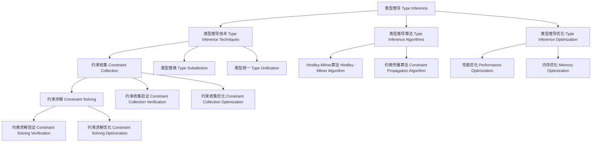

# 类型推导（Type Inference）in Haskell

## 目录 Table of Contents

1. [定义 Definition](#1-定义-definition)
2. [理论基础 Theoretical Foundation](#2-理论基础-theoretical-foundation)
3. [Haskell 语法与实现 Syntax & Implementation](#3-haskell-语法与实现-syntax--implementation)
4. [类型推导技术 Type Inference Techniques](#4-类型推导技术-type-inference-techniques)
5. [类型推导算法 Type Inference Algorithms](#5-类型推导算法-type-inference-algorithms)
6. [类型推导优化 Type Inference Optimization](#6-类型推导优化-type-inference-optimization)
7. [工程应用 Engineering Applications](#7-工程应用-engineering-applications)
8. [范畴论映射 Category Theory Mapping](#8-范畴论映射-category-theory-mapping)
9. [哲学思脉 Philosophical Context](#9-哲学思脉-philosophical-context)
10. [相关理论 Related Theories](#10-相关理论-related-theories)
11. [未来发展方向 Future Development](#11-未来发展方向-future-development)
12. [结构图 Structure Diagram](#12-结构图-structure-diagram)
13. [本地跳转 Local References](#13-本地跳转-local-references)
14. [参考文献 References](#14-参考文献-references)

## 1. 定义 Definition

- **中文**：类型推导是指在程序编译过程中，编译器自动推导表达式和函数的类型，而无需程序员显式指定类型注解的技术。类型推导通过分析程序的结构、类型约束和上下文信息，自动确定最通用的类型，从而提高编程效率和代码可读性。
- **English**: Type inference refers to the technique where the compiler automatically deduces the types of expressions and functions during program compilation without requiring explicit type annotations from programmers. Type inference automatically determines the most general types by analyzing program structure, type constraints, and contextual information, thereby improving programming efficiency and code readability.

## 2. 理论基础 Theoretical Foundation

### 2.1 类型理论 Type Theory

- **类型系统**：类型推导基于强类型系统，通过类型检查进行程序验证
- **类型安全**：通过类型系统保证程序的安全性和正确性
- **类型推导**：自动推导表达式的类型，减少显式类型注解

### 2.2 逻辑理论 Logic Theory

- **逻辑推理**：类型推导基于逻辑推理，通过类型约束推导类型
- **约束求解**：通过求解类型约束确定类型
- **逻辑完备性**：类型推导应该能够推导出所有可能的类型

### 2.3 算法理论 Algorithm Theory

- **推导算法**：类型推导使用特定的算法进行类型推导
- **算法复杂度**：类型推导算法的复杂度影响编译效率
- **算法正确性**：类型推导算法应该能够正确推导类型

## 3. Haskell 语法与实现 Syntax & Implementation

### 3.1 基本语法 Basic Syntax

```haskell
{-# LANGUAGE TypeFamilies, DataKinds, GADTs, TypeOperators #-}

-- 类型推导的基本语法
class TypeInference a where
  -- 类型推导
  typeInference :: Proxy a -> TypeInferenceResult a
  
  -- 推导验证
  inferenceVerification :: Proxy a -> InferenceVerificationResult a
  
  -- 推导优化
  inferenceOptimization :: Proxy a -> InferenceOptimizationResult a

-- 类型推导结果
data TypeInferenceResult a = TypeInferenceResult {
    inferenceType :: InferenceType a,
    inferenceMethod :: InferenceMethod a,
    inferenceResult :: InferenceResult a
}

-- 推导验证结果
data InferenceVerificationResult a = InferenceVerificationResult {
    verificationType :: VerificationType a,
    verificationMethod :: VerificationMethod a,
    verificationStatus :: VerificationStatus a
}

-- 推导优化结果
data InferenceOptimizationResult a = InferenceOptimizationResult {
    optimizationType :: OptimizationType a,
    optimizationMethod :: OptimizationMethod a,
    optimizationGain :: OptimizationGain a
}
```

### 3.2 高级实现 Advanced Implementation

```haskell
-- 高级类型推导实现
data AdvancedTypeInference a = AdvancedTypeInference {
    inferenceEngine :: InferenceEngine a,
    verificationEngine :: VerificationEngine a,
    optimizationEngine :: OptimizationEngine a
}

-- 推导引擎
data InferenceEngine a = InferenceEngine {
    inferenceAlgorithms :: [InferenceAlgorithm a],
    inferenceStrategies :: [InferenceStrategy a],
    inferenceHeuristics :: [InferenceHeuristic a]
}

-- 验证引擎
data VerificationEngine a = VerificationEngine {
    verificationAlgorithms :: [VerificationAlgorithm a],
    verificationStrategies :: [VerificationStrategy a],
    verificationHeuristics :: [VerificationHeuristic a]
}

-- 优化引擎
data OptimizationEngine a = OptimizationEngine {
    optimizationAlgorithms :: [OptimizationAlgorithm a],
    optimizationStrategies :: [OptimizationStrategy a],
    optimizationHeuristics :: [OptimizationHeuristic a]
}

-- 类型推导实例
instance TypeInference (Vector n a) where
  typeInference _ = VectorTypeInferenceResult
  inferenceVerification _ = VectorInferenceVerificationResult
  inferenceOptimization _ = VectorInferenceOptimizationResult
```

## 4. 类型推导技术 Type Inference Techniques

### 4.1 约束收集 Constraint Collection

```haskell
-- 约束收集技术
class ConstraintCollection (a :: *) where
  -- 约束收集
  constraintCollection :: Proxy a -> ConstraintCollectionResult a
  
  -- 约束收集验证
  constraintCollectionVerification :: Proxy a -> ConstraintCollectionVerificationResult a
  
  -- 约束收集优化
  constraintCollectionOptimization :: Proxy a -> ConstraintCollectionOptimizationResult a

-- 约束收集结果
data ConstraintCollectionResult a = ConstraintCollectionResult {
    constraintCollectionType :: ConstraintCollectionType a,
    constraintCollectionMethod :: ConstraintCollectionMethod a,
    constraintCollectionResult :: ConstraintCollectionResult a
}

-- 约束收集实例
instance ConstraintCollection (ConstraintType a) where
  constraintCollection _ = ConstraintTypeConstraintCollectionResult
  constraintCollectionVerification _ = ConstraintTypeConstraintCollectionVerificationResult
  constraintCollectionOptimization _ = ConstraintTypeConstraintCollectionOptimizationResult
```

### 4.2 约束求解 Constraint Solving

```haskell
-- 约束求解技术
class ConstraintSolving (a :: *) where
  -- 约束求解
  constraintSolving :: Proxy a -> ConstraintSolvingResult a
  
  -- 约束求解验证
  constraintSolvingVerification :: Proxy a -> ConstraintSolvingVerificationResult a
  
  -- 约束求解优化
  constraintSolvingOptimization :: Proxy a -> ConstraintSolvingOptimizationResult a

-- 约束求解结果
data ConstraintSolvingResult a = ConstraintSolvingResult {
    constraintSolvingType :: ConstraintSolvingType a,
    constraintSolvingMethod :: ConstraintSolvingMethod a,
    constraintSolvingResult :: ConstraintSolvingResult a
}

-- 约束求解实例
instance ConstraintSolving (ConstraintType a) where
  constraintSolving _ = ConstraintTypeConstraintSolvingResult
  constraintSolvingVerification _ = ConstraintTypeConstraintSolvingVerificationResult
  constraintSolvingOptimization _ = ConstraintTypeConstraintSolvingOptimizationResult
```

### 4.3 类型替换 Type Substitution

```haskell
-- 类型替换技术
class TypeSubstitution (a :: *) where
  -- 类型替换
  typeSubstitution :: Proxy a -> TypeSubstitutionResult a
  
  -- 类型替换验证
  typeSubstitutionVerification :: Proxy a -> TypeSubstitutionVerificationResult a
  
  -- 类型替换优化
  typeSubstitutionOptimization :: Proxy a -> TypeSubstitutionOptimizationResult a

-- 类型替换结果
data TypeSubstitutionResult a = TypeSubstitutionResult {
    typeSubstitutionType :: TypeSubstitutionType a,
    typeSubstitutionMethod :: TypeSubstitutionMethod a,
    typeSubstitutionResult :: TypeSubstitutionResult a
}

-- 类型替换实例
instance TypeSubstitution (SubstitutionType a) where
  typeSubstitution _ = SubstitutionTypeTypeSubstitutionResult
  typeSubstitutionVerification _ = SubstitutionTypeTypeSubstitutionVerificationResult
  typeSubstitutionOptimization _ = SubstitutionTypeTypeSubstitutionOptimizationResult
```

## 5. 类型推导算法 Type Inference Algorithms

### 5.1 Hindley-Milner算法 Hindley-Milner Algorithm

```haskell
-- Hindley-Milner算法
class HindleyMilnerAlgorithm (a :: *) where
  -- Hindley-Milner算法
  hindleyMilnerAlgorithm :: Proxy a -> HindleyMilnerAlgorithmResult a
  
  -- 算法验证
  algorithmVerification :: Proxy a -> AlgorithmVerificationResult a
  
  -- 算法优化
  algorithmOptimization :: Proxy a -> AlgorithmOptimizationResult a

-- Hindley-Milner算法结果
data HindleyMilnerAlgorithmResult a = HindleyMilnerAlgorithmResult {
    algorithmType :: AlgorithmType a,
    algorithmMethod :: AlgorithmMethod a,
    algorithmResult :: AlgorithmResult a
}

-- Hindley-Milner算法实例
instance HindleyMilnerAlgorithm (AlgorithmType a) where
  hindleyMilnerAlgorithm _ = AlgorithmTypeHindleyMilnerAlgorithmResult
  algorithmVerification _ = AlgorithmTypeAlgorithmVerificationResult
  algorithmOptimization _ = AlgorithmTypeAlgorithmOptimizationResult
```

### 5.2 约束传播算法 Constraint Propagation Algorithm

```haskell
-- 约束传播算法
class ConstraintPropagationAlgorithm (a :: *) where
  -- 约束传播算法
  constraintPropagationAlgorithm :: Proxy a -> ConstraintPropagationAlgorithmResult a
  
  -- 算法验证
  algorithmVerification :: Proxy a -> AlgorithmVerificationResult a
  
  -- 算法优化
  algorithmOptimization :: Proxy a -> AlgorithmOptimizationResult a

-- 约束传播算法结果
data ConstraintPropagationAlgorithmResult a = ConstraintPropagationAlgorithmResult {
    algorithmType :: AlgorithmType a,
    algorithmMethod :: AlgorithmMethod a,
    algorithmResult :: AlgorithmResult a
}

-- 约束传播算法实例
instance ConstraintPropagationAlgorithm (AlgorithmType a) where
  constraintPropagationAlgorithm _ = AlgorithmTypeConstraintPropagationAlgorithmResult
  algorithmVerification _ = AlgorithmTypeAlgorithmVerificationResult
  algorithmOptimization _ = AlgorithmTypeAlgorithmOptimizationResult
```

### 5.3 类型统一算法 Type Unification Algorithm

```haskell
-- 类型统一算法
class TypeUnificationAlgorithm (a :: *) where
  -- 类型统一算法
  typeUnificationAlgorithm :: Proxy a -> TypeUnificationAlgorithmResult a
  
  -- 算法验证
  algorithmVerification :: Proxy a -> AlgorithmVerificationResult a
  
  -- 算法优化
  algorithmOptimization :: Proxy a -> AlgorithmOptimizationResult a

-- 类型统一算法结果
data TypeUnificationAlgorithmResult a = TypeUnificationAlgorithmResult {
    algorithmType :: AlgorithmType a,
    algorithmMethod :: AlgorithmMethod a,
    algorithmResult :: AlgorithmResult a
}

-- 类型统一算法实例
instance TypeUnificationAlgorithm (AlgorithmType a) where
  typeUnificationAlgorithm _ = AlgorithmTypeTypeUnificationAlgorithmResult
  algorithmVerification _ = AlgorithmTypeAlgorithmVerificationResult
  algorithmOptimization _ = AlgorithmTypeAlgorithmOptimizationResult
```

## 6. 类型推导优化 Type Inference Optimization

### 6.1 性能优化 Performance Optimization

```haskell
-- 性能优化
class PerformanceOptimization (a :: *) where
  -- 性能优化
  performanceOptimization :: Proxy a -> PerformanceOptimizationResult a
  
  -- 性能分析
  performanceAnalysis :: Proxy a -> PerformanceAnalysisResult a
  
  -- 性能验证
  performanceVerification :: Proxy a -> PerformanceVerificationResult a

-- 性能优化结果
data PerformanceOptimizationResult a = PerformanceOptimizationResult {
    performanceOptimizationType :: PerformanceOptimizationType a,
    performanceOptimizationMethod :: PerformanceOptimizationMethod a,
    performanceOptimizationGain :: PerformanceOptimizationGain a
}

-- 性能优化实例
instance PerformanceOptimization (Vector n a) where
  performanceOptimization _ = VectorPerformanceOptimizationResult
  performanceAnalysis _ = VectorPerformanceAnalysisResult
  performanceVerification _ = VectorPerformanceVerificationResult
```

### 6.2 内存优化 Memory Optimization

```haskell
-- 内存优化
class MemoryOptimization (a :: *) where
  -- 内存优化
  memoryOptimization :: Proxy a -> MemoryOptimizationResult a
  
  -- 内存分析
  memoryAnalysis :: Proxy a -> MemoryAnalysisResult a
  
  -- 内存验证
  memoryVerification :: Proxy a -> MemoryVerificationResult a

-- 内存优化结果
data MemoryOptimizationResult a = MemoryOptimizationResult {
    memoryOptimizationType :: MemoryOptimizationType a,
    memoryOptimizationMethod :: MemoryOptimizationMethod a,
    memoryOptimizationGain :: MemoryOptimizationGain a
}

-- 内存优化实例
instance MemoryOptimization (MemoryType a) where
  memoryOptimization _ = MemoryTypeMemoryOptimizationResult
  memoryAnalysis _ = MemoryTypeMemoryAnalysisResult
  memoryVerification _ = MemoryTypeMemoryVerificationResult
```

### 6.3 算法优化 Algorithm Optimization

```haskell
-- 算法优化
class AlgorithmOptimization (a :: *) where
  -- 算法优化
  algorithmOptimization :: Proxy a -> AlgorithmOptimizationResult a
  
  -- 算法分析
  algorithmAnalysis :: Proxy a -> AlgorithmAnalysisResult a
  
  -- 算法验证
  algorithmVerification :: Proxy a -> AlgorithmVerificationResult a

-- 算法优化结果
data AlgorithmOptimizationResult a = AlgorithmOptimizationResult {
    algorithmOptimizationType :: AlgorithmOptimizationType a,
    algorithmOptimizationMethod :: AlgorithmOptimizationMethod a,
    algorithmOptimizationGain :: AlgorithmOptimizationGain a
}

-- 算法优化实例
instance AlgorithmOptimization (AlgorithmType a) where
  algorithmOptimization _ = AlgorithmTypeAlgorithmOptimizationResult
  algorithmAnalysis _ = AlgorithmTypeAlgorithmAnalysisResult
  algorithmVerification _ = AlgorithmTypeAlgorithmVerificationResult
```

## 7. 工程应用 Engineering Applications

### 7.1 编译器设计 Compiler Design

```haskell
-- 编译器设计
class CompilerDesign (a :: *) where
  -- 编译器设计
  compilerDesign :: Proxy a -> CompilerDesignResult a
  
  -- 设计验证
  designVerification :: Proxy a -> DesignVerificationResult a
  
  -- 设计优化
  designOptimization :: Proxy a -> DesignOptimizationResult a

-- 编译器设计结果
data CompilerDesignResult a = CompilerDesignResult {
    designType :: DesignType a,
    designMethod :: DesignMethod a,
    designResult :: DesignResult a
}

-- 编译器设计实例
instance CompilerDesign (CompilerType a) where
  compilerDesign _ = CompilerTypeCompilerDesignResult
  designVerification _ = CompilerTypeDesignVerificationResult
  designOptimization _ = CompilerTypeDesignOptimizationResult
```

### 7.2 类型检查器 Type Checker

```haskell
-- 类型检查器
class TypeChecker (a :: *) where
  -- 类型检查器
  typeChecker :: Proxy a -> TypeCheckerResult a
  
  -- 检查器验证
  checkerVerification :: Proxy a -> CheckerVerificationResult a
  
  -- 检查器优化
  checkerOptimization :: Proxy a -> CheckerOptimizationResult a

-- 类型检查器结果
data TypeCheckerResult a = TypeCheckerResult {
    checkerType :: CheckerType a,
    checkerMethod :: CheckerMethod a,
    checkerResult :: CheckerResult a
}

-- 类型检查器实例
instance TypeChecker (CheckerType a) where
  typeChecker _ = CheckerTypeTypeCheckerResult
  checkerVerification _ = CheckerTypeCheckerVerificationResult
  checkerOptimization _ = CheckerTypeCheckerOptimizationResult
```

### 7.3 开发工具 Development Tools

```haskell
-- 开发工具
class DevelopmentTools (a :: *) where
  -- 开发工具
  developmentTools :: Proxy a -> DevelopmentToolsResult a
  
  -- 工具验证
  toolVerification :: Proxy a -> ToolVerificationResult a
  
  -- 工具优化
  toolOptimization :: Proxy a -> ToolOptimizationResult a

-- 开发工具结果
data DevelopmentToolsResult a = DevelopmentToolsResult {
    toolType :: ToolType a,
    toolMethod :: ToolMethod a,
    toolResult :: ToolResult a
}

-- 开发工具实例
instance DevelopmentTools (ToolType a) where
  developmentTools _ = ToolTypeDevelopmentToolsResult
  toolVerification _ = ToolTypeToolVerificationResult
  toolOptimization _ = ToolTypeToolOptimizationResult
```

## 8. 范畴论映射 Category Theory Mapping

### 8.1 类型推导作为函子 Type Inference as Functor

- **类型推导可视为范畴中的函子，保持类型结构的同时进行类型推导**
- **Type inference can be viewed as a functor in category theory, preserving type structure while performing type inference**

```haskell
-- 范畴论映射
class CategoryTheoryMapping (a :: *) where
  -- 函子映射
  functorMapping :: Proxy a -> FunctorMapping a
  
  -- 自然变换
  naturalTransformation :: Proxy a -> NaturalTransformation a
  
  -- 范畴结构
  categoryStructure :: Proxy a -> CategoryStructure a

-- 范畴论映射实例
instance CategoryTheoryMapping (Vector n a) where
  functorMapping _ = VectorFunctorMapping
  naturalTransformation _ = VectorNaturalTransformation
  categoryStructure _ = VectorCategoryStructure
```

## 9. 哲学思脉 Philosophical Context

### 9.1 推导哲学 Inference Philosophy

- **推导的本质**：类型推导体现了推导的本质，通过逻辑推理确定类型
- **推导的方法**：通过约束收集、约束求解、类型替换等方法进行推导
- **推导的完备性**：推导应该能够推导出所有可能的类型

### 9.2 算法哲学 Algorithm Philosophy

- **算法的本质**：类型推导算法体现了算法的本质，通过特定步骤解决问题
- **算法的效率**：算法应该能够高效地推导类型
- **算法的正确性**：算法应该能够正确推导类型

### 9.3 优化哲学 Optimization Philosophy

- **优化的本质**：类型推导优化体现了优化的本质，通过改进提高效率
- **优化的方法**：通过性能优化、内存优化、算法优化等方法进行优化
- **优化的效果**：优化应该能够显著提高推导效率

## 10. 相关理论 Related Theories

### 10.1 类型理论 Type Theory

- **简单类型理论**：类型推导的基础理论
- **依赖类型理论**：类型推导的扩展理论
- **同伦类型理论**：类型推导的现代发展

### 10.2 逻辑理论 Logic Theory

- **约束逻辑**：类型推导的逻辑基础
- **统一逻辑**：类型推导的统一方法
- **推理逻辑**：类型推导的推理方法

### 10.3 算法理论 Algorithm Theory

- **推导算法**：类型推导的算法基础
- **优化算法**：类型推导的优化方法
- **复杂度理论**：类型推导的复杂度分析

## 11. 未来发展方向 Future Development

### 11.1 理论扩展 Theoretical Extensions

- **高阶类型推导**：支持更高阶的类型推导能力
- **概率类型推导**：支持不确定性的类型推导
- **量子类型推导**：支持量子计算的类型推导

### 11.2 技术改进 Technical Improvements

- **性能优化**：提高类型推导的效率
- **内存优化**：减少类型推导的内存占用
- **并行化**：支持类型推导的并行处理

### 11.3 应用扩展 Application Extensions

- **领域特定语言**：为特定领域定制类型推导系统
- **交互式开发**：支持交互式的类型推导调试
- **可视化工具**：提供类型推导过程的可视化

## 12. 结构图 Structure Diagram



## 13. 本地跳转 Local References

- [类型安全 Type Safety](../Type/01-Type-Safety.md)
- [类型类 Type Class](../Type/01-Type-Class.md)
- [类型族 Type Family](../Type/01-Type-Family.md)
- [类型级编程 Type-Level Programming](../Type-Level/01-Type-Level-Programming.md)
- [编译时推理 Compile-Time Reasoning](../Type-Level/01-Compile-Time-Reasoning.md)

## 14. 参考文献 References

### 14.1 学术资源 Academic Resources

- Wikipedia: [Type inference](https://en.wikipedia.org/wiki/Type_inference)
- Wikipedia: [Hindley–Milner type system](https://en.wikipedia.org/wiki/Hindley%E2%80%93Milner_type_system)
- The Stanford Encyclopedia of Philosophy: [Type Theory](https://plato.stanford.edu/entries/type-theory/)

### 14.2 技术文档 Technical Documentation

- [GHC User's Guide](https://ghc.gitlab.haskell.org/ghc/doc/users_guide/)
- [Haskell 2010 Language Report](https://www.haskell.org/onlinereport/haskell2010/)
- [Type Inference Documentation](https://gitlab.haskell.org/ghc/ghc/-/wikis/type-inference)

### 14.3 学术论文 Academic Papers

- "A Theory of Type Polymorphism in Programming" by Robin Milner
- "Type Inference with Simple Types" by J. Roger Hindley
- "Type Inference in Haskell" by Simon Peyton Jones

---

`# Type #Type-01 #Type-01-Type-Inference #TypeInference #HindleyMilner #TypeTheory #Haskell #TypeSystem`
