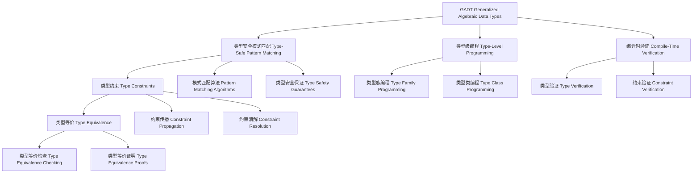

# GADT（Generalized Algebraic Data Types）in Haskell

## 目录 Table of Contents

1. [定义 Definition](#1-定义-definition)
2. [理论基础 Theoretical Foundation](#2-理论基础-theoretical-foundation)
3. [Haskell 语法与实现 Syntax & Implementation](#3-haskell-语法与实现-syntax--implementation)
4. GADT 技术 GADT Techniques](#4-gadt-技术-gadt-techniques)
5. [类型级编程 Type-Level Programming](#5-类型级编程-type-level-programming)
6. [编译时验证 Compile-Time Verification](#6-编译时验证-compile-time-verification)
7. [工程应用 Engineering Applications](#7-工程应用-engineering-applications)
8. [范畴论映射 Category Theory Mapping](#8-范畴论映射-category-theory-mapping)
9. [哲学思脉 Philosophical Context](#9-哲学思脉-philosophical-context)
10. [相关理论 Related Theories](#10-相关理论-related-theories)
11. [未来发展方向 Future Development](#11-未来发展方向-future-development)
12. [结构图 Structure Diagram](#12-结构图-structure-diagram)
13. [本地跳转 Local References](#13-本地跳转-local-references)
14. [参考文献 References](#14-参考文献-references)

## 1. 定义 Definition

- **中文**：GADT（广义代数数据类型）是Haskell中一种强大的类型系统扩展，允许构造函数返回不同的类型，从而在类型层面携带更多的信息。GADT通过类型参数和类型约束实现类型安全的模式匹配和编译时验证。
- **English**: GADT (Generalized Algebraic Data Types) is a powerful type system extension in Haskell that allows constructors to return different types, carrying more information at the type level. GADTs achieve type-safe pattern matching and compile-time verification through type parameters and type constraints.

## 2. 理论基础 Theoretical Foundation

### 2.1 代数数据类型 Algebraic Data Types

- **数据类型**：GADT基于代数数据类型，通过构造函数定义数据结构
- **类型安全**：通过类型系统保证数据结构的类型安全
- **模式匹配**：支持类型安全的模式匹配

### 2.2 类型理论 Type Theory

- **类型系统**：GADT基于强类型系统，通过类型检查进行程序验证
- **类型安全**：通过类型系统保证程序的安全性和正确性
- **类型推导**：自动推导表达式的类型，减少显式类型注解

### 2.3 广义类型 Generalized Types

- **类型参数**：GADT支持类型参数，允许构造函数返回不同的类型
- **类型约束**：通过类型约束实现类型安全的模式匹配
- **类型等价**：通过类型等价关系进行类型检查

## 3. Haskell 语法与实现 Syntax & Implementation

### 3.1 基本语法 Basic Syntax

```haskell
{-# LANGUAGE GADTs, DataKinds, KindSignatures, TypeOperators #-}

-- GADT的基本语法
data GADTExample a where
  -- 构造函数可以返回不同的类型
  Constructor1 :: Int -> GADTExample Int
  Constructor2 :: String -> GADTExample String
  Constructor3 :: Bool -> GADTExample Bool

-- 带类型参数的GADT
data TypedGADT (a :: *) where
  -- 类型参数影响构造函数的类型
  TypedConstructor :: a -> TypedGADT a

-- 带类型约束的GADT
data ConstrainedGADT (a :: *) where
  -- 类型约束确保类型安全
  ConstrainedConstructor :: Show a => a -> ConstrainedGADT a
```

### 3.2 高级实现 Advanced Implementation

```haskell
-- 高级GADT实现
data AdvancedGADT (a :: *) (b :: *) where
  -- 复杂的类型关系
  AdvancedConstructor1 :: a -> AdvancedGADT a b
  AdvancedConstructor2 :: b -> AdvancedGADT a b
  AdvancedConstructor3 :: (a, b) -> AdvancedGADT a b

-- 递归GADT
data RecursiveGADT (a :: *) where
  -- 递归定义
  RecursiveConstructor :: a -> RecursiveGADT a -> RecursiveGADT a
  EmptyConstructor :: RecursiveGADT a

-- 类型族GADT
data TypeFamilyGADT (a :: *) where
  -- 使用类型族
  TypeFamilyConstructor :: TypeFamily a -> TypeFamilyGADT a

-- 类型族定义
type family TypeFamily (a :: *) :: * where
  TypeFamily Int = Bool
  TypeFamily String = Int
  TypeFamily Bool = String
```

## 4. GADT 技术 GADT Techniques

### 4.1 类型安全模式匹配 Type-Safe Pattern Matching

```haskell
-- 类型安全模式匹配
class TypeSafePatternMatching (a :: *) where
  -- 类型安全模式匹配
  typeSafePatternMatching :: GADTExample a -> PatternMatchingResult a
  
  -- 类型安全验证
  typeSafeVerification :: GADTExample a -> VerificationResult a
  
  -- 类型安全优化
  typeSafeOptimization :: GADTExample a -> OptimizationResult a

-- 模式匹配结果
data PatternMatchingResult a = PatternMatchingResult {
    patternType :: PatternType a,
    patternMethod :: PatternMethod a,
    patternConclusion :: PatternConclusion a
}

-- 类型安全模式匹配实例
instance TypeSafePatternMatching Int where
  typeSafePatternMatching (Constructor1 i) = IntPatternMatchingResult i
  typeSafeVerification (Constructor1 i) = IntVerificationResult i
  typeSafeOptimization (Constructor1 i) = IntOptimizationResult i

instance TypeSafePatternMatching String where
  typeSafePatternMatching (Constructor2 s) = StringPatternMatchingResult s
  typeSafeVerification (Constructor2 s) = StringVerificationResult s
  typeSafeOptimization (Constructor2 s) = StringOptimizationResult s
```

### 4.2 类型约束 Type Constraints

```haskell
-- 类型约束技术
class TypeConstraintTechniques (a :: *) where
  -- 类型约束
  typeConstraint :: Proxy a -> TypeConstraintResult a
  
  -- 约束验证
  constraintVerification :: Proxy a -> ConstraintVerificationResult a
  
  -- 约束优化
  constraintOptimization :: Proxy a -> ConstraintOptimizationResult a

-- 类型约束结果
data TypeConstraintResult a = TypeConstraintResult {
    constraintType :: ConstraintType a,
    constraintMethod :: ConstraintMethod a,
    constraintConclusion :: ConstraintConclusion a
}

-- 类型约束技术实例
instance TypeConstraintTechniques (Show a) where
  typeConstraint _ = ShowTypeConstraintResult
  constraintVerification _ = ShowConstraintVerificationResult
  constraintOptimization _ = ShowConstraintOptimizationResult
```

### 4.3 类型等价 Type Equivalence

```haskell
-- 类型等价技术
class TypeEquivalenceTechniques (a :: *) (b :: *) where
  -- 类型等价
  typeEquivalence :: Proxy a -> Proxy b -> TypeEquivalenceResult a b
  
  -- 等价验证
  equivalenceVerification :: Proxy a -> Proxy b -> EquivalenceVerificationResult a b
  
  -- 等价优化
  equivalenceOptimization :: Proxy a -> Proxy b -> EquivalenceOptimizationResult a b

-- 类型等价结果
data TypeEquivalenceResult a b = TypeEquivalenceResult {
    equivalenceType :: EquivalenceType a b,
    equivalenceMethod :: EquivalenceMethod a b,
    equivalenceConclusion :: EquivalenceConclusion a b
}

-- 类型等价技术实例
instance TypeEquivalenceTechniques Int Int where
  typeEquivalence _ _ = IntIntTypeEquivalenceResult
  equivalenceVerification _ _ = IntIntEquivalenceVerificationResult
  equivalenceOptimization _ _ = IntIntEquivalenceOptimizationResult
```

## 5. 类型级编程 Type-Level Programming

### 5.1 类型族编程 Type Family Programming

```haskell
-- 类型族编程
class TypeFamilyProgramming (a :: k) where
  -- 类型族编程
  typeFamilyProgramming :: Proxy a -> TypeFamilyProgrammingResult a
  
  -- 类型族验证
  typeFamilyVerification :: Proxy a -> TypeFamilyVerificationResult a
  
  -- 类型族优化
  typeFamilyOptimization :: Proxy a -> TypeFamilyOptimizationResult a

-- 类型族编程结果
data TypeFamilyProgrammingResult (a :: k) = TypeFamilyProgrammingResult {
    typeFamilyType :: TypeFamilyType a,
    typeFamilyMethod :: TypeFamilyMethod a,
    typeFamilyConclusion :: TypeFamilyConclusion a
}

-- 类型族编程实例
instance TypeFamilyProgramming (Vector n a) where
  typeFamilyProgramming _ = VectorTypeFamilyProgrammingResult
  typeFamilyVerification _ = VectorTypeFamilyVerificationResult
  typeFamilyOptimization _ = VectorTypeFamilyOptimizationResult
```

### 5.2 类型类编程 Type Class Programming

```haskell
-- 类型类编程
class TypeClassProgramming (a :: *) where
  -- 类型类编程
  typeClassProgramming :: Proxy a -> TypeClassProgrammingResult a
  
  -- 类型类验证
  typeClassVerification :: Proxy a -> TypeClassVerificationResult a
  
  -- 类型类优化
  typeClassOptimization :: Proxy a -> TypeClassOptimizationResult a

-- 类型类编程结果
data TypeClassProgrammingResult a = TypeClassProgrammingResult {
    typeClassType :: TypeClassType a,
    typeClassMethod :: TypeClassMethod a,
    typeClassConclusion :: TypeClassConclusion a
}

-- 类型类编程实例
instance TypeClassProgramming (Show a) where
  typeClassProgramming _ = ShowTypeClassProgrammingResult
  typeClassVerification _ = ShowTypeClassVerificationResult
  typeClassOptimization _ = ShowTypeClassOptimizationResult
```

## 6. 编译时验证 Compile-Time Verification

### 6.1 类型验证 Type Verification

```haskell
-- 类型验证
class TypeVerification (a :: *) where
  -- 类型验证
  typeVerification :: Proxy a -> TypeVerificationResult a
  
  -- 类型检查
  typeChecking :: Proxy a -> TypeCheckingResult a
  
  -- 类型推理
  typeInference :: Proxy a -> TypeInferenceResult a

-- 类型验证结果
data TypeVerificationResult a = TypeVerificationResult {
    verificationType :: VerificationType a,
    verificationMethod :: VerificationMethod a,
    verificationStatus :: VerificationStatus a
}

-- 类型验证实例
instance TypeVerification (GADTExample a) where
  typeVerification _ = GADTExampleTypeVerificationResult
  typeChecking _ = GADTExampleTypeCheckingResult
  typeInference _ = GADTExampleTypeInferenceResult
```

### 6.2 约束验证 Constraint Verification

```haskell
-- 约束验证
class ConstraintVerification (c :: Constraint) where
  -- 约束验证
  constraintVerification :: Proxy c -> ConstraintVerificationResult c
  
  -- 约束检查
  constraintChecking :: Proxy c -> ConstraintCheckingResult c
  
  -- 约束推理
  constraintInference :: Proxy c -> ConstraintInferenceResult c

-- 约束验证结果
data ConstraintVerificationResult (c :: Constraint) = ConstraintVerificationResult {
    constraintVerificationType :: ConstraintVerificationType c,
    constraintVerificationMethod :: ConstraintVerificationMethod c,
    constraintVerificationStatus :: ConstraintVerificationStatus c
}

-- 约束验证实例
instance ConstraintVerification (Show a) where
  constraintVerification _ = ShowConstraintVerificationResult
  constraintChecking _ = ShowConstraintCheckingResult
  constraintInference _ = ShowConstraintInferenceResult
```

## 7. 工程应用 Engineering Applications

### 7.1 类型安全编程 Type-Safe Programming

```haskell
-- 类型安全编程
class TypeSafeProgramming (a :: *) where
  -- 类型安全编程
  typeSafeProgramming :: Proxy a -> TypeSafeProgrammingResult a
  
  -- 类型安全检查
  typeSafetyChecking :: Proxy a -> TypeSafetyCheckingResult a
  
  -- 类型安全优化
  typeSafetyOptimization :: Proxy a -> TypeSafetyOptimizationResult a

-- 类型安全编程结果
data TypeSafeProgrammingResult a = TypeSafeProgrammingResult {
    typeSafeType :: TypeSafeType a,
    typeSafeMethod :: TypeSafeMethod a,
    typeSafeConclusion :: TypeSafeConclusion a
}

-- 类型安全编程实例
instance TypeSafeProgramming (GADTExample a) where
  typeSafeProgramming _ = GADTExampleTypeSafeProgrammingResult
  typeSafetyChecking _ = GADTExampleTypeSafetyCheckingResult
  typeSafetyOptimization _ = GADTExampleTypeSafetyOptimizationResult
```

### 7.2 编译时验证 Compile-Time Verification

```haskell
-- 编译时验证
class CompileTimeVerification (a :: *) where
  -- 编译时验证
  compileTimeVerification :: Proxy a -> CompileTimeVerificationResult a
  
  -- 编译时分析
  compileTimeAnalysis :: Proxy a -> CompileTimeAnalysisResult a
  
  -- 编译时优化
  compileTimeOptimization :: Proxy a -> CompileTimeOptimizationResult a

-- 编译时验证结果
data CompileTimeVerificationResult a = CompileTimeVerificationResult {
    verificationType :: VerificationType a,
    verificationMethod :: VerificationMethod a,
    verificationStatus :: VerificationStatus a
}

-- 编译时验证实例
instance CompileTimeVerification (GADTExample a) where
  compileTimeVerification _ = GADTExampleCompileTimeVerificationResult
  compileTimeAnalysis _ = GADTExampleCompileTimeAnalysisResult
  compileTimeOptimization _ = GADTExampleCompileTimeOptimizationResult
```

## 8. 范畴论映射 Category Theory Mapping

### 8.1 GADT作为函子 GADT as Functor

- **GADT可视为范畴中的函子，保持类型结构的同时进行类型转换**
- **GADTs can be viewed as functors in category theory, preserving type structure while performing type transformations**

```haskell
-- 范畴论映射
class CategoryTheoryMapping (a :: *) where
  -- 函子映射
  functorMapping :: Proxy a -> FunctorMapping a
  
  -- 自然变换
  naturalTransformation :: Proxy a -> NaturalTransformation a
  
  -- 范畴结构
  categoryStructure :: Proxy a -> CategoryStructure a

-- 范畴论映射实例
instance CategoryTheoryMapping (GADTExample a) where
  functorMapping _ = GADTExampleFunctorMapping
  naturalTransformation _ = GADTExampleNaturalTransformation
  categoryStructure _ = GADTExampleCategoryStructure
```

## 9. 哲学思脉 Philosophical Context

### 9.1 类型哲学 Type Philosophy

- **类型的本质**：GADT体现了类型的本质，通过类型系统保证程序安全
- **类型的安全**：类型系统通过类型检查保证程序的安全性和正确性
- **类型的表达**：类型系统应该能够表达丰富的程序性质

### 9.2 安全哲学 Safety Philosophy

- **安全的本质**：类型安全是程序安全的基础
- **安全的方法**：通过类型系统、类型检查等方法保证程序安全
- **安全的边界**：类型安全定义了程序安全的边界

### 9.3 验证哲学 Verification Philosophy

- **验证的本质**：验证是确保程序正确性的过程
- **验证的方法**：通过类型检查、约束检查等方法进行验证
- **验证的可靠性**：验证结果应该可靠地反映程序的正确性

## 10. 相关理论 Related Theories

### 10.1 类型理论 Type Theory

- **简单类型理论**：GADT的基础理论
- **依赖类型理论**：GADT的扩展理论
- **同伦类型理论**：GADT的现代发展

### 10.2 逻辑理论 Logic Theory

- **命题逻辑**：GADT的逻辑基础
- **构造性逻辑**：GADT的证明方法
- **高阶逻辑**：GADT的表达能力

### 10.3 计算理论 Computation Theory

- **λ演算**：GADT的计算模型
- **图灵机理论**：GADT的计算能力
- **复杂性理论**：GADT的计算复杂度

## 11. 未来发展方向 Future Development

### 11.1 理论扩展 Theoretical Extensions

- **高阶GADT**：支持更高阶的GADT能力
- **概率GADT**：支持不确定性的GADT
- **量子GADT**：支持量子计算的GADT

### 11.2 技术改进 Technical Improvements

- **性能优化**：提高GADT的效率
- **内存优化**：减少GADT的内存占用
- **并行化**：支持GADT的并行处理

### 11.3 应用扩展 Application Extensions

- **领域特定语言**：为特定领域定制GADT系统
- **交互式开发**：支持交互式的GADT调试
- **可视化工具**：提供GADT过程的可视化

## 12. 结构图 Structure Diagram



## 13. 本地跳转 Local References

- [依赖类型理论 Dependent Type Theory](../Type/01-Dependent-Type-Theory.md)
- [类型族 Type Family](../Type/01-Type-Family.md)
- [类型类 Type Class](../Type/01-Type-Class.md)
- [类型安全 Type Safety](../Type-Level/01-Type-Safety.md)
- [类型级编程 Type-Level Programming](../Type-Level/01-Type-Level-Programming.md)

## 14. 参考文献 References

### 14.1 学术资源 Academic Resources

- Wikipedia: [Generalized algebraic data type](https://en.wikipedia.org/wiki/Generalized_algebraic_data_type)
- Wikipedia: [Algebraic data type](https://en.wikipedia.org/wiki/Algebraic_data_type)
- The Stanford Encyclopedia of Philosophy: [Type Theory](https://plato.stanford.edu/entries/type-theory/)

### 14.2 技术文档 Technical Documentation

- [GHC User's Guide](https://ghc.gitlab.haskell.org/ghc/doc/users_guide/)
- [Haskell 2010 Language Report](https://www.haskell.org/onlinereport/haskell2010/)
- [GADTs Documentation](https://gitlab.haskell.org/ghc/ghc/-/wikis/gadt)

### 14.3 学术论文 Academic Papers

- "GADTs Meet Their Match" by Simon Peyton Jones
- "Type Families with Class" by Simon Peyton Jones
- "Fun with Type Functions" by Oleg Kiselyov

---

`# Type #Type-01 #Type-01-GADT #GADT #GeneralizedAlgebraicDataTypes #Haskell #TypeTheory #TypeSafeProgramming`
