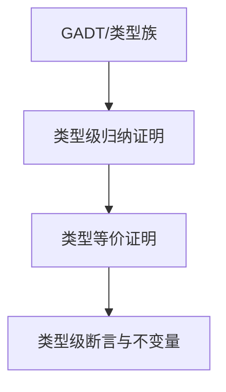

# 01. 类型级证明在Haskell中的理论与实践（Type-Level Proof in Haskell）

## 目录 Table of Contents

- 1.1 类型级证明简介
- 1.2 语法与语义
- 1.3 结构映射与范畴论建模
- 1.4 形式化证明与论证
- 1.5 多表征与本地跳转
- 1.6 历史与发展
- 1.7 Haskell 相关特性
- 1.8 应用
- 1.9 例子
- 1.10 相关理论
- 1.11 参考文献
- 1.12 定义-性质-关系-证明对齐（Skeleton）
- 1.13 课程与行业案例对齐

> **中英双语核心定义 | Bilingual Core Definitions**

## 1.1 类型级证明简介（Introduction to Type-Level Proof）

- **定义（Definition）**：
  - **中文**：类型级证明是指在类型系统层面对类型属性、约束和不变量进行形式化证明。Haskell通过GADT、类型族、类型等价、依赖类型等机制支持类型级归纳、等价和安全性证明。
  - **English**: Type-level proof refers to the formal verification of type properties, constraints, and invariants at the type system level. Haskell supports type-level induction, equality, and safety proofs via GADTs, type families, type equality, and dependent types.

- **Wiki风格国际化解释（Wiki-style Explanation）**：
  - 类型级证明是类型安全、依赖类型和编译期验证的基础，广泛用于不可变数据结构、类型安全API和形式化方法。
  - Type-level proof is the foundation of type safety, dependent types, and compile-time verification, widely used in immutable data structures, type-safe APIs, and formal methods.

## 1.2 Haskell中的类型级证明语法与语义（Syntax and Semantics of Type-Level Proof in Haskell）

- **GADT与类型级归纳证明**

```haskell
{-# LANGUAGE GADTs, DataKinds, TypeFamilies #-}

data Nat = Z | S Nat

data SNat n where
  SZ :: SNat 'Z
  SS :: SNat n -> SNat ('S n)

-- 证明 n + 0 = n
plusZero :: SNat n -> (n ~ Add n 'Z) => ()
plusZero _ = ()

type family Add n m where
  Add 'Z     m = m
  Add ('S n) m = 'S (Add n m)
```

- **类型等价与证明**

```haskell
data EqProof a b where
  Refl :: EqProof a a

symm :: EqProof a b -> EqProof b a
symm Refl = Refl
```

- **类型级断言与不变量**

```haskell
safeHead :: (n ~ 'S m) => Vec a n -> a
safeHead (VCons x _) = x
```

## 1.3 结构映射与范畴论建模（Mapping and Category-Theoretic Modeling）

| 概念 | Haskell实现 | 代码示例 | 中文解释 |
|------|-------------|----------|----------|
| 类型级归纳 | GADT/类型族 | `plusZero :: SNat n -> (n ~ Add n 'Z) => ()` | 类型级归纳证明 |
| 类型等价证明 | GADT | `EqProof a b` | 类型等价归纳 |
| 类型级断言 | 类型约束 | `(n ~ 'S m) => ...` | 类型级不变量 |

## 1.4 形式化证明与论证（Formal Proofs & Reasoning）

- **类型级归纳证明**
  - **中文**：证明类型级递归定义的性质（如加法结合律、零元律等）。
  - **English**: Prove properties of type-level recursive definitions (e.g., associativity, identity law for addition).

- **类型等价关系证明**
  - **中文**：证明类型等价关系满足自反性、对称性、传递性。
  - **English**: Prove that type equality is reflexive, symmetric, and transitive.

## 1.5 多表征与本地跳转（Multi-representation & Local Reference）

- **类型级证明结构图（Type-Level Proof Structure Diagram）**



- **相关主题跳转**：
  - [类型级编程 Type-Level Programming](./01-Type-Level-Programming.md)
  - [类型等价 Type Equality](./01-Type-Equality.md)
  - [依赖类型 Dependent Type](./01-Dependent-Type.md)

---

## 1.6 历史与发展 History & Development

- **中文**：类型级证明思想起源于类型理论、归纳法和形式化验证。Haskell自GADT、类型族、DataKinds等特性引入后，成为类型级归纳、等价和安全性证明的主流平台。GHC不断扩展类型级证明相关特性，如Singletons、TypeLits、QuantifiedConstraints、Dependent Types等。
- **English**: The idea of type-level proof originates from type theory, induction, and formal verification. With the introduction of GADTs, type families, and DataKinds, Haskell has become a mainstream platform for type-level induction, equality, and safety proofs. GHC has continuously extended type-level proof features, such as Singletons, TypeLits, QuantifiedConstraints, and Dependent Types.

## 1.7 Haskell 相关特性 Haskell Features

### 经典特性 Classic Features

- GADTs、类型族、类型等价、类型级归纳、类型级断言。
- GADTs, type families, type equality, type-level induction, type-level assertions.

### 最新特性 Latest Features

- **Singletons**：类型与值的单例化，桥接类型级与值级。
- **TypeLits**：类型级自然数与符号。
- **QuantifiedConstraints/RankNTypes**：高阶类型与约束。
- **Dependent Types（依赖类型）**：GHC 9.x实验性支持。
- **GHC 2021/2022**：标准化更多类型级证明相关扩展。

- **English**:
  - Singletons: Singletonization of types and values, bridging type and value levels.
  - TypeLits: Type-level naturals and symbols.
  - QuantifiedConstraints/RankNTypes: Higher-order types and constraints.
  - Dependent Types: Experimental in GHC 9.x.
  - GHC 2021/2022: Standardizes more type-level proof extensions.

## 1.8 应用 Applications

- **中文**：不可变数据结构、类型安全API、编译期验证、泛型编程、形式化验证、类型安全DSL等。
- **English**: Immutable data structures, type-safe APIs, compile-time verification, generic programming, formal verification, type-safe DSLs, etc.

## 1.9 例子 Examples

```haskell
{-# LANGUAGE GADTs, DataKinds, TypeFamilies, TypeOperators #-}
data Nat = Z | S Nat
data SNat n where
  SZ :: SNat 'Z
  SS :: SNat n -> SNat ('S n)

type family Add n m where
  Add 'Z     m = m
  Add ('S n) m = 'S (Add n m)

-- 类型级归纳证明：n + 0 = n
plusZero :: SNat n -> (n ~ Add n 'Z) => ()
plusZero _ = ()

-- 类型等价证明
 data EqProof a b where
   Refl :: EqProof a a

symm :: EqProof a b -> EqProof b a
symm Refl = Refl
```

## 1.10 相关理论 Related Theories

- 类型级编程（Type-level Programming）
- 依赖类型理论（Dependent Type Theory）
- 形式化验证（Formal Verification）
- 类型系统理论（Type System Theory）

## 1.11 参考文献 References

- [Wikipedia: Type-level proof](https://en.wikipedia.org/wiki/Type-level_programming#Proofs)
- [GHC User's Guide](https://downloads.haskell.org/ghc/latest/docs/html/users_guide/)
- [Types and Programming Languages, Benjamin C. Pierce]
- [Learn You a Haskell for Great Good!](http://learnyouahaskell.com/)

> 本文档为类型级证明在Haskell中的中英双语、Haskell语义模型与形式化证明规范化输出，适合学术研究与工程实践参考。

## 1.12 定义-性质-关系-证明对齐（Skeleton）

- 定义：类型等价、归纳、断言与不变量。
- 性质：自反/对称/传递、归纳可达、保形变换。
- 关系：与归纳/验证/依赖类型的互补。
- 证明：等价证明模式与约束求解器结合（GHC/Lean/Coq）。

## 1.13 课程与行业案例对齐 Courses & Industry Alignment

- 课程：证明论/类型理论课程的程序即证明（Curry-Howard）。
- 行业：不可变数据结构律、API 安全合约的类型级证据。

参考模板：参见 `../Haskell_Rust_Lean/course_case_alignment_template.md`
