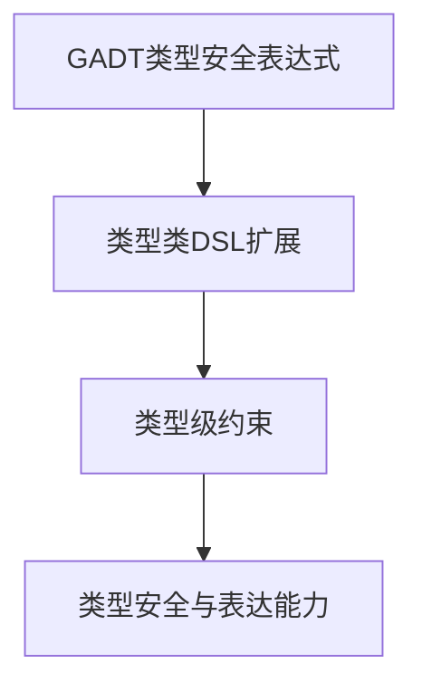

# 01. 类型驱动DSL在Haskell中的理论与实践（Type-Driven DSL in Haskell）

## 目录 Table of Contents

- 1.1 类型驱动DSL简介
- 1.2 语法与语义
- 1.3 范畴论建模与结构映射
- 1.4 形式化证明与论证
- 1.5 多表征与本地跳转
- 1.6 历史与发展
- 1.7 Haskell 相关特性
- 1.8 应用
- 1.9 例子
- 1.10 相关理论
- 1.11 参考文献

> **中英双语核心定义 | Bilingual Core Definitions**

## 1.1 类型驱动DSL简介（Introduction to Type-Driven DSL）

- **定义（Definition）**：
  - **中文**：类型驱动DSL是指利用类型系统进行语法、语义和约束建模的领域特定语言。Haskell通过GADT、类型类、类型级编程等机制支持类型安全的DSL设计。
  - **English**: Type-driven DSL refers to domain-specific languages whose syntax, semantics, and constraints are modeled by the type system. Haskell supports type-safe DSL design via GADTs, type classes, type-level programming, etc.

- **Wiki风格国际化解释（Wiki-style Explanation）**：
  - 类型驱动DSL极大提升了Haskell在嵌入式语言、配置、验证等领域的表达力和安全性。
  - Type-driven DSLs greatly enhance Haskell's expressiveness and safety in embedded languages, configuration, verification, and more.

## 1.2 Haskell中的类型驱动DSL语法与语义（Syntax and Semantics of Type-Driven DSL in Haskell）

- **GADT定义类型安全DSL**

```haskell
{-# LANGUAGE GADTs #-}

data Expr a where
  LitInt  :: Int  -> Expr Int
  LitBool :: Bool -> Expr Bool
  Add     :: Expr Int -> Expr Int -> Expr Int
  If      :: Expr Bool -> Expr a -> Expr a -> Expr a

-- 类型安全的DSL解释器
eval :: Expr a -> a
eval (LitInt n)    = n
eval (LitBool b)   = b
eval (Add e1 e2)   = eval e1 + eval e2
eval (If c t f)    = if eval c then eval t else eval f
```

- **类型类与DSL扩展**

```haskell
class DSLExpr e where
  litInt  :: Int -> e Int
  litBool :: Bool -> e Bool
  add     :: e Int -> e Int -> e Int
  if_     :: e Bool -> e a -> e a -> e a
```

- **类型级约束与DSL安全性**

```haskell
safeHead :: (n ~ 'S m) => Vec a n -> a
safeHead (VCons x _) = x
```

## 1.3 范畴论建模与结构映射（Category-Theoretic Modeling and Mapping）

- **类型驱动DSL与范畴论关系**
  - 类型驱动DSL可视为范畴中的对象（类型）与态射（操作）组合的DSL范畴。

| 概念 | Haskell实现 | 代码示例 | 中文解释 |
|------|-------------|----------|----------|
| 类型安全DSL | GADT | `data Expr a where ...` | 类型安全表达式 |
| DSL扩展 | 类型类 | `class DSLExpr e where ...` | 可扩展接口 |
| 类型级约束 | 类型安全 | `(n ~ 'S m) => ...` | 静态约束 |

## 1.4 形式化证明与论证（Formal Proofs & Reasoning）

- **DSL类型安全性证明**
  - **中文**：证明类型驱动DSL下的所有表达式和操作在类型系统下是安全的。
  - **English**: Prove that all expressions and operations in type-driven DSLs are safe under the type system.

- **DSL表达能力证明**
  - **中文**：证明类型驱动DSL可表达复杂的领域约束和语义。
  - **English**: Prove that type-driven DSLs can express complex domain constraints and semantics.

## 1.5 多表征与本地跳转（Multi-representation & Local Reference）

- **类型驱动DSL结构图（Type-Driven DSL Structure Diagram）**



- **相关主题跳转**：
  - [类型级编程 Type-Level Programming](./01-Type-Level-Programming.md)
  - [GADT in Haskell](./01-GADT.md)
  - [类型安全 Type Safety](./01-Type-Safety.md)

---

## 1.6 历史与发展 History & Development

- **中文**：类型驱动DSL的思想源自类型理论、范畴论和函数式编程。Haskell自GADT、类型类、类型级编程等特性引入后，成为类型驱动DSL设计的主流平台。GHC不断扩展类型级能力，如Type Families、Dependent Types、Singletons等，极大提升了DSL的表达力和安全性。
- **English**: The idea of type-driven DSLs originates from type theory, category theory, and functional programming. With the introduction of GADTs, type classes, and type-level programming, Haskell has become a mainstream platform for type-driven DSL design. GHC has continuously extended type-level capabilities, such as Type Families, Dependent Types, and Singletons, greatly enhancing the expressiveness and safety of DSLs.

## 1.7 Haskell 相关特性 Haskell Features

### 经典特性 Classic Features

- GADTs、类型类、类型推断、类型安全解释器、类型级约束。
- GADTs, type classes, type inference, type-safe interpreters, type-level constraints.

### 最新特性 Latest Features

- **Type Families/Type-level Programming**：类型级DSL、类型级归纳与验证。
- **Dependent Types（依赖类型）**：GHC 9.x实验性支持，类型依赖于DSL结构。
- **Singletons**：类型与值的单例化，支持类型安全的DSL操作。
- **QuantifiedConstraints/RankNTypes**：高阶类型与约束。
- **GHC 2021/2022**：标准化更多类型级DSL相关扩展。

- **English**:
  - Type Families/Type-level Programming: Type-level DSLs, type-level induction and verification.
  - Dependent Types: Experimental in GHC 9.x, types depending on DSL structure.
  - Singletons: Singletonization of types and values, supporting type-safe DSL operations.
  - QuantifiedConstraints/RankNTypes: Higher-order types and constraints.
  - GHC 2021/2022: Standardizes more type-level DSL extensions.

## 1.8 应用 Applications

- **中文**：嵌入式DSL、配置语言、形式化验证、编译器前端、不可变数据结构、类型安全API等。
- **English**: Embedded DSLs, configuration languages, formal verification, compiler frontends, immutable data structures, type-safe APIs, etc.

## 1.9 例子 Examples

```haskell
{-# LANGUAGE GADTs, TypeFamilies, DataKinds, KindSignatures #-}
data Nat = Z | S Nat
data Vec a n where
  VNil  :: Vec a 'Z
  VCons :: a -> Vec a n -> Vec a ('S n)

safeHead :: Vec a ('S n) -> a
safeHead (VCons x _) = x

-- 类型级DSL扩展
class DSLExpr e where
  litInt  :: Int -> e Int
  add     :: e Int -> e Int -> e Int
  if_     :: e Bool -> e a -> e a -> e a
```

## 1.10 相关理论 Related Theories

- 类型理论（Type Theory）
- 范畴论（Category Theory）
- 类型级编程（Type-level Programming）
- 依赖类型理论（Dependent Type Theory）
- 形式化验证（Formal Verification）

## 1.11 参考文献 References

- [Wikipedia: Domain-specific language](https://en.wikipedia.org/wiki/Domain-specific_language)
- [GHC User's Guide](https://downloads.haskell.org/ghc/latest/docs/html/users_guide/)
- [Types and Programming Languages, Benjamin C. Pierce]
- [Learn You a Haskell for Great Good!](http://learnyouahaskell.com/)

> 本文档为类型驱动DSL在Haskell中的中英双语、Haskell语义模型与形式化证明规范化输出，适合学术研究与工程实践参考。
