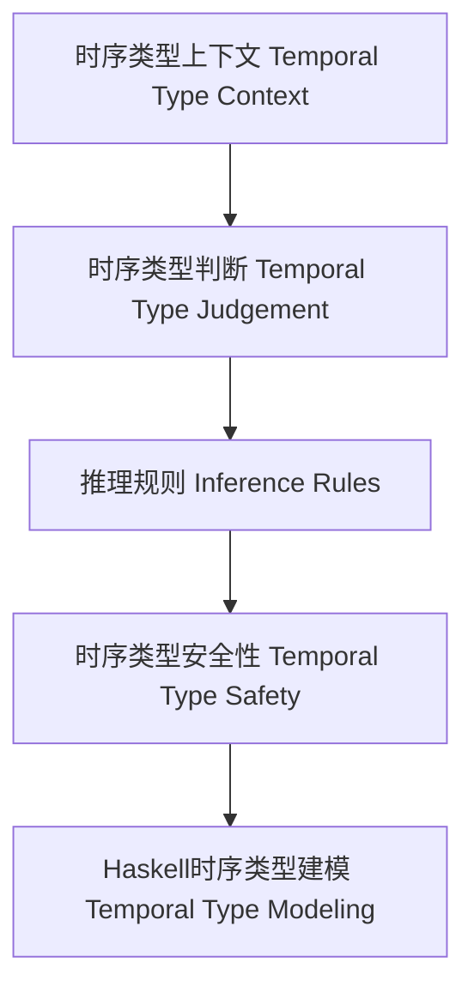

# 时序类型理论与Haskell实现（Temporal Type Theory in Haskell）

## 目录 Table of Contents

- 定义 Definition
- 时序类型系统核心概念 Core Concepts
- Haskell实现与现代语言对比 Haskell & Modern Language Comparison
- 结构图 Structure Diagram
- 形式化论证与证明 Formal Reasoning & Proofs
- 工程应用 Engineering Application
- 本地跳转 Local References
- 历史与发展 History & Development
- Haskell 相关特性 Haskell Features
- 应用 Applications
- 例子 Examples
- 相关理论 Related Theories
- 参考文献 References

## 定义 Definition

- **中文**：时序类型理论是一种将时间维度引入类型系统的理论，能够描述和验证程序在不同时间点的行为和属性，广泛用于实时系统、嵌入式系统和时序逻辑建模。Haskell可通过类型标记、GADT等方式表达时序约束。
- **English**: Temporal type theory is a type system that incorporates the time dimension, enabling the description and verification of program behaviors and properties at different time points. Haskell can express temporal constraints via type tags, GADTs, etc.

## 时序类型系统核心概念 Core Concepts

- **时序类型上下文（Temporal Type Context）**：变量带有类型和时间信息。
- **时序类型构造（Temporal Type Constructors）**：可能性类型（eventually）、必然性类型（always）、直到类型（until）等。
- **时序推理规则（Inference Rules）**：变量、时序抽象、时序应用、可能性/必然性引入。

## Haskell实现与现代语言对比 Haskell & Modern Language Comparison

- Haskell：GADT、类型标记、类型级时间建模。
- TLA+、Coq、Idris：原生支持时序逻辑或依赖类型。
- Rust/Scala/OCaml：无原生时序类型，但可通过类型系统扩展模拟。

### Haskell 时序类型示例

```haskell
data Time = T0 | T1 | T2 deriving (Eq, Ord, Show)

data Temporal a = At Time a | Always a | Eventually a

atT1 :: Temporal Int -> Maybe Int
atT1 (At T1 x) = Just x
atT1 _ = Nothing
```

## 结构图 Structure Diagram



## 形式化论证与证明 Formal Reasoning & Proofs

- **时序类型保持性（Preservation）**：归约后时序类型不变。
- **进展性（Progress）**：类型正确的表达式要么是值，要么可归约。
- **时序约束证明**：操作在指定时间点或区间内执行。

### 证明示例 Proof Example

- 对每个推理规则，证明时序类型在归约后保持不变。
- 对每个语法构造，证明要么是值，要么可以继续归约。

## 工程应用 Engineering Application

- 实时系统、嵌入式系统、时序逻辑建模、编译期时序约束验证。

## 本地跳转 Local References

- [类型理论基础 Type Theory Foundation](../01-Type-Theory/01-Type-Theory-Foundation.md)
- [线性类型理论 Linear Type Theory](../02-Linear-Type-Theory/01-Linear-Type-Theory-Foundation.md)
- [仿射类型理论 Affine Type Theory](../03-Affine-Type-Theory/01-Affine-Type-Theory-Foundation.md)
- [类型安全 Type Safety](../14-Type-Safety/01-Type-Safety-in-Haskell.md)

---

## 历史与发展 History & Development

- **中文**：时序类型理论源自时序逻辑和实时系统建模，20世纪后期发展起来，广泛应用于嵌入式、实时和分布式系统。Haskell等函数式语言通过类型系统扩展和GADT等机制支持时序建模。
- **English**: Temporal type theory originated from temporal logic and real-time system modeling, developed in the late 20th century, and is widely used in embedded, real-time, and distributed systems. Functional languages like Haskell support temporal modeling via type system extensions and GADTs.

## Haskell 相关特性 Haskell Features

### 经典特性 Classic Features

- GADTs、类型类、不可变数据结构、类型安全的状态建模等。
- GADTs, type classes, immutable data structures, type-safe state modeling, etc.

### 最新特性 Latest Features

- **Type-level Programming**：类型级时序建模与约束。
- **Dependent Types**：实验性支持，类型依赖于时间参数。
- **GHC 2021/2022**：标准化时序相关类型系统扩展。

- **English**:
  - Type-level programming: Type-level temporal modeling and constraints.
  - Dependent Types: Experimental support, types depending on time parameters.
  - GHC 2021/2022: Standardizes temporal type system extensions.

## 应用 Applications

- **中文**：实时系统、嵌入式系统、分布式系统、时序逻辑建模、类型安全的时序API等。
- **English**: Real-time systems, embedded systems, distributed systems, temporal logic modeling, type-safe temporal APIs, etc.

## 例子 Examples

```haskell
data Time = T0 | T1 | T2 deriving (Eq, Ord, Show)
data Temporal a = At Time a | Always a | Eventually a

-- 在T1时刻执行操作
temporalAtT1 :: Temporal Int -> Maybe Int
temporalAtT1 (At T1 x) = Just x
temporalAtT1 _ = Nothing
```

## 相关理论 Related Theories

- 时序逻辑（Temporal Logic）
- 实时系统理论（Real-Time System Theory）
- 状态机建模（State Machine Modeling）
- 形式化验证（Formal Verification）

## 参考文献 References

- [Wikipedia: Temporal Logic](https://en.wikipedia.org/wiki/Temporal_logic)
- [GHC User's Guide](https://downloads.haskell.org/ghc/latest/docs/html/users_guide/)
- [Types and Programming Languages, Benjamin C. Pierce]
- [Learn You a Haskell for Great Good!](http://learnyouahaskell.com/)
