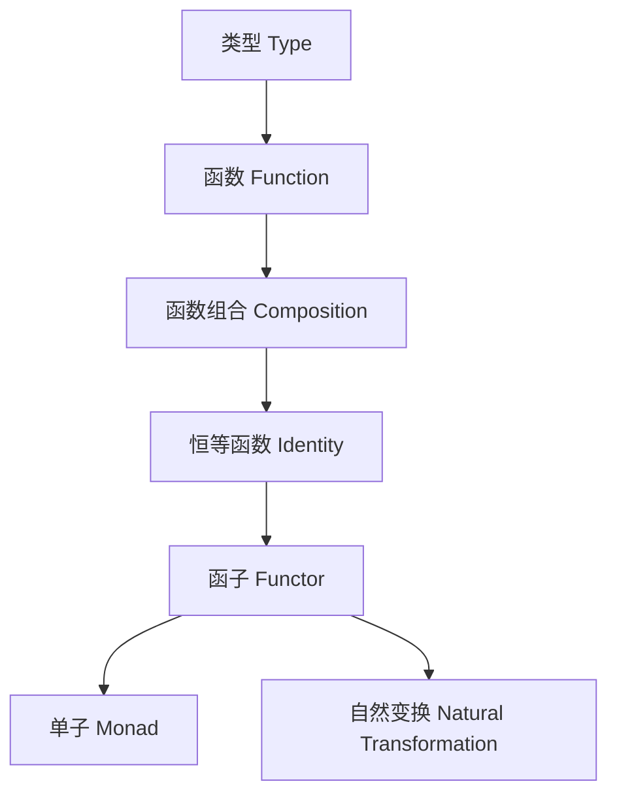

# 范畴论与Haskell类型系统（Category Theory and Haskell Type System）

## 定义 Definition

- **中文**：范畴论是一门研究对象与态射（映射）及其组合规律的数学理论。Haskell的类型系统可被视为一个范畴，其中类型为对象，函数为态射。
- **English**: Category theory is a mathematical theory that studies objects, morphisms (arrows), and their composition. The type system of Haskell can be viewed as a category, where types are objects and functions are morphisms.

## 范畴论核心概念 Core Concepts

- **对象（Object）**：类型（Type）
- **态射（Morphism）**：函数（Function）
- **组合（Composition）**：函数组合（Function composition）
- **恒等态射（Identity）**：恒等函数（Identity function）
- **函子（Functor）**、**单子（Monad）**、**自然变换（Natural Transformation）**

## Haskell类型系统映射 Haskell Type System Mapping

- 类型 <-> 对象，函数 <-> 态射，函数组合 <-> 组合，id <-> 恒等态射
- Haskell Functor/Monad/Applicative/自然变换等类型类与范畴论结构一一对应

### Haskell 代码示例

```haskell
class Functor f where
  fmap :: (a -> b) -> f a -> f b

class Monad m where
  (>>=)  :: m a -> (a -> m b) -> m b
  return :: a -> m a
```

## 结构图 Structure Diagram



## 形式化论证与证明 Formal Reasoning & Proofs

- **范畴公理在Haskell类型系统中的体现**：结合律、恒等律
- **函子/单子/自然变换公理证明**：fmap id = id, fmap (g . f) = fmap g . fmap f, monad三定律等

### 证明示例 Proof Example

- 证明Haskell中函数组合满足结合律，id为恒等元
- 证明Functor/Monad/自然变换的公理在Haskell类型系统下成立

## 工程应用 Engineering Application

- 类型安全抽象、泛型库、DSL、函数式设计模式、跨语言类型系统建模

## 本地跳转 Local References

- [类型理论基础 Type Theory Foundation](../01-Type-Theory/01-Type-Theory-Foundation.md)
- [类型推断与多态 Type Inference and Polymorphism](../06-Type-Inference-and-Polymorphism/01-Type-Inference-and-Polymorphism-in-Haskell.md)
- [类型安全 Type Safety](../14-Type-Safety/01-Type-Safety-in-Haskell.md)
- [函子 Functor](../05-Category-Theory/02-Functor/01-Functor-and-Haskell.md)
- [单子 Monad](../05-Category-Theory/03-Monad/01-Monad-and-Haskell.md)
- [自然变换 Natural Transformation](../05-Category-Theory/04-Natural-Transformation/01-Natural-Transformation-and-Haskell.md)

---

## 历史与发展 History & Development

- **中文**：范畴论起源于20世纪40年代，由Eilenberg和Mac Lane提出，最初用于代数拓扑，后广泛影响数学、逻辑和计算机科学。Haskell自1990年代诞生以来，其类型系统不断吸收范畴论思想，推动了类型类、Functor、Monad等概念的普及。
- **English**: Category theory originated in the 1940s, introduced by Eilenberg and Mac Lane for algebraic topology, and later influenced mathematics, logic, and computer science. Since the 1990s, Haskell's type system has incorporated category theory concepts, popularizing type classes, Functors, Monads, etc.

## Haskell 相关特性 Haskell Features

### 经典特性 Classic Features

- 类型类（Type Classes）、Functor、Monad、Applicative、自然变换（Natural Transformation）等，均有范畴论基础。
- Type classes, Functor, Monad, Applicative, and natural transformations in Haskell are all rooted in category theory.

### 最新特性 Latest Features

- **GADTs（广义代数数据类型）**：更强的类型表达能力，支持更复杂的范畴结构。
- **Type Families/Type-level Programming**：类型级函数和类型运算，支持类型范畴的抽象。
- **Linear Types（线性类型）**：GHC 8.12+，引入资源敏感的范畴结构。
- **Dependent Types（依赖类型）**：GHC 9.x实验性支持，类型依赖于值，进一步接近范畴论中的依赖范畴。
- **QuantifiedConstraints/RankNTypes**：更高阶的类型抽象。
- **GHC 2021/2022**：标准化更多类型系统扩展。

- **English**:
  - GADTs: More expressive types, supporting complex categorical structures.
  - Type Families/Type-level Programming: Type-level functions and computation, enabling categorical abstraction at the type level.
  - Linear Types: Introduced in GHC 8.12+, resource-sensitive categorical structures.
  - Dependent Types: Experimental in GHC 9.x, types depending on values, approaching dependent categories in category theory.
  - QuantifiedConstraints/RankNTypes: Higher-order type abstraction.
  - GHC 2021/2022: Standardizes more type system extensions.

## 应用 Applications

- **中文**：Haskell的范畴论思想广泛应用于泛型编程、抽象代数、DSL设计、并发与分布式系统、形式化验证等领域。
- **English**: Category theory in Haskell is widely used in generic programming, abstract algebra, DSL design, concurrency and distributed systems, and formal verification.

## 例子 Examples

```haskell
-- 依赖类型与GADT结合的例子（GHC 9.x）
data Nat = Z | S Nat

data Vec a n where
  VNil  :: Vec a 'Z
  VCons :: a -> Vec a n -> Vec a ('S n)

-- 类型级编程：类型族
{-# LANGUAGE TypeFamilies #-}
type family F a where
  F Int = Bool
  F Bool = Int
```

## 相关理论 Related Theories

- 依赖类型理论（Dependent Type Theory）
- 线性类型理论（Linear Type Theory）
- 范畴论与计算机科学（Category Theory in Computer Science）
- 代数数据类型（Algebraic Data Types）
- 形式化验证（Formal Verification）

## 参考文献 References

- [Wikipedia: Category Theory](https://en.wikipedia.org/wiki/Category_theory)
- [Wikipedia: Haskell (programming language)](https://en.wikipedia.org/wiki/Haskell_(programming_language))
- [GHC User's Guide](https://downloads.haskell.org/ghc/latest/docs/html/users_guide/)
- [Category Theory for Programmers](https://bartoszmilewski.com/category/category-theory/)
- [Learn You a Haskell for Great Good!](http://learnyouahaskell.com/)
