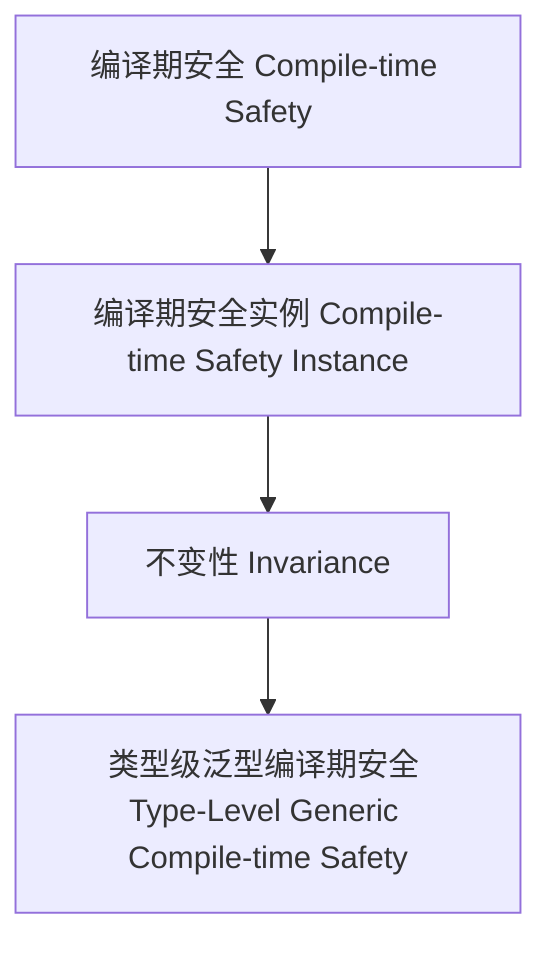

# 01. 类型级泛型编译期安全（Type-Level Generic Compile-time Safety in Haskell）

> **中英双语核心定义 | Bilingual Core Definitions**

## 1.1 类型级泛型编译期安全简介（Introduction to Type-Level Generic Compile-time Safety）

- **定义（Definition）**：
  - **中文**：类型级泛型编译期安全是指在类型系统层面，通过泛型机制在编译期确保任意类型结构的类型安全和属性不变性。Haskell通过类型族、GADT、类型类等机制支持类型级泛型编译期安全。
  - **English**: Type-level generic compile-time safety refers to ensuring type safety and property invariance of arbitrary type structures at compile time via generic mechanisms at the type system level. Haskell supports type-level generic compile-time safety via type families, GADTs, type classes, etc.

- **Wiki风格国际化解释（Wiki-style Explanation）**：
  - 类型级泛型编译期安全是高可靠性、自动化和形式化验证的基础。
  - Type-level generic compile-time safety is the foundation of high reliability, automation, and formal verification.

## 1.2 Haskell中的类型级泛型编译期安全语法与语义（Syntax and Semantics of Type-Level Generic Compile-time Safety in Haskell）

- **类型级安全结构与泛型不变性**

```haskell
{-# LANGUAGE TypeFamilies, DataKinds, GADTs #-}

data Nat = Z | S Nat

type family CompiletimeSafeAdd (n :: Nat) (m :: Nat) :: Nat where
  CompiletimeSafeAdd 'Z m = m
  CompiletimeSafeAdd ('S n) m = 'S (CompiletimeSafeAdd n m)

-- 泛型编译期安全：类型级加法保证不变性
```

- **类型类与泛型编译期安全实例**

```haskell
class GCompiletimeSafe f where
  gcompiletimeSafe :: f a -> Bool

instance GCompiletimeSafe Maybe where
  gcompiletimeSafe Nothing  = True
  gcompiletimeSafe (Just _) = True
```

## 1.3 范畴论建模与结构映射（Category-Theoretic Modeling and Mapping）

- **类型级泛型编译期安全与范畴论关系**
  - 类型级泛型编译期安全可视为范畴中的对象、函子与不变性。

| 概念 | Haskell实现 | 代码示例 | 中文解释 |
|------|-------------|----------|----------|
| 编译期安全 | 类型族 | `CompiletimeSafeAdd n m` | 编译期安全 |
| 编译期安全实例 | 类型类 | `GCompiletimeSafe` | 编译期安全实例 |
| 不变性 | 类型族+类型类 | `gcompiletimeSafe` | 不变性 |

## 1.4 形式化证明与论证（Formal Proofs & Reasoning）

- **编译期安全不变性证明**
  - **中文**：证明类型级泛型编译期安全结构满足属性不变性。
  - **English**: Prove that type-level generic compile-time safety structures satisfy property invariance.

- **自动化安全能力证明**
  - **中文**：证明类型级泛型编译期安全可自动保证复杂类型结构的安全性。
  - **English**: Prove that type-level generic compile-time safety can automatically ensure the safety of complex type structures.

## 1.5 多表征与本地跳转（Multi-representation & Local Reference）

- **类型级泛型编译期安全结构图（Type-Level Generic Compile-time Safety Structure Diagram）**



- **相关主题跳转**：
  - [类型级泛型编译期验证 Type-Level Generic Compile-time Verification](./01-Type-Level-Generic-Compiletime-Verification.md)
  - [类型级泛型编译期一致性 Type-Level Generic Compile-time Consistency](./01-Type-Level-Generic-Compiletime-Consistency.md)
  - [类型安全 Type Safety](./01-Type-Safety.md)
