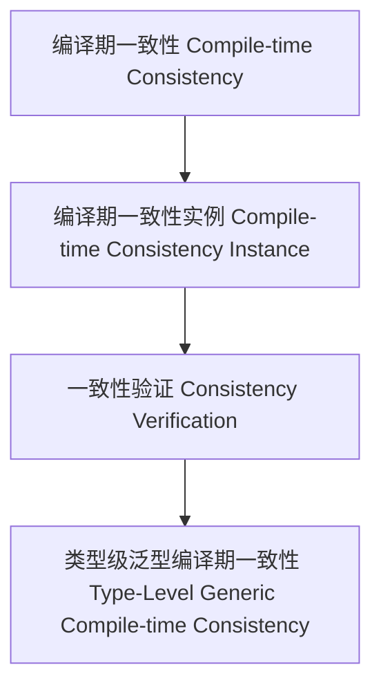

# 01. 类型级泛型编译期一致性（Type-Level Generic Compile-time Consistency in Haskell）

> **中英双语核心定义 | Bilingual Core Definitions**

## 1.1 类型级泛型编译期一致性简介（Introduction to Type-Level Generic Compile-time Consistency）

- **定义（Definition）**：
  - **中文**：类型级泛型编译期一致性是指在类型系统层面，通过泛型机制在编译期确保所有类型结构和属性在推导、验证和自动化过程中保持一致。Haskell通过类型族、GADT、类型类等机制支持类型级泛型编译期一致性。
  - **English**: Type-level generic compile-time consistency refers to ensuring that all type structures and properties remain consistent during inference, verification, and automation at compile time via generic mechanisms at the type system level. Haskell supports type-level generic compile-time consistency via type families, GADTs, type classes, etc.

- **Wiki风格国际化解释（Wiki-style Explanation）**：
  - 类型级泛型编译期一致性是类型安全、可靠性和自动化推理的基础。
  - Type-level generic compile-time consistency is the foundation of type safety, reliability, and automated reasoning.

## 1.2 Haskell中的类型级泛型编译期一致性语法与语义（Syntax and Semantics of Type-Level Generic Compile-time Consistency in Haskell）

- **类型级一致性结构与泛型推导**

```haskell
{-# LANGUAGE TypeFamilies, DataKinds, GADTs #-}

data Nat = Z | S Nat

type family CompiletimeConsistent (xs :: [Nat]) :: Bool where
  CompiletimeConsistent '[] = 'True
  CompiletimeConsistent (x ': xs) = CompiletimeConsistentOne x && CompiletimeConsistent xs

-- 伪代码：CompiletimeConsistentOne 可定义为类型级谓词，判断某类型推导在编译期是否一致
```

- **类型类与泛型一致性实例**

```haskell
class GCompiletimeConsistent f where
  gcompiletimeConsistent :: f a -> Bool

instance GCompiletimeConsistent Maybe where
  gcompiletimeConsistent Nothing  = True
  gcompiletimeConsistent (Just _) = True
```

## 1.3 范畴论建模与结构映射（Category-Theoretic Modeling and Mapping）

- **类型级泛型编译期一致性与范畴论关系**
  - 类型级泛型编译期一致性可视为范畴中的对象、函子与一致性验证。

| 概念 | Haskell实现 | 代码示例 | 中文解释 |
|------|-------------|----------|----------|
| 编译期一致性 | 类型族 | `CompiletimeConsistent xs` | 编译期一致性 |
| 编译期一致性实例 | 类型类 | `GCompiletimeConsistent` | 编译期一致性实例 |
| 一致性验证 | 类型族+类型类 | `gcompiletimeConsistent` | 一致性验证 |

## 1.4 形式化证明与论证（Formal Proofs & Reasoning）

- **编译期一致性证明**
  - **中文**：证明类型级泛型编译期一致性能确保所有类型结构推导和验证过程在编译期保持一致。
  - **English**: Prove that type-level generic compile-time consistency ensures all type structure inference and verification processes are consistent at compile time.

- **自动化一致性能力证明**
  - **中文**：证明类型级泛型编译期一致性可自动保证复杂类型结构推导和验证的一致性。
  - **English**: Prove that type-level generic compile-time consistency can automatically ensure the consistency of inference and verification for complex type structures.

## 1.5 多表征与本地跳转（Multi-representation & Local Reference）

- **类型级泛型编译期一致性结构图（Type-Level Generic Compile-time Consistency Structure Diagram）**



- **相关主题跳转**：
  - [类型级泛型编译期优化 Type-Level Generic Compile-time Optimization](./01-Type-Level-Generic-Compiletime-Optimization.md)
  - [类型级泛型一致性 Type-Level Generic Consistency](./01-Type-Level-Generic-Consistency.md)
  - [类型安全 Type Safety](./01-Type-Safety.md)
