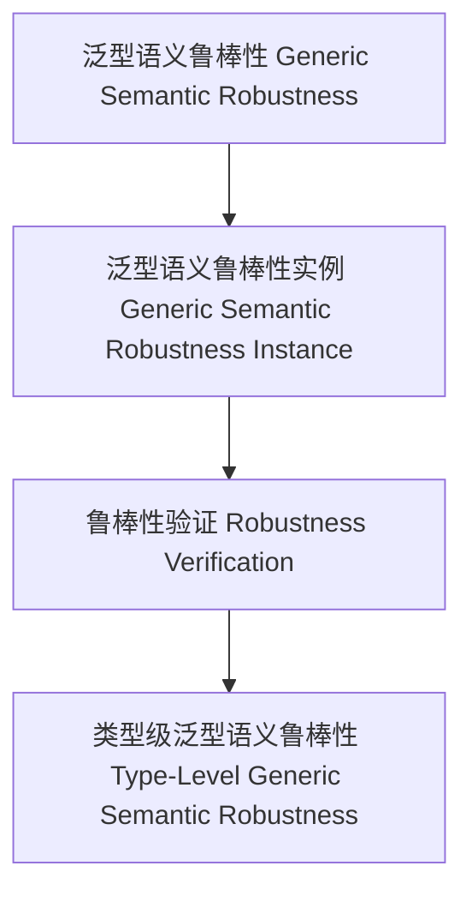

# 01. 类型级泛型语义鲁棒性（Type-Level Generic Semantic Robustness in Haskell）

> **中英双语核心定义 | Bilingual Core Definitions**

## 1.1 类型级泛型语义鲁棒性简介（Introduction to Type-Level Generic Semantic Robustness）

- **定义（Definition）**：
  - **中文**：类型级泛型语义鲁棒性是指在类型系统层面，通过泛型机制确保任意类型结构的语义在推导、验证和自动化过程中具有鲁棒性和容错性。Haskell通过类型族、GADT、类型类等机制支持类型级泛型语义鲁棒性。
  - **English**: Type-level generic semantic robustness refers to ensuring the robustness and fault tolerance of the semantics of arbitrary type structures during inference, verification, and automation at the type system level via generic mechanisms. Haskell supports type-level generic semantic robustness via type families, GADTs, type classes, etc.

- **Wiki风格国际化解释（Wiki-style Explanation）**：
  - 类型级泛型语义鲁棒性是类型安全、可靠性和自动化语义推理的基础。
  - Type-level generic semantic robustness is the foundation of type safety, reliability, and automated semantic reasoning.

## 1.2 Haskell中的类型级泛型语义鲁棒性语法与语义（Syntax and Semantics of Type-Level Generic Semantic Robustness in Haskell）

- **类型级鲁棒性结构与泛型语义推导**

```haskell
{-# LANGUAGE TypeFamilies, DataKinds, GADTs #-}

data Nat = Z | S Nat

type family RobustSemantics (n :: Nat) :: Bool where
  RobustSemantics 'Z = 'True
  RobustSemantics ('S n) = RobustSemantics n

-- 泛型语义鲁棒性：递归验证类型级自然数语义的鲁棒性
```

- **类型类与泛型语义鲁棒性实例**

```haskell
class GSemanticRobust f where
  gsemanticRobust :: f a -> Bool

instance GSemanticRobust Maybe where
  gsemanticRobust Nothing  = True
  gsemanticRobust (Just _) = True
```

## 1.3 范畴论建模与结构映射（Category-Theoretic Modeling and Mapping）

- **类型级泛型语义鲁棒性与范畴论关系**
  - 类型级泛型语义鲁棒性可视为范畴中的对象、函子与鲁棒性验证。

| 概念 | Haskell实现 | 代码示例 | 中文解释 |
|------|-------------|----------|----------|
| 泛型语义鲁棒性 | 类型族 | `RobustSemantics n` | 泛型语义鲁棒性 |
| 泛型语义鲁棒性实例 | 类型类 | `GSemanticRobust` | 泛型语义鲁棒性实例 |
| 鲁棒性验证 | 类型族+类型类 | `gsemanticRobust` | 鲁棒性验证 |

## 1.4 形式化证明与论证（Formal Proofs & Reasoning）

- **泛型语义鲁棒性证明**
  - **中文**：证明类型级泛型语义鲁棒性可确保复杂类型结构语义的健壮性。
  - **English**: Prove that type-level generic semantic robustness ensures the robustness of the semantics of complex type structures.

- **自动化鲁棒性能力证明**
  - **中文**：证明类型级泛型语义鲁棒性可自动保证复杂类型结构语义的鲁棒性。
  - **English**: Prove that type-level generic semantic robustness can automatically ensure the robustness of the semantics of complex type structures.

## 1.5 多表征与本地跳转（Multi-representation & Local Reference）

- **类型级泛型语义鲁棒性结构图（Type-Level Generic Semantic Robustness Structure Diagram）**



- **相关主题跳转**：
  - [类型级泛型语义验证 Type-Level Generic Semantic Validation](./01-Type-Level-Generic-Semantic-Validation.md)
  - [类型级泛型一致性 Type-Level Generic Consistency](./01-Type-Level-Generic-Consistency.md)
  - [类型安全 Type Safety](./01-Type-Safety.md)
