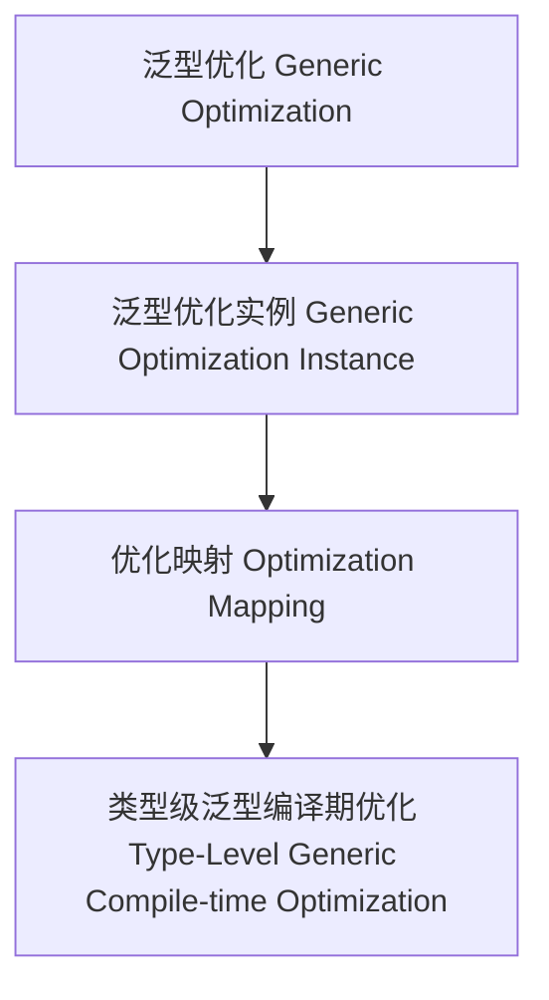

# 01. 类型级泛型编译期优化（Type-Level Generic Compile-time Optimization in Haskell）

> **中英双语核心定义 | Bilingual Core Definitions**

## 1.1 类型级泛型编译期优化简介（Introduction to Type-Level Generic Compile-time Optimization）

- **定义（Definition）**：
  - **中文**：类型级泛型编译期优化是指在类型系统层面，通过泛型机制在编译期对任意类型结构进行优化和推导。Haskell通过类型族、GADT、类型类等机制支持类型级泛型编译期优化。
  - **English**: Type-level generic compile-time optimization refers to optimizing and inferring arbitrary type structures at compile time via generic mechanisms at the type system level. Haskell supports type-level generic compile-time optimization via type families, GADTs, type classes, etc.

- **Wiki风格国际化解释（Wiki-style Explanation）**：
  - 类型级泛型编译期优化是类型安全、自动化和高效编译的基础。
  - Type-level generic compile-time optimization is the foundation of type safety, automation, and efficient compilation.

## 1.2 Haskell中的类型级泛型编译期优化语法与语义（Syntax and Semantics of Type-Level Generic Compile-time Optimization in Haskell）

- **类型级优化结构与泛型推导**

```haskell
{-# LANGUAGE TypeFamilies, DataKinds, GADTs #-}

data Nat = Z | S Nat

type family Optimize (n :: Nat) :: Nat where
  Optimize 'Z = 'Z
  Optimize ('S n) = 'S (Optimize n)

-- 泛型优化：类型级自然数的编译期优化
```

- **类型类与泛型优化实例**

```haskell
class GOptimize f where
  goptimize :: f a -> f a

instance GOptimize Maybe where
  goptimize Nothing  = Nothing
  goptimize (Just x) = Just x
```

## 1.3 范畴论建模与结构映射（Category-Theoretic Modeling and Mapping）

- **类型级泛型编译期优化与范畴论关系**
  - 类型级泛型编译期优化可视为范畴中的对象、函子与优化映射。

| 概念 | Haskell实现 | 代码示例 | 中文解释 |
|------|-------------|----------|----------|
| 泛型优化 | 类型族 | `Optimize n` | 泛型优化 |
| 泛型优化实例 | 类型类 | `GOptimize` | 泛型优化实例 |
| 优化映射 | 类型族+类型类 | `goptimize` | 优化映射 |

## 1.4 形式化证明与论证（Formal Proofs & Reasoning）

- **泛型优化一致性证明**
  - **中文**：证明类型级泛型编译期优化与类型系统和领域优化目标一致。
  - **English**: Prove that type-level generic compile-time optimization is consistent with the type system and domain optimization goals.

- **自动化优化能力证明**
  - **中文**：证明类型级泛型编译期优化可自动优化复杂类型结构。
  - **English**: Prove that type-level generic compile-time optimization can automatically optimize complex type structures.

## 1.5 多表征与本地跳转（Multi-representation & Local Reference）

- **类型级泛型编译期优化结构图（Type-Level Generic Compile-time Optimization Structure Diagram）**



- **相关主题跳转**：
  - [类型级泛型语义 Type-Level Generic Semantics](./01-Type-Level-Generic-Semantics.md)
  - [类型级泛型一致性 Type-Level Generic Consistency](./01-Type-Level-Generic-Consistency.md)
  - [类型安全 Type Safety](./01-Type-Safety.md)
