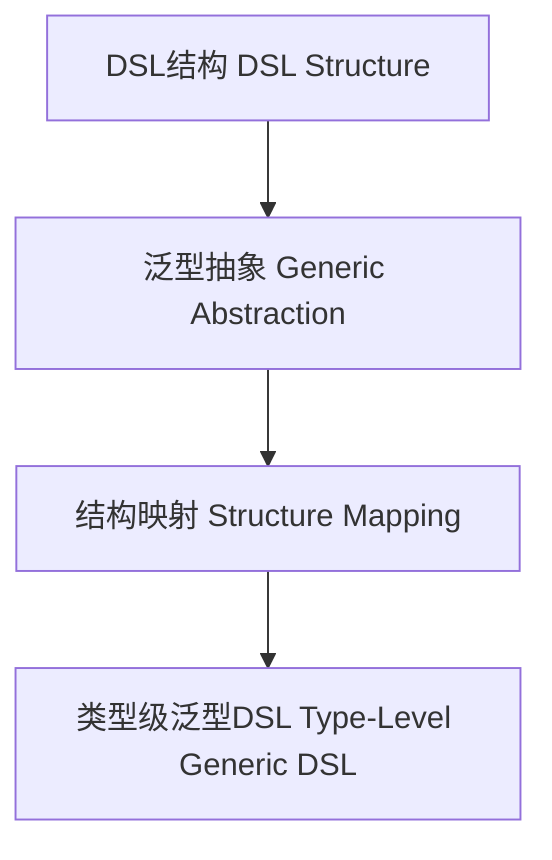

# 01. 类型级泛型DSL（Type-Level Generic DSL in Haskell）

> **中英双语核心定义 | Bilingual Core Definitions**

## 1.1 类型级泛型DSL简介（Introduction to Type-Level Generic DSL）

- **定义（Definition）**：
  - **中文**：类型级泛型DSL是指在类型系统层面，通过泛型和类型级机制构建领域特定语言（DSL），实现类型安全的抽象与自动化。Haskell通过类型族、GADT、类型类等机制支持类型级泛型DSL。
  - **English**: Type-level generic DSL refers to building domain-specific languages (DSLs) at the type system level using generic and type-level mechanisms, enabling type-safe abstraction and automation. Haskell supports type-level generic DSLs via type families, GADTs, type classes, etc.

- **Wiki风格国际化解释（Wiki-style Explanation）**：
  - 类型级泛型DSL是类型安全抽象、自动化和领域建模的基础。
  - Type-level generic DSL is the foundation of type-safe abstraction, automation, and domain modeling.

## 1.2 Haskell中的类型级泛型DSL语法与语义（Syntax and Semantics of Type-Level Generic DSL in Haskell）

- **类型级DSL结构与泛型抽象**

```haskell
{-# LANGUAGE GADTs, TypeFamilies, DataKinds #-}

data Expr a where
  LitInt  :: Int -> Expr Int
  LitBool :: Bool -> Expr Bool
  Add     :: Expr Int -> Expr Int -> Expr Int
  If      :: Expr Bool -> Expr a -> Expr a -> Expr a

-- 泛型DSL解释器
eval :: Expr a -> a
eval (LitInt n)   = n
eval (LitBool b)  = b
eval (Add e1 e2)  = eval e1 + eval e2
eval (If c t f)   = if eval c then eval t else eval f
```

- **类型类与DSL扩展**

```haskell
class DSLShow f where
  dslShow :: f a -> String

instance DSLShow Expr where
  dslShow (LitInt n)   = show n
  dslShow (LitBool b)  = show b
  dslShow (Add e1 e2)  = "(" ++ dslShow e1 ++ "+" ++ dslShow e2 ++ ")"
  dslShow (If c t f)   = "if " ++ dslShow c ++ " then " ++ dslShow t ++ " else " ++ dslShow f
```

## 1.3 范畴论建模与结构映射（Category-Theoretic Modeling and Mapping）

- **类型级泛型DSL与范畴论关系**
  - 类型级泛型DSL可视为范畴中的对象、函子与结构映射。

| 概念 | Haskell实现 | 代码示例 | 中文解释 |
|------|-------------|----------|----------|
| DSL结构 | GADT | `Expr a` | DSL结构 |
| 泛型抽象 | 类型类 | `DSLShow` | 泛型抽象 |
| 结构映射 | GADT+类型类 | `eval` | 结构映射 |

## 1.4 形式化证明与论证（Formal Proofs & Reasoning）

- **DSL结构一致性证明**
  - **中文**：证明类型级泛型DSL结构与领域语义一致。
  - **English**: Prove that type-level generic DSL structures are consistent with domain semantics.

- **类型安全性证明**
  - **中文**：证明类型级泛型DSL可防止类型错误，实现类型安全。
  - **English**: Prove that type-level generic DSLs prevent type errors and ensure type safety.

## 1.5 多表征与本地跳转（Multi-representation & Local Reference）

- **类型级泛型DSL结构图（Type-Level Generic DSL Structure Diagram）**



- **相关主题跳转**：
  - [类型级泛型编程 Type-Level Generic Programming](./01-Type-Level-Generic-Programming.md)
  - [类型级泛型自动化 Type-Level Generic Automation](./01-Type-Level-Generic-Automation.md)
  - [类型安全 Type Safety](./01-Type-Safety.md)
