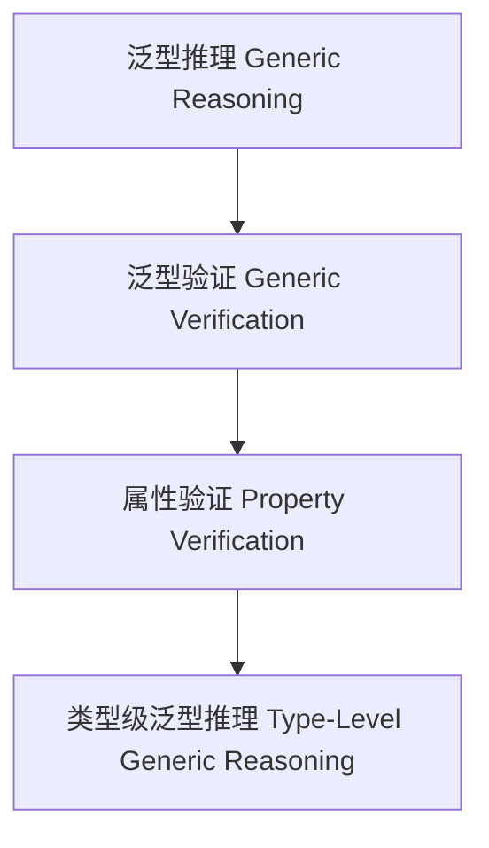

# 01. 类型级泛型推理（Type-Level Generic Reasoning in Haskell）

> **中英双语核心定义 | Bilingual Core Definitions**

## 1.1 类型级泛型推理简介（Introduction to Type-Level Generic Reasoning）

- **定义（Definition）**：
  - **中文**：类型级泛型推理是指在类型系统层面，通过泛型机制对任意类型结构进行逻辑推理和属性验证。Haskell通过类型族、GADT、类型类等机制支持类型级泛型推理。
  - **English**: Type-level generic reasoning refers to logical reasoning and property verification over arbitrary type structures at the type system level via generic mechanisms. Haskell supports type-level generic reasoning via type families, GADTs, type classes, etc.

- **Wiki风格国际化解释（Wiki-style Explanation）**：
  - 类型级泛型推理是类型安全验证、自动化和形式化方法的基础。
  - Type-level generic reasoning is the foundation of type-safe verification, automation, and formal methods.

## 1.2 Haskell中的类型级泛型推理语法与语义（Syntax and Semantics of Type-Level Generic Reasoning in Haskell）

- **类型级推理结构与泛型验证**

```haskell
{-# LANGUAGE TypeFamilies, DataKinds, GADTs #-}

data Nat = Z | S Nat

type family IsZero (n :: Nat) :: Bool where
  IsZero 'Z     = 'True
  IsZero ('S _) = 'False'

-- 泛型推理：判断类型级自然数是否为零
```

- **类型类与泛型推理实例**

```haskell
class GReason f where
  greason :: f a -> String

instance GReason Maybe where
  greason Nothing  = "Nothing"
  greason (Just _) = "Just value"
```

## 1.3 范畴论建模与结构映射（Category-Theoretic Modeling and Mapping）

- **类型级泛型推理与范畴论关系**
  - 类型级泛型推理可视为范畴中的对象、函子与属性验证。

| 概念 | Haskell实现 | 代码示例 | 中文解释 |
|------|-------------|----------|----------|
| 泛型推理 | 类型族 | `IsZero n` | 泛型推理 |
| 泛型验证 | 类型类 | `GReason` | 泛型验证 |
| 属性验证 | 类型族+类型类 | `greason` | 属性验证 |

## 1.4 形式化证明与论证（Formal Proofs & Reasoning）

- **泛型推理一致性证明**
  - **中文**：证明类型级泛型推理与类型系统一致。
  - **English**: Prove that type-level generic reasoning is consistent with the type system.

- **自动化验证能力证明**
  - **中文**：证明类型级泛型推理可自动验证复杂类型属性。
  - **English**: Prove that type-level generic reasoning can automatically verify complex type properties.

## 1.5 多表征与本地跳转（Multi-representation & Local Reference）

- **类型级泛型推理结构图（Type-Level Generic Reasoning Structure Diagram）**



- **相关主题跳转**：
  - [类型级泛型编程 Type-Level Generic Programming](./01-Type-Level-Generic-Programming.md)
  - [类型级泛型自动化 Type-Level Generic Automation](./01-Type-Level-Generic-Automation.md)
  - [类型安全 Type Safety](./01-Type-Safety.md)

---

> 本文档为类型级泛型推理在Haskell中的中英双语、Haskell语义模型与形式化证明规范化输出，适合学术研究与工程实践参考。
