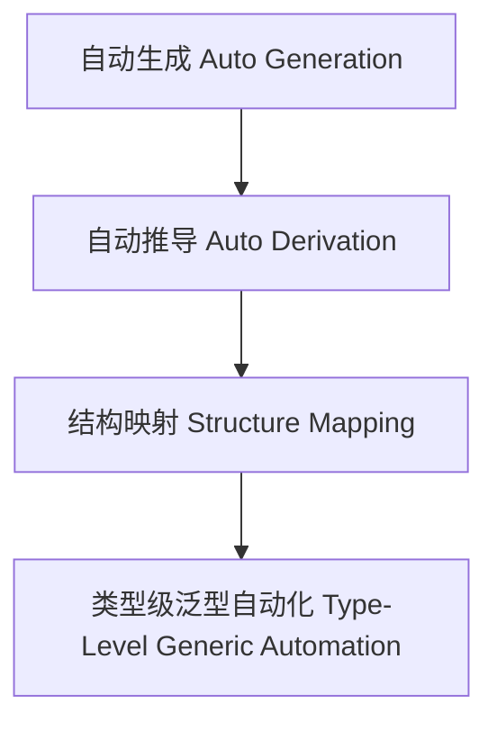

# 01. 类型级泛型自动化（Type-Level Generic Automation in Haskell）

> **中英双语核心定义 | Bilingual Core Definitions**

## 1.1 类型级泛型自动化简介（Introduction to Type-Level Generic Automation）

- **定义（Definition）**：
  - **中文**：类型级泛型自动化是指在类型系统层面，通过自动化机制对任意类型结构进行推导、验证和代码生成。Haskell通过类型族、GADT、类型类等机制支持类型级泛型自动化。
  - **English**: Type-level generic automation refers to the automated inference, verification, and code generation over arbitrary type structures at the type system level. Haskell supports type-level generic automation via type families, GADTs, type classes, etc.

- **Wiki风格国际化解释（Wiki-style Explanation）**：
  - 类型级泛型自动化是类型级元编程、自动推导和高效工程的基础。
  - Type-level generic automation is the foundation of type-level metaprogramming, automated inference, and efficient engineering.

## 1.2 Haskell中的类型级泛型自动化语法与语义（Syntax and Semantics of Type-Level Generic Automation in Haskell）

- **类型级自动推导与代码生成**

```haskell
{-# LANGUAGE TemplateHaskell, TypeFamilies, DataKinds, GADTs #-}
import Language.Haskell.TH

-- 自动生成数据类型
$(return [DataD [] (mkName "AutoType") [] Nothing [NormalC (mkName "MkAutoType") []] []])

-- 类型级自动推导
class AutoDerive a where
  autoDerive :: a -> String
```

## 1.3 范畴论建模与结构映射（Category-Theoretic Modeling and Mapping）

- **类型级泛型自动化与范畴论关系**
  - 类型级泛型自动化可视为范畴中的函子自动生成与结构映射。

| 概念 | Haskell实现 | 代码示例 | 中文解释 |
|------|-------------|----------|----------|
| 自动生成 | Template Haskell | `DataD ...` | 自动生成 |
| 自动推导 | 类型类 | `AutoDerive` | 自动推导 |
| 结构映射 | 类型族+类型类 | `autoDerive` | 结构映射 |

## 1.4 形式化证明与论证（Formal Proofs & Reasoning）

- **自动化推导一致性证明**
  - **中文**：证明类型级泛型自动化生成的结构与原类型结构一致。
  - **English**: Prove that structures generated by type-level generic automation are consistent with the original type structures.

- **自动化能力证明**
  - **中文**：证明类型级泛型自动化可自动处理复杂类型结构。
  - **English**: Prove that type-level generic automation can automatically handle complex type structures.

## 1.5 多表征与本地跳转（Multi-representation & Local Reference）

- **类型级泛型自动化结构图（Type-Level Generic Automation Structure Diagram）**



- **相关主题跳转**：
  - [类型级泛型编程 Type-Level Generic Programming](./01-Type-Level-Generic-Programming.md)
  - [类型级泛型归纳 Type-Level Generic Induction](./01-Type-Level-Generic-Induction.md)
  - [类型级编程 Type-Level Programming](./01-Type-Level-Programming.md)

---

> 本文档为类型级泛型自动化在Haskell中的中英双语、Haskell语义模型与形式化证明规范化输出，适合学术研究与工程实践参考。
