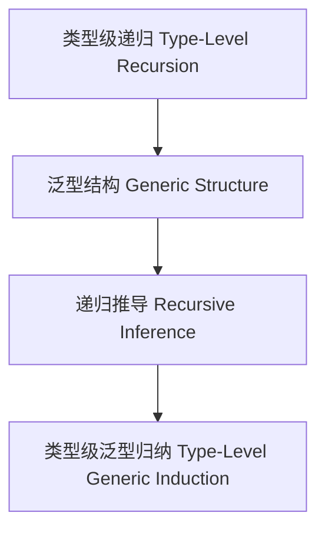

# 01. 类型级泛型归纳（Type-Level Generic Induction in Haskell）

> **中英双语核心定义 | Bilingual Core Definitions**

## 1.1 类型级泛型归纳简介（Introduction to Type-Level Generic Induction）

- **定义（Definition）**：
  - **中文**：类型级泛型归纳是指在类型系统层面，通过递归和归纳机制实现对任意类型结构的通用推导与证明。Haskell通过类型族、GADT、类型类等机制支持类型级泛型归纳。
  - **English**: Type-level generic induction refers to the generic inference and proof of arbitrary type structures at the type system level via recursion and induction. Haskell supports type-level generic induction via type families, GADTs, type classes, etc.

- **Wiki风格国际化解释（Wiki-style Explanation）**：
  - 类型级泛型归纳是类型级编程、自动化推导和高阶抽象的基础。
  - Type-level generic induction is the foundation of type-level programming, automated inference, and higher-order abstraction.

## 1.2 Haskell中的类型级泛型归纳语法与语义（Syntax and Semantics of Type-Level Generic Induction in Haskell）

- **类型级递归与泛型结构**

```haskell
{-# LANGUAGE TypeFamilies, DataKinds, GADTs, TypeOperators, KindSignatures #-}

data Nat = Z | S Nat

type family Length (xs :: [a]) :: Nat where
  Length '[] = 'Z
  Length (x ': xs) = 'S (Length xs)

-- 泛型归纳：对任意类型列表归纳推导长度
```

- **类型类与泛型归纳实例**

```haskell
class GenericInduction f where
  ginduce :: f a -> String

instance GenericInduction [] where
  ginduce [] = "Empty list"
  ginduce (_:xs) = "Cons " ++ ginduce xs
```

## 1.3 范畴论建模与结构映射（Category-Theoretic Modeling and Mapping）

- **类型级泛型归纳与范畴论关系**
  - 类型级泛型归纳可视为范畴中的递归函子与归纳结构。

| 概念 | Haskell实现 | 代码示例 | 中文解释 |
|------|-------------|----------|----------|
| 泛型归纳 | 类型族 | `Length xs` | 泛型归纳 |
| 泛型结构 | 类型类 | `GenericInduction` | 泛型结构 |
| 递归推导 | 类型族+类型类 | `ginduce` | 递归推导 |

## 1.4 形式化证明与论证（Formal Proofs & Reasoning）

- **泛型归纳正确性证明**
  - **中文**：证明类型级泛型归纳能对任意类型结构进行正确推导。
  - **English**: Prove that type-level generic induction can correctly infer arbitrary type structures.

- **递归归纳能力证明**
  - **中文**：证明类型级泛型归纳可自动递归处理复杂类型。
  - **English**: Prove that type-level generic induction can recursively handle complex types automatically.

## 1.5 多表征与本地跳转（Multi-representation & Local Reference）

- **类型级泛型归纳结构图（Type-Level Generic Induction Structure Diagram）**



- **相关主题跳转**：
  - [类型级归纳 Type-Level Induction](./01-Type-Level-Induction.md)
  - [类型级编程 Type-Level Programming](./01-Type-Level-Programming.md)
  - [类型安全 Type Safety](./01-Type-Safety.md)

---

> 本文档为类型级泛型归纳在Haskell中的中英双语、Haskell语义模型与形式化证明规范化输出，适合学术研究与工程实践参考。
