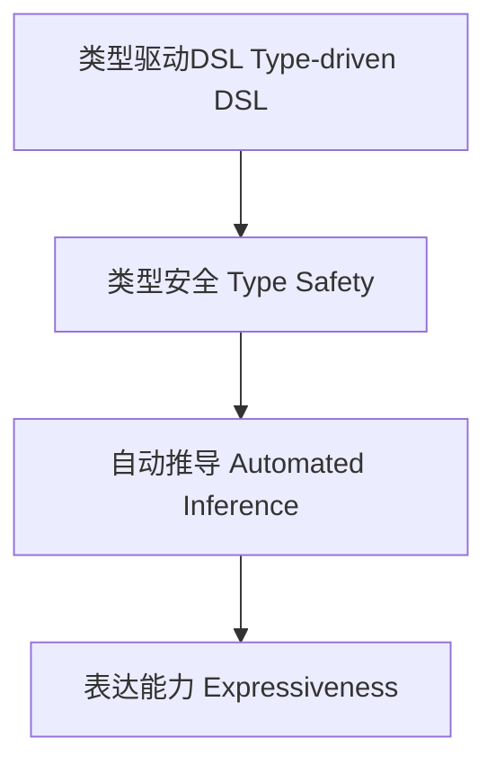

# 类型驱动DSL扩展（Type-Driven DSL Advanced in Haskell）

## 定义 Definition

- **中文**：类型驱动DSL扩展是指利用类型系统进行领域特定语言（DSL）设计、约束和自动推导的高级方法，确保DSL的类型安全与表达能力。
- **English**: Type-driven DSL advanced refers to advanced methods for designing, constraining, and inferring domain-specific languages (DSLs) using the type system, ensuring type safety and expressiveness of the DSL in Haskell.

## Haskell 语法与实现 Syntax & Implementation

```haskell
{-# LANGUAGE GADTs, DataKinds, KindSignatures, TypeFamilies #-}

-- 类型驱动DSL示例：类型安全的表达式语言

data Expr a where
  LitInt  :: Int  -> Expr Int
  LitBool :: Bool -> Expr Bool
  Add     :: Expr Int -> Expr Int -> Expr Int
  If      :: Expr Bool -> Expr a -> Expr a -> Expr a

-- 类型安全的解释器
interp :: Expr a -> a
interp (LitInt n)   = n
interp (LitBool b)  = b
interp (Add x y)    = interp x + interp y
interp (If c t e)   = if interp c then interp t else interp e
```

## 类型驱动DSL设计与安全性 Type-Driven DSL Design & Safety

- 利用GADT、类型族等保证DSL表达式的类型安全
- 支持类型级约束与自动推导，提升DSL表达能力

## 形式化证明 Formal Reasoning

- **类型安全性证明**：归纳证明DSL解释器不会出现类型错误
- **Proof of type safety**: Inductive proof that the DSL interpreter is type-safe

### 证明示例 Proof Example

- 对 `Expr a` 归纳：每个构造器都保证 `interp` 返回类型为 `a`，无类型错误

## 工程应用 Engineering Application

- 类型安全的配置DSL、嵌入式DSL、自动化推导与验证
- Type-safe configuration DSLs, embedded DSLs, automated inference and verification

## 范畴论映射 Category Theory Mapping

- 类型驱动DSL可视为范畴中的自由代数（Free algebra）结构

## 结构图 Structure Diagram



## 本地跳转 Local References

- [GADT in Haskell](./01-GADT.md)
- [类型级编程 Type-Level Programming](./01-Type-Level-Programming.md)
- [类型安全 Type Safety](./01-Type-Safety.md)
