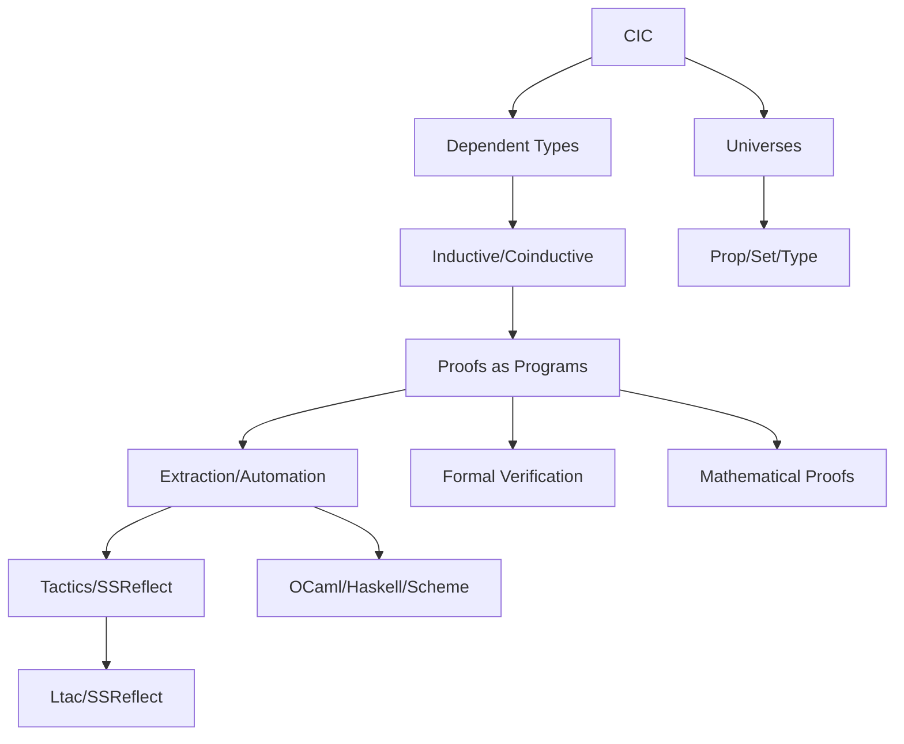

# Coq 形式语言与证明助理（Coq Proof Assistant & Formal Language）

> **中英双语核心定义 | Bilingual Core Definitions**

## 1. 定义与定位 Definition & Positioning

### 1.1 核心定义 Core Definition

- **中文**：Coq 是基于构造演算（Calculus of Inductive Constructions, CIC）的交互式定理证明器与函数式编程语言，支持以"命题即类型（Curry–Howard）"将证明写成可执行的程序。Coq 为形式化验证、数学证明和程序正确性验证提供了强大的工具。
- **English**: Coq is an interactive theorem prover and functional language based on CIC, supporting the propositions-as-types paradigm to write proofs as programs. Coq provides powerful tools for formal verification, mathematical proofs, and program correctness verification.

### 1.2 历史背景 Historical Background

- **1980s**: Thierry Coquand 和 Gérard Huet 开发了构造演算
- **1990s**: Coq 系统正式发布，支持归纳类型
- **2000s**: 引入宇宙多态和模块系统
- **2010s**: 支持同伦类型论扩展

## 2. 理论基础 Theoretical Foundations

### 2.1 构造演算 CIC

- **CIC**: CoC + Inductive Types + Universes（避免悖论）
- **依赖类型**: 类型依赖于值的类型系统 (Dependent types: type system where types depend on values)
- **归纳/协归纳类型**: 递归数据结构和无限对象 (Inductive/coinductive types: recursive data structures and infinite objects)
- **模式匹配**: 结构分解和递归 (Pattern matching: structural decomposition and recursion)
- **递归/归纳原理**: 证明和定义的基础 (Recursion/induction principles: foundation for proofs and definitions)

### 2.2 类型层级 Type Hierarchy

- **Prop/Set/Type 层级**: 避免悖论的类型分层 (Prop/Set/Type hierarchy: type stratification to avoid paradoxes)
- **范畴/同伦理论联系**: 与数学基础理论的联系 (Category/homotopy theory connections: connections to mathematical foundations)
- **HoTT 扩展**: 同伦类型论的可选支持 (HoTT extensions: optional support for homotopy type theory)

## 3. 工具链与生态 Tooling & Ecosystem

### 3.1 交互环境 Interactive Environments

- **CoqIDE**: 官方集成开发环境 (Official integrated development environment)
- **VS Code (VsCoq)**: Visual Studio Code 扩展 (Visual Studio Code extension)
- **Proof General**: Emacs 集成 (Emacs integration)

### 3.2 标准库与生态 Standard Library & Ecosystem

- **Coq stdlib**: 标准库 (Standard library)
- **Mathematical Components**: 数学组件库 (Mathematical Components library)
- **Iris**: 并发分离逻辑 (Concurrent separation logic)
- **VST**: 验证软件工具链 (Verified Software Toolchain)
- **CompCert**: 验证的 C 编译器 (Verified C compiler)
- **SSReflect**: 结构化反射证明风格 (Structured reflection proof style)
- **MetaCoq**: 反射与元理论 (Reflection and metatheory)

### 3.3 程序提取 Program Extraction

- **提取目标**: 到 OCaml/Haskell/Scheme 的程序提取 (Extraction targets: program extraction to OCaml/Haskell/Scheme)
- **证据擦除**: 运行时性能优化 (Evidence erasure: runtime performance optimization)

## 4. 工程实践 Engineering Practice

### 4.1 证明组织 Proof Organization

- **模块/节**: 模块化证明结构 (Modules/sections: modular proof structure)
- **公理/引理/定理**: 证明层次结构 (Axioms/lemmas/theorems: proof hierarchy)
- **战术脚本**: Ltac/SSReflect 自动化 (Tactic scripts: Ltac/SSReflect automation)

### 4.2 自动化 Automation

- **基础自动化**: auto/eauto 自动搜索 (Basic automation: auto/eauto automatic search)
- **决策过程**: lia/nia、ring/field、firstorder、congruence (Decision procedures: lia/nia, ring/field, firstorder, congruence)
- **插件系统**: 扩展决策过程 (Plugin system: extended decision procedures)

### 4.3 CI/复用 CI/Reuse

- **OPAM 包管理**: 库的包化管理 (OPAM package management: package management for libraries)
- **持续集成**: GitHub Actions 自动化 (Continuous integration: GitHub Actions automation)

## 5. 与 Haskell/Rust/Lean 对照 Comparison

### 5.1 语言对比 Language Comparison

| 特性 | Coq | Haskell | Rust | Lean |
|------|-----|---------|------|------|
| 类型系统 | 依赖类型 | 强类型 | 所有权系统 | 依赖类型 |
| 证明支持 | 原生 | 类型级编码 | 有限 | 原生 |
| 应用领域 | 形式化验证 | 函数式编程 | 系统编程 | 定理证明 |
| 学习曲线 | 陡峭 | 中等 | 中等 | 陡峭 |

### 5.2 详细对比 Detailed Comparison

- **Haskell**: 以类型级编码近似证明；Coq 具原生依赖类型与证明内核
- **Rust**: 所有权/借用面向资源正确性；Coq 面向数学/程序性质证明
- **Lean**: 同为依赖类型证明助理，语法/战术/生态各异（Lean4 更偏工业化）

## 6. 文档结构 Document Structure

### 6.1 核心文档 Core Documents

- [01-Coq 形式系统 Coq Formal System](./01-Coq-Formal-System.md)
- [02-Coq 自动化 Coq Automation](./02-Coq-Automation.md)
- [03-Coq 生态 Coq Ecosystem](./03-Coq-Ecosystem.md)
- [04-Coq 战术 Coq Tactics](./04-Coq-Tactics.md)
- [04-Coq 定义 Coq Definitions](./04-Coq-Definitions.md)
- [05-Coq 示例 Coq Examples](./05-Coq-Examples.md)

### 6.2 文档特色 Document Features

- **中英双语**: 所有内容提供中英文对照 (Bilingual: all content provided in both Chinese and English)
- **国际对标**: 参考 Wikipedia、SEP、nLab 等权威资源 (International standards: referencing Wikipedia, SEP, nLab, etc.)
- **代码示例**: 丰富的 Coq 代码实例 (Code examples: rich Coq code instances)
- **交叉引用**: 完整的文档间链接 (Cross references: complete inter-document links)

## 7. 结构图 Structure Diagram

## 8. 应用领域 Application Domains

### 8.1 形式化验证 Formal Verification

- **程序正确性**: 软件系统的形式化验证 (Program correctness: formal verification of software systems)
- **硬件验证**: 处理器和电路的形式化验证 (Hardware verification: formal verification of processors and circuits)
- **协议验证**: 网络协议和安全协议验证 (Protocol verification: network and security protocol verification)

### 8.2 数学证明 Mathematical Proofs

- **定理证明**: 数学定理的形式化证明 (Theorem proving: formal proofs of mathematical theorems)
- **同伦类型论**: 现代数学基础的形式化 (Homotopy type theory: formalization of modern mathematical foundations)
- **代数几何**: 高级数学领域的应用 (Algebraic geometry: applications in advanced mathematical fields)

## 9. 争议与批判 Controversies & Critique

### 9.1 学习曲线

- **中文**：Coq 的学习曲线非常陡峭，需要掌握类型理论、证明策略等多个领域
- **English**: Coq has a very steep learning curve, requiring mastery of type theory, proof strategies, and other domains

### 9.2 性能问题

- **中文**：大型证明的编译时间可能很长，影响开发效率
- **English**: Compilation time for large proofs can be very long, affecting development efficiency

## 10. 前沿趋势 Frontier Trends

### 10.1 技术发展

- **同伦类型论**: 更好的 HoTT 支持 (Homotopy type theory: better HoTT support)
- **证明自动化**: 机器学习辅助证明 (Proof automation: machine learning-assisted proofs)
- **并行化**: 多核证明搜索 (Parallelization: multi-core proof search)

### 10.2 应用扩展

- **区块链验证**: 智能合约形式化验证 (Blockchain verification: formal verification of smart contracts)
- **AI 安全**: 机器学习算法验证 (AI safety: verification of machine learning algorithms)

## 11. 参考文献 References

### 11.1 核心文档 Core Documentation

- **Coq Reference Manual**: 官方参考手册 (Official reference manual)
- **Coq stdlib 文档**: 标准库文档 (Standard library documentation)

### 11.2 学术资源 Academic Resources

- **Wikipedia: Coq**: 维基百科条目 (Wikipedia entry)
- **nLab: Calculus of Inductive Constructions**: 数学百科条目 (Mathematical encyclopedia entry)
- **Software Foundations**: 软件基础教程 (Software Foundations tutorial)
- **Certified Programming with Dependent Types**: 依赖类型认证编程 (Certified Programming with Dependent Types)

### 11.3 在线资源 Online Resources

- [Coq Documentation](https://coq.inria.fr/documentation)
- [Software Foundations](https://softwarefoundations.cis.upenn.edu/)
- [Mathematical Components](https://math-comp.github.io/)

---

## 总结 Summary

Coq 作为基于构造演算的交互式定理证明器，为形式化验证、数学证明和程序正确性验证提供了强大的工具。其依赖类型系统、归纳类型支持和丰富的生态系统使其成为学术研究和工业应用中的重要工具。虽然存在学习曲线陡峭和性能问题，但 Coq 在形式化方法领域仍然发挥着不可替代的作用。

---

`# Coq #FormalVerification #TheoremProving #DependentTypes #CIC #TypeTheory #ProofAssistant`
