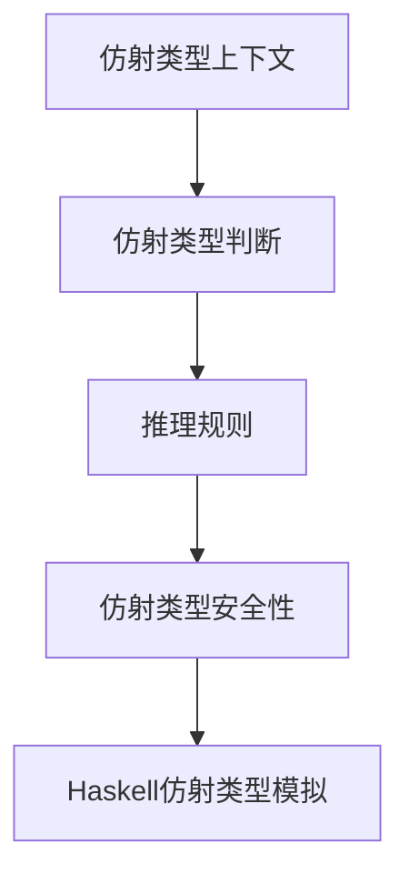

# 01. 仿射类型理论基础（Affine Type Theory Foundation）

> **中英双语核心定义 | Bilingual Core Definitions**

## 1.1 仿射类型理论简介（Introduction to Affine Type Theory）

- **定义（Definition）**：
  - **中文**：仿射类型理论是一种类型系统，要求每个变量最多使用一次（可以不用），广泛用于内存安全、资源管理和并发场景。
  - **English**: Affine type theory is a type system that requires each variable to be used at most once (possibly zero times). It is widely used for memory safety, resource management, and concurrency.

- **Wiki风格国际化解释（Wiki-style Explanation）**：
  - 仿射类型理论为Rust的所有权与借用系统、Haskell的资源安全抽象等提供理论基础。
  - Affine type theory underpins Rust's ownership and borrowing system, as well as resource-safe abstractions in Haskell.

## 1.2 仿射类型系统基本结构（Basic Structure of Affine Type Systems）

- **仿射类型上下文（Affine Type Context）**
  - $\Gamma : \text{Var} \rightarrow \text{Type}$，每个变量最多出现一次。
  - **中文**：仿射类型上下文允许变量不用，但最多用一次。
  - **English**: Affine type context allows each variable to be used at most once.

- **仿射类型构造（Affine Type Constructors）**
  - $\tau ::= \text{Base} \mid \tau_1 \rightarrow \tau_2 \mid \tau_1 \& \tau_2 \mid \tau_1 \oplus \tau_2$
  - $\rightarrow$：仿射函数类型（affine function type）
  - $\&$：加法积类型（with type）
  - $\oplus$：加法类型（plus type）

- **推理规则（Inference Rules）**

| 规则 | 数学形式 | 中文 | English |
|------|----------|------|---------|
| 变量 | $\frac{x : \tau \in \Gamma}{\Gamma \vdash x : \tau}$ | 变量类型 | Variable type |
| 仿射抽象 | $\frac{\Gamma, x : \tau_1 \vdash e : \tau_2}{\Gamma \vdash \lambda x.e : \tau_1 \rightarrow \tau_2}$ | 仿射函数抽象 | Affine function abstraction |
| 仿射应用 | $\frac{\Gamma_1 \vdash e_1 : \tau_1 \rightarrow \tau_2 \quad \Gamma_2 \vdash e_2 : \tau_1}{\Gamma_1, \Gamma_2 \vdash e_1 e_2 : \tau_2}$ | 仿射函数应用 | Affine function application |
| 弱化 | $\frac{\Gamma \vdash e : \tau}{\Gamma, x : \tau' \vdash e : \tau}$ | 变量可不用 | Weakening (variable may be unused) |

## 1.3 Haskell仿射类型系统与语义模型（Haskell Affine Type System & Semantic Model）

- **Haskell中的仿射类型思想**
  - Haskell本身不直接支持仿射类型，但可通过类型类、newtype等模拟资源唯一性。

```haskell
newtype Affine a = Affine { useOnce :: Maybe a }

consume :: Affine a -> (a -> b) -> Maybe b
consume (Affine (Just x)) f = Just (f x)
consume _ _ = Nothing
```

- **Rust所有权系统对比**
  - Rust的所有权与借用系统严格实现了仿射类型约束：

```rust
fn main() {
    let s1 = String::from("hello");
    let s2 = s1;  // s1 被移动到 s2，s1 不再可用
    // println!("{}", s1);  // 编译错误：s1 已被移动
}
```

## 1.4 形式化证明与论证（Formal Proofs & Reasoning）

- **仿射类型保持性证明（Preservation Proof）**
  - **中文**：对每个推理规则，证明仿射类型在归约后保持不变。
  - **English**: For each inference rule, prove that the affine type is preserved after reduction.

- **仿射进展性证明（Progress Proof）**
  - **中文**：对每个语法构造，证明要么是值，要么可以继续归约。
  - **English**: For each syntactic construct, prove it is either a value or can be further reduced.

## 1.5 多表征与本地跳转（Multi-representation & Local Reference）

- **仿射类型系统结构图（Affine Type System Structure Diagram）**



- **相关主题跳转**：
  - [类型理论 Type Theory](../01-Type-Theory/01-Type-Theory-Foundation.md)
  - [线性类型理论 Linear Type Theory](../02-Linear-Type-Theory/01-Linear-Type-Theory-Foundation.md)
  - [时序类型理论 Temporal Type Theory](../04-Temporal-Type-Theory/01-Temporal-Type-Theory-Foundation.md)

---

> 本文档为仿射类型理论基础的中英双语、Haskell语义模型与形式化证明规范化输出，适合学术研究与工程实践参考。
