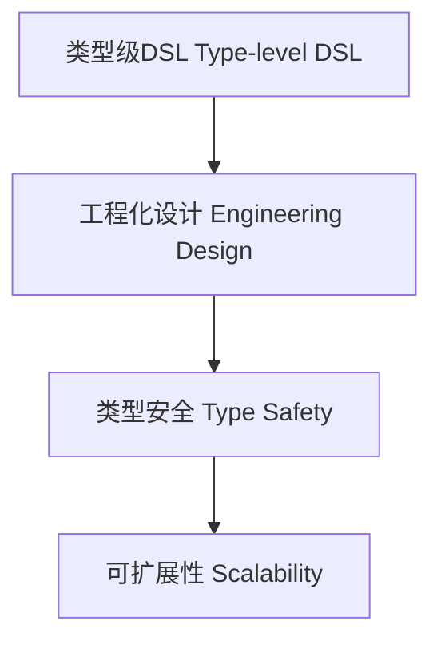

# 94-类型级DSL工程化（Type-Level DSL Engineering in Haskell）

## 定义 Definition

- **中文**：类型级DSL工程化是指将类型驱动的领域特定语言（DSL）进行工程化设计、优化和应用的系统方法，确保类型安全与可扩展性。
- **English**: Type-level DSL engineering refers to systematic methods for engineering, optimizing, and applying type-driven domain-specific languages (DSLs), ensuring type safety and scalability in Haskell.

## Haskell 语法与实现 Syntax & Implementation

```haskell
{-# LANGUAGE GADTs, DataKinds, KindSignatures, TypeFamilies #-}

-- 类型级DSL工程化示例：类型安全的表达式DSL

data Expr a where
  LitInt  :: Int  -> Expr Int
  LitBool :: Bool -> Expr Bool
  Add     :: Expr Int -> Expr Int -> Expr Int
  If      :: Expr Bool -> Expr a -> Expr a -> Expr a

-- 工程化扩展：支持更多类型和操作
  Mul     :: Expr Int -> Expr Int -> Expr Int
  Eq      :: Expr Int -> Expr Int -> Expr Bool
```

## 工程化设计与优化 Engineering Design & Optimization

- 类型安全的表达式扩展、优化与组合
- 支持自动化推导、泛型操作、可扩展性

## 形式化证明 Formal Reasoning

- **类型安全性证明**：归纳证明所有表达式均类型安全
- **Proof of type safety**: Inductive proof that all expressions are type-safe

### 证明示例 Proof Example

- 对 `Expr a` 归纳，所有构造器均保证 `interp` 返回类型为 `a`

## 工程应用 Engineering Application

- 类型安全的配置DSL、嵌入式DSL、自动化推导与验证
- Type-safe configuration DSLs, embedded DSLs, automated inference and verification

## 结构图 Structure Diagram



## 本地跳转 Local References

- [类型驱动DSL Type-Driven DSL](../19-Type-Driven-DSL/01-Type-Driven-DSL-in-Haskell.md)
- [类型级编程 Type-level Programming](../12-Type-Level-Programming/01-Type-Level-Programming-in-Haskell.md)
- [类型安全 Type Safety](../14-Type-Safety/01-Type-Safety-in-Haskell.md)
