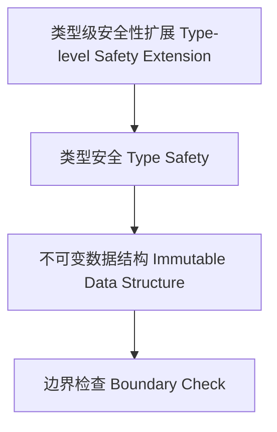

# 97-类型级安全性扩展（Type-Level Safety Extension in Haskell）

## 定义 Definition

- **中文**：类型级安全性扩展是指在类型系统层面通过类型级机制增强程序的安全性，防止类型错误和运行时异常。
- **English**: Type-level safety extension refers to mechanisms at the type system level for enhancing program safety, preventing type errors and runtime exceptions in Haskell.

## Haskell 语法与实现 Syntax & Implementation

```haskell
{-# LANGUAGE DataKinds, GADTs, KindSignatures #-}

-- 类型级安全性扩展示例：安全的向量类型

data Nat = Z | S Nat

data Vec :: * -> Nat -> * where
  VNil  :: Vec a 'Z
  VCons :: a -> Vec a n -> Vec a ('S n)

-- 类型安全的向量拼接
appendVec :: Vec a n -> Vec a m -> Vec a (Add n m)
appendVec VNil ys = ys
appendVec (VCons x xs) ys = VCons x (appendVec xs ys)
```

## 安全性扩展机制 Safety Extension Mechanism

- 利用 GADT、DataKinds、类型族等实现编译期安全性检查
- 支持不可变数据结构、类型级约束、边界检查等

## 形式化证明 Formal Reasoning

- **安全性扩展正确性证明**：证明类型级机制能防止非法操作
- **Proof of correctness for safety extension**: Show that type-level mechanisms prevent illegal operations

### 证明示例 Proof Example

- 对 `appendVec`，归纳证明拼接后向量长度等于两向量长度之和，且类型安全

## 工程应用 Engineering Application

- 类型安全的容器、不可变数据结构、嵌入式系统安全
- Type-safe containers, immutable data structures, embedded system safety

## 范畴论映射 Category Theory Mapping

- 安全性扩展可视为范畴中的限制子范畴（Subcategory of safety constraints）

## 结构图 Structure Diagram



## 本地跳转 Local References

- [类型安全 Type Safety](../14-Type-Safety/01-Type-Safety-in-Haskell.md)
- [GADT](../09-GADT/01-GADT-in-Haskell.md)
- [类型级编程 Type-level Programming](../12-Type-Level-Programming/01-Type-Level-Programming-in-Haskell.md)
