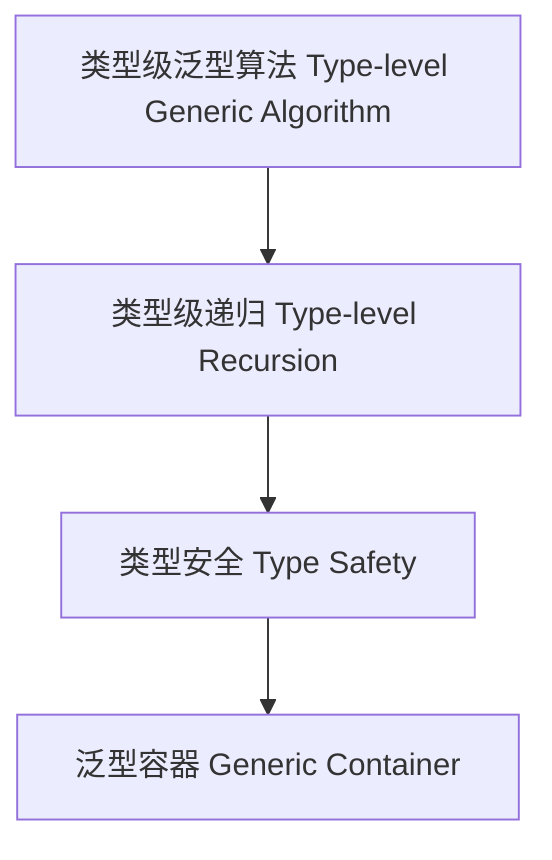

# 98-类型级泛型算法（Type-Level Generic Algorithm in Haskell）

## 定义 Definition

- **中文**：类型级泛型算法是指在类型系统层面实现的通用算法，能够对多种类型结构进行类型安全的操作与推导。
- **English**: Type-level generic algorithm refers to generic algorithms implemented at the type system level, capable of type-safe operations and inference over various type structures in Haskell.

## Haskell 语法与实现 Syntax & Implementation

```haskell
{-# LANGUAGE TypeFamilies, DataKinds, TypeOperators, GADTs #-}

-- 类型级泛型算法示例：类型级列表反转

type family Reverse (xs :: [k]) :: [k] where
  Reverse '[] = '[]
  Reverse (x ': xs) = Append (Reverse xs) '[x]

-- 类型级列表拼接

type family Append (xs :: [k]) (ys :: [k]) :: [k] where
  Append '[] ys = ys
  Append (x ': xs) ys = x ': Append xs ys
```

## 泛型算法设计 Generic Algorithm Design

- 类型级递归、映射、折叠、过滤等通用算法
- 支持类型安全的泛型容器与类型级数据结构

## 形式化证明 Formal Reasoning

- **泛型算法正确性证明**：如归纳证明 Reverse (Reverse xs) = xs
- **Proof of correctness for generic algorithms**: e.g., inductive proof that Reverse (Reverse xs) = xs

### 证明示例 Proof Example

- 对 `Reverse xs`，对 `xs` 归纳：
  - 基础：`xs = []`，`Reverse [] = []` 成立
  - 归纳：假设 `Reverse xs` 成立，则 `Reverse (x:xs) = Append (Reverse xs) [x]` 也成立

## 工程应用 Engineering Application

- 类型安全的泛型库、类型级数据结构、DSL 框架
- Type-safe generic libraries, type-level data structures, DSL frameworks

## 范畴论映射 Category Theory Mapping

- 泛型算法对应于范畴中的函子算法（Functorial algorithm）

## 结构图 Structure Diagram



## 本地跳转 Local References

- [类型级泛型 Type-level Generic](../24-Type-Level-Generic/01-Type-Level-Generic-in-Haskell.md)
- [类型级递归优化 Type-Level Recursion Optimization](../31-Type-Level-Recursion-Optimization/01-Type-Level-Recursion-Optimization-in-Haskell.md)
- [类型级编程 Type-level Programming](../12-Type-Level-Programming/01-Type-Level-Programming-in-Haskell.md)
