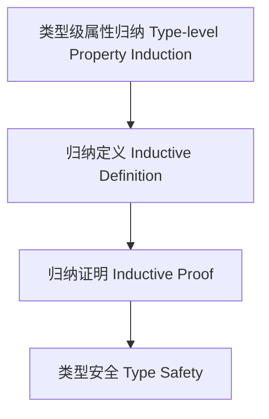

# 类型级属性归纳（Type-Level Property Induction in Haskell）

## 定义 Definition

- **中文**：类型级属性归纳是指在类型系统层面对类型属性进行归纳定义和归纳证明的机制，支持类型安全的自动化推理与泛型编程。
- **English**: Type-level property induction refers to mechanisms at the type system level for inductively defining and proving properties of types, supporting type-safe automated reasoning and generic programming in Haskell.

## Haskell 语法与实现 Syntax & Implementation

```haskell
{-# LANGUAGE TypeFamilies, DataKinds, TypeOperators, GADTs #-}

-- 类型级属性归纳示例：类型级列表是否全为零

type family AllZero (xs :: [Nat]) :: Bool where
  AllZero '[] = 'True
  AllZero (0 ': xs) = AllZero xs
  AllZero (n ': xs) = 'False
```

## 属性归纳机制 Property Induction Mechanism

- 类型族递归归纳、类型类属性分析
- 支持类型属性的归纳定义与自动化证明

## 形式化证明 Formal Reasoning

- **属性归纳正确性证明**：归纳证明 AllZero xs 能准确判断列表是否全为零
- **Proof of correctness for property induction**: Inductive proof that AllZero xs correctly determines if all elements are zero

### 证明示例 Proof Example

- 对 `AllZero xs`，对 `xs` 归纳：
  - 基础：`xs = []`，`AllZero [] = True` 成立
  - 归纳：若首元素为 0 且 AllZero xs 成立，则 AllZero (0:xs) = AllZero xs 成立

## 工程应用 Engineering Application

- 类型安全的属性验证、自动化推理、泛型库
- Type-safe property verification, automated reasoning, generic libraries

## 结构图 Structure Diagram



## 本地跳转 Local References

- [类型级属性推导 Type-Level Property Inference](../42-Type-Level-Property-Inference/01-Type-Level-Property-Inference-in-Haskell.md)
- [类型级归纳与递归 Type-Level Induction & Recursion](../23-Type-Level-Induction/01-Type-Level-Induction-in-Haskell.md)
- [类型安全 Type Safety](../14-Type-Safety/01-Type-Safety-in-Haskell.md)
