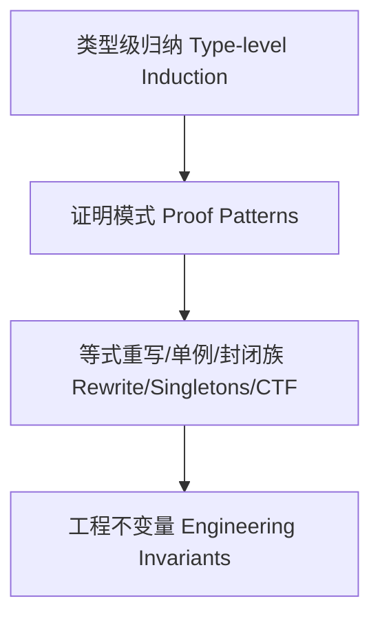
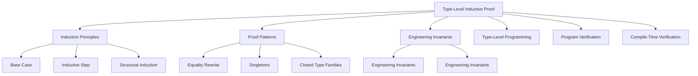

# 13-类型级归纳证明（Type-Level Inductive Proof in Haskell）

## 目录 Table of Contents

- [13-类型级归纳证明（Type-Level Inductive Proof in Haskell）](#13-类型级归纳证明type-level-inductive-proof-in-haskell)
  - [目录 Table of Contents](#目录-table-of-contents)
  - [定义 Definition](#定义-definition)
  - [归纳原理 Induction Principles](#归纳原理-induction-principles)
  - [Haskell 语法与实现 Syntax \& Implementation](#haskell-语法与实现-syntax--implementation)
    - [证明模式 Proof Patterns](#证明模式-proof-patterns)
  - [形式化推理 Formal Reasoning](#形式化推理-formal-reasoning)
  - [工程应用 Engineering Application](#工程应用-engineering-application)
  - [范畴论映射 Category Theory Mapping](#范畴论映射-category-theory-mapping)
  - [结构图 Structure Diagram](#结构图-structure-diagram)
  - [对比分析 Comparison](#对比分析-comparison)
  - [争议与批判 Controversies \& Critique](#争议与批判-controversies--critique)
  - [前沿趋势 Frontier Trends](#前沿趋势-frontier-trends)
  - [常见陷阱 Common Pitfalls](#常见陷阱-common-pitfalls)
  - [扩展交叉引用 Extended Cross References](#扩展交叉引用-extended-cross-references)
  - [知识图谱 Knowledge Graph](#知识图谱-knowledge-graph)
  - [本地跳转 Local References](#本地跳转-local-references)

> 对标 Wikipedia/nLab 与教材：给出定义、原理、证明模式、Haskell 示例与工程应用，双语。

## 定义 Definition

- 中文：类型级归纳证明是在类型系统层面对索引数据/类型族递归进行归纳，以证明不变量（等价、安全、覆盖等）。
- English: Type-level inductive proof performs induction at the type level over indexed data/type-family recursion to establish invariants (equality, safety, coverage, etc.).

## 归纳原理 Induction Principles

- 基础情形 Base case：对最小构造（如 Z、[]、Unit）直接证明性质
- 归纳情形 Inductive step：假设对较小结构成立，推出对组合构造成立
- 结构归纳/强归纳 Structural/Strong induction：对 GADT/索引族根据构造器进行分类证明

## Haskell 语法与实现 Syntax & Implementation

```haskell
{-# LANGUAGE DataKinds, GADTs, TypeFamilies, TypeOperators, UndecidableInstances #-}

data Nat = Z | S Nat

-- 类型级加法（以归纳定义）
type family Add (a :: Nat) (b :: Nat) :: Nat where
  Add 'Z     b = b
  Add ('S a) b = 'S (Add a b)

-- 归纳证明样式：证明 Add a 'Z = a
-- 以布尔性质刻画证明目标（可与等价证据 :~: 配合）
type family AddZeroRight (a :: Nat) :: Bool where
  AddZeroRight 'Z     = 'True
  AddZeroRight ('S a) = AddZeroRight a

-- 单例桥接：在值层复用类型层的归纳结构

data SNat (n :: Nat) where
  SZ :: SNat 'Z
  SS :: SNat n -> SNat ('S n)

replicateVec :: SNat n -> a -> [a]  -- 示例：利用单例进行结构化递归
replicateVec SZ     _ = []
replicateVec (SS k) x = x : replicateVec k x
```

### 证明模式 Proof Patterns

- 等式重写（rewrite with :~:）：以 Refl 作为同一性证据实现替换
- 单例（Singletons）桥接：以 SNat n 见证类型层的归纳假设在值层展开
- 封闭类型族：以穷举分支进行“按构造器归纳”的等式约简

## 形式化推理 Formal Reasoning

- 严谨性：保持一致性（coherence）与终止性（termination）
- 覆盖性：每个构造器均被证明覆盖
- 与 GADTs/TF 的协同：在构造器上精化索引，归纳假设随之细化

## 工程应用 Engineering Application

- 向量/矩阵维度、协议状态机、权限/能力、AST 不变量的编译期证明
- 泛型库安全化：以类型级证明约束暴露 API 的可用状态

## 范畴论映射 Category Theory Mapping

- 初始代数上的归纳原理；W‑types 与归纳族对应普遍性

## 结构图 Structure Diagram



## 对比分析 Comparison

- **中文**：类型级归纳证明 vs 运行时归纳证明 vs 静态归纳证明 vs 动态归纳证明
  - 类型级归纳证明关注"编译时的类型级归纳证明"；运行时归纳证明聚焦"执行时的归纳证明验证"；静态归纳证明强调"编译时分析"；动态归纳证明注重"运行时监控"。
- **English**: Type-level inductive proof vs runtime inductive proof vs static inductive proof vs dynamic inductive proof
  - Type-level inductive proof focuses on "compile-time type-level inductive proof"; runtime inductive proof on "runtime inductive proof verification"; static inductive proof on "compile-time analysis"; dynamic inductive proof on "runtime monitoring".

## 争议与批判 Controversies & Critique

- **中文**：
  - 类型级归纳证明 vs 证明复杂性的权衡；形式化归纳证明 vs 非形式化归纳证明；
  - 类型级归纳证明的适用范围；归纳证明系统的完备性问题。
- **English**:
  - Trade-off between type-level inductive proof vs proof complexity; formal inductive proof vs informal inductive proof;
  - Scope of applicability of type-level inductive proof; completeness issues in inductive proof systems.

## 前沿趋势 Frontier Trends

- **中文**：
  - AI辅助的类型级归纳证明；量子计算中的类型级归纳证明；
  - 分布式系统的类型级归纳证明；多语言类型级归纳证明框架。
- **English**:
  - AI-assisted type-level inductive proof; type-level inductive proof in quantum computing;
  - Type-level inductive proof for distributed systems; multi-language type-level inductive proof frameworks.

## 常见陷阱 Common Pitfalls

- **中文**：
  - 过度依赖类型级归纳证明；忽视归纳证明的局限性；
  - 类型级归纳证明的复杂性；归纳证明系统的性能问题。
- **English**:
  - Over-reliance on type-level inductive proof; ignoring limitations of inductive proof;
  - Complexity of type-level inductive proof; performance issues in inductive proof systems.

## 扩展交叉引用 Extended Cross References

- [编译时安全 Compile-Time Safety](../Type-Level/06-编译时安全.md)
- [编译时优化 Compile-Time Optimization](../Type-Level/07-编译时优化.md)
- [类型级编译期一致性 Type-Level Compile-Time Consistency](../Type-Level/14-类型级编译期一致性.md)
- [类型级语义分析 Type-Level Semantic Analysis](../Type-Level/29-类型级语义分析.md)
- [类型级编程 Type-Level Programming](../Type-Level/01-类型级编程.md)
- [类型级证明 Type-Level Proof](../Type-Level/04-类型级证明.md)

## 知识图谱 Knowledge Graph



## 本地跳转 Local References

- [类型级归纳与递归 Type-Level Induction & Recursion](../23-Type-Level-Induction/01-Type-Level-Induction-in-Haskell.md)
- [类型级证明 Type-Level Proof](../17-Type-Level-Proof/01-Type-Level-Proof-in-Haskell.md)
- [类型安全 Type Safety](../14-Type-Safety/01-Type-Safety-in-Haskell.md)
