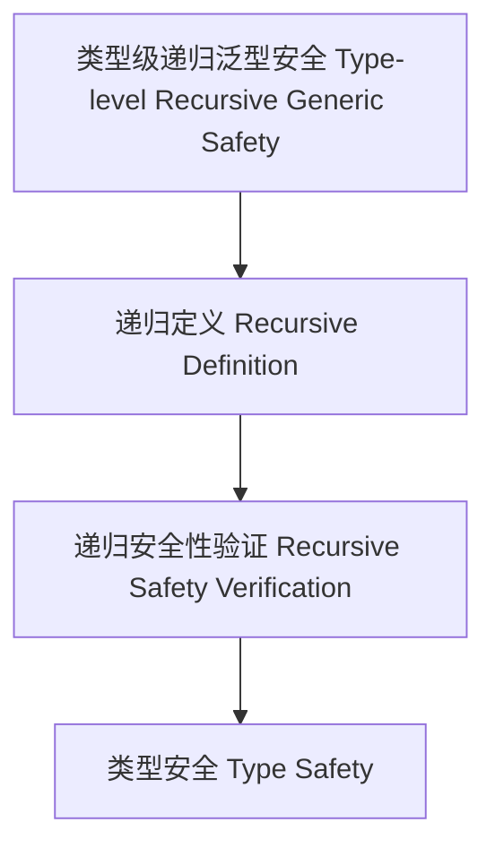

# 17-类型级递归泛型安全（Type-Level Recursive Generic Safety in Haskell）

## 目录 Table of Contents

- [17-类型级递归泛型安全（Type-Level Recursive Generic Safety in Haskell）](#17-类型级递归泛型安全type-level-recursive-generic-safety-in-haskell)
  - [目录 Table of Contents](#目录-table-of-contents)
  - [定义 Definition](#定义-definition)
  - [Haskell 语法与实现 Syntax \& Implementation](#haskell-语法与实现-syntax--implementation)
  - [递归泛型安全机制 Recursive Generic Safety Mechanism](#递归泛型安全机制-recursive-generic-safety-mechanism)
  - [形式化证明 Formal Reasoning](#形式化证明-formal-reasoning)
    - [证明示例 Proof Example](#证明示例-proof-example)
  - [工程应用 Engineering Application](#工程应用-engineering-application)
  - [结构图 Structure Diagram](#结构图-structure-diagram)
  - [本地跳转 Local References](#本地跳转-local-references)

## 定义 Definition

- **中文**：类型级递归泛型安全是指在类型系统层面对泛型类型和算法进行递归定义与递归安全性验证的机制，支持类型安全的泛型编程与自动化推理。
- **English**: Type-level recursive generic safety refers to mechanisms at the type system level for recursively defining and verifying the safety of generic types and algorithms, supporting type-safe generic programming and automated reasoning in Haskell.

## Haskell 语法与实现 Syntax & Implementation

```haskell
{-# LANGUAGE TypeFamilies, DataKinds, GADTs, KindSignatures #-}

-- 类型级递归泛型安全示例：安全的泛型向量拼接

data Nat = Z | S Nat

data Vec :: * -> Nat -> * where
  VNil  :: Vec a 'Z
  VCons :: a -> Vec a n -> Vec a ('S n)

appendVec :: Vec a n -> Vec a m -> Vec a (Add n m)
appendVec VNil ys = ys
appendVec (VCons x xs) ys = VCons x (appendVec xs ys)
```

## 递归泛型安全机制 Recursive Generic Safety Mechanism

- GADT递归定义、类型族递归安全性验证
- 支持泛型容器、算法的递归安全性归纳

## 形式化证明 Formal Reasoning

- **递归泛型安全性证明**：归纳证明 appendVec 拼接后向量长度等于两向量长度之和，且类型安全
- **Proof of recursive generic safety**: Inductive proof that appendVec preserves type safety and length

### 证明示例 Proof Example

- 对 `appendVec`，对第一个向量递归归纳：
  - 基础：`VNil`，拼接结果为第二个向量，长度正确
  - 归纳：假设 `appendVec xs ys` 成立，则 `appendVec (VCons x xs) ys = VCons x (appendVec xs ys)` 也成立

## 工程应用 Engineering Application

- 类型安全的递归泛型容器、不可变数据结构、嵌入式系统
- Type-safe recursive generic containers, immutable data structures, embedded systems

## 结构图 Structure Diagram



## 本地跳转 Local References

- [类型级递归泛型实例 Type-Level Recursive Generic Instance](../77-Type-Level-Recursive-Generic-Instance/01-Type-Level-Recursive-Generic-Instance-in-Haskell.md)
- [类型级递归泛型归纳 Type-Level Recursive Generic Induction](../82-Type-Level-Recursive-Generic-Induction/01-Type-Level-Recursive-Generic-Induction-in-Haskell.md)
- [类型安全 Type Safety](../14-Type-Safety/01-Type-Safety-in-Haskell.md)
- [类型级递归泛型验证 Type-Level Recursive Generic Verification](../91-Type-Level-Recursive-Generic-Verification/01-Type-Level-Recursive-Generic-Verification-in-Haskell.md)
- [类型级递归泛型约束 Type-Level Recursive Generic Constraint](../78-Type-Level-Recursive-Generic-Constraint/01-Type-Level-Recursive-Generic-Constraint-in-Haskell.md)
- [类型安全 Type Safety](../14-Type-Safety/01-Type-Safety-in-Haskell.md)
