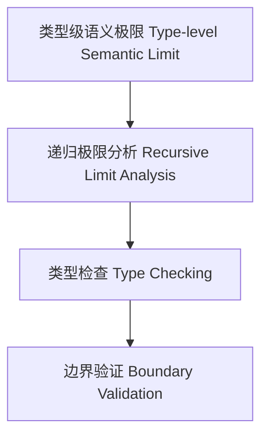

# 19-类型级语义极限（Type-Level Semantic Limit in Haskell）

## 目录 Table of Contents

- [19-类型级语义极限（Type-Level Semantic Limit in Haskell）](#19-类型级语义极限type-level-semantic-limit-in-haskell)
  - [目录 Table of Contents](#目录-table-of-contents)
  - [定义 Definition](#定义-definition)
  - [Haskell 语法与实现 Syntax \& Implementation](#haskell-语法与实现-syntax--implementation)
  - [类型级递归极限分析与类型检查 Recursive Limit Analysis \& Type Checking](#类型级递归极限分析与类型检查-recursive-limit-analysis--type-checking)
  - [形式化证明 Formal Reasoning](#形式化证明-formal-reasoning)
    - [证明示例 Proof Example](#证明示例-proof-example)
  - [工程应用 Engineering Application](#工程应用-engineering-application)
  - [结构图 Structure Diagram](#结构图-structure-diagram)
  - [本地跳转 Local References](#本地跳转-local-references)

## 定义 Definition

- **中文**：类型级语义极限是指在类型系统层面对类型级结构和表达式进行递归极限分析、类型检查与极端边界验证的机制，支持类型安全的编译期语义极限保障。
- **English**: Type-level semantic limit refers to mechanisms at the type system level for recursive limit analysis, type checking, and edge/boundary validation of type-level structures and expressions, supporting type-safe compile-time semantic limit in Haskell.

## Haskell 语法与实现 Syntax & Implementation

```haskell
{-# LANGUAGE GADTs, DataKinds, TypeFamilies #-}

-- 类型级表达式

data Expr a where
  LitInt  :: Int  -> Expr Int
  Add     :: Expr Int -> Expr Int -> Expr Int

-- 类型级语义极限分析

type family SemLimit (e :: Expr a) :: Bool where
  SemLimit ('LitInt n) = 'True
  SemLimit ('Add x y) = SemLimit x && SemLimit y
```

## 类型级递归极限分析与类型检查 Recursive Limit Analysis & Type Checking

- 类型级表达式的递归语义极限分析、类型检查、边界验证
- 支持类型安全的编译期语义极限保障

## 形式化证明 Formal Reasoning

- **语义极限正确性证明**：SemLimit e 能准确分析表达式语义极限
- **Proof of semantic limit correctness**: SemLimit e can accurately analyze semantic limit of expressions

### 证明示例 Proof Example

- 对 `SemLimit e`，归纳每个构造器，极限分析覆盖所有情况

## 工程应用 Engineering Application

- 类型安全的类型级DSL、编译期语义极限分析、自动化验证
- Type-safe type-level DSLs, compile-time semantic limit analysis, automated verification

## 结构图 Structure Diagram



## 本地跳转 Local References

- [类型级语义健壮性 Type-Level Semantic Robustness](../126-Type-Level-Semantic-Robustness/01-Type-Level-Semantic-Robustness-in-Haskell.md)
- [类型级语义覆盖 Type-Level Semantic Coverage](../124-Type-Level-Semantic-Coverage/01-Type-Level-Semantic-Coverage-in-Haskell.md)
- [类型安全 Type Safety](../14-Type-Safety/01-Type-Safety-in-Haskell.md)
