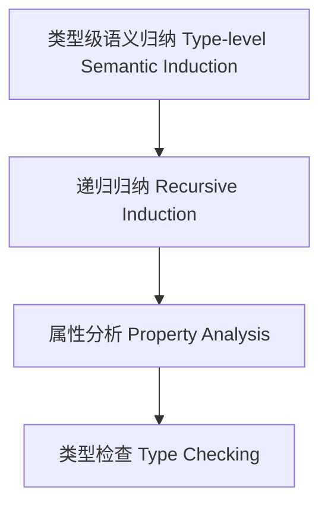

# 25-类型级语义归纳（Type-Level Semantic Induction in Haskell）

## 定义 Definition

- **中文**：类型级语义归纳是指在类型系统层面对类型级结构和表达式进行递归归纳、属性分析与类型检查的机制，支持类型安全的编译期语义归纳与验证。
- **English**: Type-level semantic induction refers to mechanisms at the type system level for recursive induction, property analysis, and type checking of type-level structures and expressions, supporting type-safe compile-time semantic induction and verification in Haskell.

## Haskell 语法与实现 Syntax & Implementation

```haskell
{-# LANGUAGE GADTs, DataKinds, TypeFamilies #-}

-- 类型级表达式

data Expr a where
  LitInt  :: Int  -> Expr Int
  Add     :: Expr Int -> Expr Int -> Expr Int

-- 类型级语义归纳

type family SemInduct (e :: Expr a) :: Bool where
  SemInduct ('LitInt n) = 'True
  SemInduct ('Add x y) = SemInduct x && SemInduct y
```

## 类型级递归归纳与类型检查 Recursive Induction & Type Checking

- 类型级表达式的递归语义归纳、属性分析、类型检查
- 支持类型安全的编译期语义归纳与验证

## 形式化证明 Formal Reasoning

- **语义归纳正确性证明**：SemInduct e 能准确归纳表达式语义属性
- **Proof of semantic induction correctness**: SemInduct e can accurately induct semantic properties of expressions

### 证明示例 Proof Example

- 对 `SemInduct e`，归纳每个构造器，归纳覆盖所有情况

## 工程应用 Engineering Application

- 类型安全的类型级DSL、编译期语义归纳、自动化验证
- Type-safe type-level DSLs, compile-time semantic induction, automated verification

## 结构图 Structure Diagram



## 本地跳转 Local References

- [类型级语义推断 Type-Level Semantic Inference](../116-Type-Level-Semantic-Inference/01-Type-Level-Semantic-Inference-in-Haskell.md)
- [类型级编译期推理 Type-Level Compile-Time Reasoning](../115-Type-Level-Compile-Time-Reasoning/01-Type-Level-Compile-Time-Reasoning-in-Haskell.md)
- [类型安全 Type Safety](../14-Type-Safety/01-Type-Safety-in-Haskell.md)
