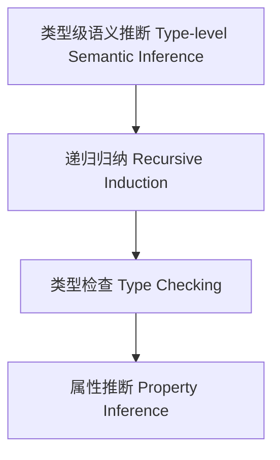

# 26-类型级语义推断（Type-Level Semantic Inference in Haskell）

## 定义 Definition

- **中文**：类型级语义推断是指在类型系统层面对类型级结构和表达式进行语义归纳、递归推断与类型检查的机制，支持类型安全的编译期语义自动推断。
- **English**: Type-level semantic inference refers to mechanisms at the type system level for semantic induction, recursive inference, and type checking of type-level structures and expressions, supporting type-safe compile-time semantic inference in Haskell.

## Haskell 语法与实现 Syntax & Implementation

```haskell
{-# LANGUAGE GADTs, DataKinds, TypeFamilies #-}

-- 类型级表达式

data Expr a where
  LitInt  :: Int  -> Expr Int
  Add     :: Expr Int -> Expr Int -> Expr Int

-- 类型级语义推断

type family Infer (e :: Expr a) :: Bool where
  Infer ('LitInt n) = 'True
  Infer ('Add x y) = Infer x && Infer y
```

## 类型级递归归纳与类型检查 Recursive Induction & Type Checking

- 类型级表达式的递归语义推断、类型检查、属性归纳
- 支持类型安全的编译期语义自动推断

## 形式化证明 Formal Reasoning

- **语义推断正确性证明**：Infer e 能准确推断表达式语义属性
- **Proof of semantic inference correctness**: Infer e can accurately infer semantic properties of expressions

### 证明示例 Proof Example

- 对 `Infer e`，归纳每个构造器，推断覆盖所有情况

## 工程应用 Engineering Application

- 类型安全的类型级DSL、编译期语义推断、自动化验证
- Type-safe type-level DSLs, compile-time semantic inference, automated verification

## 结构图 Structure Diagram



## 本地跳转 Local References

- [类型级语义分析 Type-Level Semantic Analysis](../111-Type-Level-Semantic-Analysis/01-Type-Level-Semantic-Analysis-in-Haskell.md)
- [类型级编译期推理 Type-Level Compile-Time Reasoning](../115-Type-Level-Compile-Time-Reasoning/01-Type-Level-Compile-Time-Reasoning-in-Haskell.md)
- [类型安全 Type Safety](../14-Type-Safety/01-Type-Safety-in-Haskell.md)
