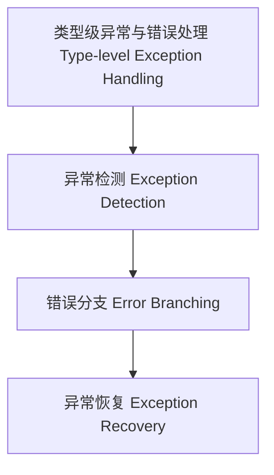

# 32-类型级异常与错误处理（Type-Level Exception Handling in Haskell）

## 定义 Definition

- **中文**：类型级异常与错误处理是指在类型系统层面对类型级结构和算法的异常检测、错误分支与恢复机制的建模，支持类型安全的编译期错误管理。
- **English**: Type-level exception handling refers to mechanisms at the type system level for modeling exception detection, error branching, and recovery in type-level structures and algorithms, supporting type-safe compile-time error management in Haskell.

## Haskell 语法与实现 Syntax & Implementation

```haskell
{-# LANGUAGE TypeFamilies, DataKinds, TypeOperators #-}

-- 类型级异常分支

type family Try (m :: Maybe k) (fallback :: k) :: k where
  Try ('Just x) _ = x
  Try 'Nothing fallback = fallback

-- 类型级错误检测

type family SafeDiv (a :: Nat) (b :: Nat) :: Maybe Nat where
  SafeDiv _ 0 = 'Nothing
  SafeDiv a b = 'Just (Div a b)
```

## 类型级错误检测与恢复 Error Detection & Recovery

- 类型级错误分支、异常恢复、编译期错误提示
- 支持类型安全的错误检测与分支恢复

## 形式化证明 Formal Reasoning

- **异常处理覆盖性证明**：Try、SafeDiv 等类型族分支覆盖性与一致性
- **Proof of exception handling coverage**: Branch coverage and consistency for Try, SafeDiv, etc.

### 证明示例 Proof Example

- 对 `Try m f`，m 取值为 Just/Nothing 时均有定义，分支覆盖完整

## 工程应用 Engineering Application

- 类型安全的类型级DSL、泛型库、编译期错误管理
- Type-safe type-level DSLs, generic libraries, compile-time error management

## 结构图 Structure Diagram



## 本地跳转 Local References

- [类型级控制流 Type-Level Control Flow](../106-Type-Level-Control-Flow/01-Type-Level-Control-Flow-in-Haskell.md)
- [类型级泛型安全 Type-Level Generic Safety](../40-Type-Level-Generic-Safety/01-Type-Level-Generic-Safety-in-Haskell.md)
- [类型安全 Type Safety](../14-Type-Safety/01-Type-Safety-in-Haskell.md)
