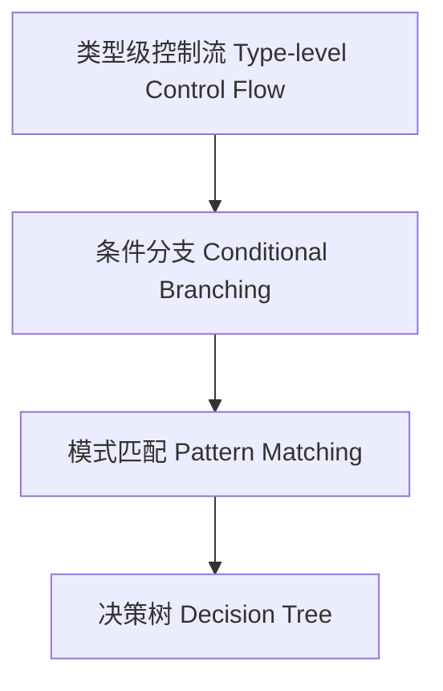

# 34-类型级控制流（Type-Level Control Flow in Haskell）

## 定义 Definition

- **中文**：类型级控制流是指在类型系统层面实现条件分支、模式匹配、决策树等控制结构的机制，支持类型安全的编译期流程控制。
- **English**: Type-level control flow refers to mechanisms at the type system level for implementing conditional branching, pattern matching, decision trees, and other control structures, supporting type-safe compile-time flow control in Haskell.

## Haskell 语法与实现 Syntax & Implementation

```haskell
{-# LANGUAGE TypeFamilies, DataKinds, TypeOperators #-}

-- 类型级条件分支

type family If (cond :: Bool) (then_ :: k) (else_ :: k) :: k where
  If 'True then_ else_ = then_
  If 'False then_ else_ = else_

-- 类型级模式匹配

type family MatchList (xs :: [k]) (empty :: l) (nonEmpty :: k -> [k] -> l) :: l where
  MatchList '[] empty nonEmpty = empty
  MatchList (x ': xs) empty nonEmpty = nonEmpty x xs
```

## 类型级决策树与流程控制 Decision Trees & Flow Control

- 类型级多分支决策、嵌套条件、递归流程
- 支持类型安全的编译期流程分派

## 形式化证明 Formal Reasoning

- **控制流正确性证明**：If、MatchList 等类型族分支覆盖性与一致性
- **Proof of control flow correctness**: Branch coverage and consistency for If, MatchList, etc.

### 证明示例 Proof Example

- 对 `If cond t e`，cond 取值为 True/False 时均有定义，分支覆盖完整

## 工程应用 Engineering Application

- 类型安全的类型级DSL、泛型库、编译期决策优化
- Type-safe type-level DSLs, generic libraries, compile-time decision optimization

## 结构图 Structure Diagram



## 本地跳转 Local References

- [类型级等价判定 Type-Level Equality Decision](../32-Type-Level-Equality-Decision/01-Type-Level-Equality-Decision-in-Haskell.md)
- [类型级泛型算法 Type-Level Generic Algorithm](../33-Type-Level-Generic-Algorithm/01-Type-Level-Generic-Algorithm-in-Haskell.md)
- [类型安全 Type Safety](../14-Type-Safety/01-Type-Safety-in-Haskell.md)
