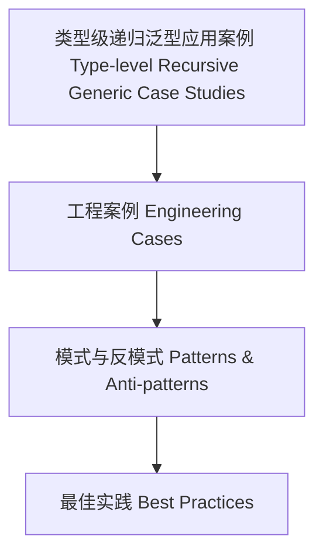

# 39-类型级递归泛型应用案例（Type-Level Recursive Generic Case Studies in Haskell）

## 定义 Definition

- **中文**：类型级递归泛型应用案例是指在实际工程与研究中，类型级递归泛型技术的典型应用、模式与反模式的系统总结。
- **English**: Type-level recursive generic case studies refer to systematic summaries of typical applications, patterns, and anti-patterns of type-level recursive generic techniques in real-world engineering and research.

## 典型工程案例 Typical Engineering Cases

- 泛型序列化/反序列化库（如GHC.Generics、aeson）
- 类型安全的DSL嵌入与解释器（如typed template DSL）
- 自动化推理与验证工具（如liquid haskell、type-level proofs）
- 复杂数据结构的类型级归纳与递归（如类型级树、图、嵌套结构）

## Haskell 实现与分析 Haskell Implementation & Analysis

```haskell
{-# LANGUAGE TypeFamilies, DataKinds, TypeOperators, GADTs #-}

-- 案例：类型级递归泛型自动推导 Show 实例
class GShow a where
  gshow :: a -> String

data Tree a = Leaf a | Node (Tree a) (Tree a)

instance Show a => GShow (Tree a) where
  gshow (Leaf x) = "Leaf " ++ show x
  gshow (Node l r) = "Node (" ++ gshow l ++ ", " ++ gshow r ++ ")"
```

## 分析与总结 Analysis & Summary

- 类型级递归泛型极大提升了类型安全、自动化与可维护性
- 典型反模式：过度嵌套导致编译期爆炸、类型族终止性问题
- 最佳实践：合理分层、尾递归优化、类型级缓存

## 结构图 Structure Diagram



## 本地跳转 Local References

- [类型级递归泛型推导 Type-Level Recursive Generic Derivation](../96-Type-Level-Recursive-Generic-Derivation/01-Type-Level-Recursive-Generic-Derivation-in-Haskell.md)
- [类型级递归泛型安全 Type-Level Recursive Generic Safety](../100-Type-Level-Recursive-Generic-Safety/01-Type-Level-Recursive-Generic-Safety-in-Haskell.md)
- [类型安全 Type Safety](../14-Type-Safety/01-Type-Safety-in-Haskell.md)
