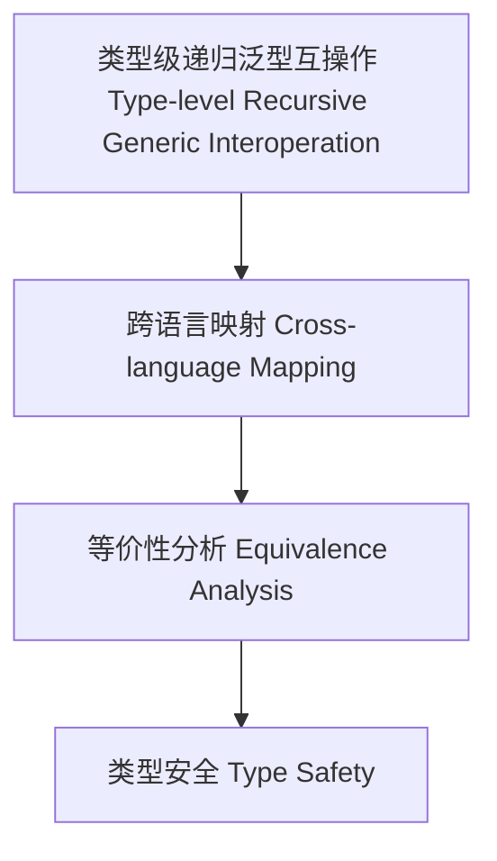

# 41-类型级递归泛型互操作（Type-Level Recursive Generic Interoperation in Haskell）

## 定义 Definition

- **中文**：类型级递归泛型互操作是指在类型系统层面实现Haskell与其他语言（如Rust、Scala、Idris等）递归泛型类型和算法的互操作、映射与对比的机制。
- **English**: Type-level recursive generic interoperation refers to mechanisms at the type system level for interoperating, mapping, and comparing recursive generic types and algorithms between Haskell and other languages (such as Rust, Scala, Idris, etc.).

## Haskell 与其他语言类型系统对比 Comparison with Other Languages

- Haskell：类型族、GADT、类型类递归、类型级推理
- Rust：trait、const generics、递归类型、宏系统
- Scala：类型类、隐式、递归类型、宏
- Idris/Agda：依赖类型、递归证明、类型级归纳

## 互操作机制 Interoperation Mechanism

- 类型级递归泛型结构的跨语言映射与等价性分析
- 类型系统特性的互补与迁移

## Haskell 语法与实现 Syntax & Implementation

```haskell
{-# LANGUAGE TypeFamilies, DataKinds, TypeOperators #-}

-- Haskell 类型级递归泛型示例

type family Map (f :: k -> l) (xs :: [k]) :: [l] where
  Map f '[] = '[]
  Map f (x ': xs) = f x ': Map f xs
```

## 形式化证明 Formal Reasoning

- **互操作一致性证明**：类型级递归泛型结构在不同语言间的等价性
- **Proof of interoperation consistency**: Equivalence of type-level recursive generic structures across languages

### 证明示例 Proof Example

- 对 `Map` 在 Haskell 与 Rust/Scala/Idris 的等价实现进行结构归纳

## 工程应用 Engineering Application

- 类型安全的跨语言递归泛型库、DSL、验证工具
- Type-safe cross-language recursive generic libraries, DSLs, verification tools

## 结构图 Structure Diagram



## 本地跳转 Local References

- [类型级递归泛型算法 Type-Level Recursive Generic Algorithm](../72-Type-Level-Recursive-Generic-Algorithm/01-Type-Level-Recursive-Generic-Algorithm-in-Haskell.md)
- [类型级递归泛型多态性 Type-Level Recursive Generic Polymorphism](../93-Type-Level-Recursive-Generic-Polymorphism/01-Type-Level-Recursive-Generic-Polymorphism-in-Haskell.md)
- [类型安全 Type Safety](../14-Type-Safety/01-Type-Safety-in-Haskell.md)
