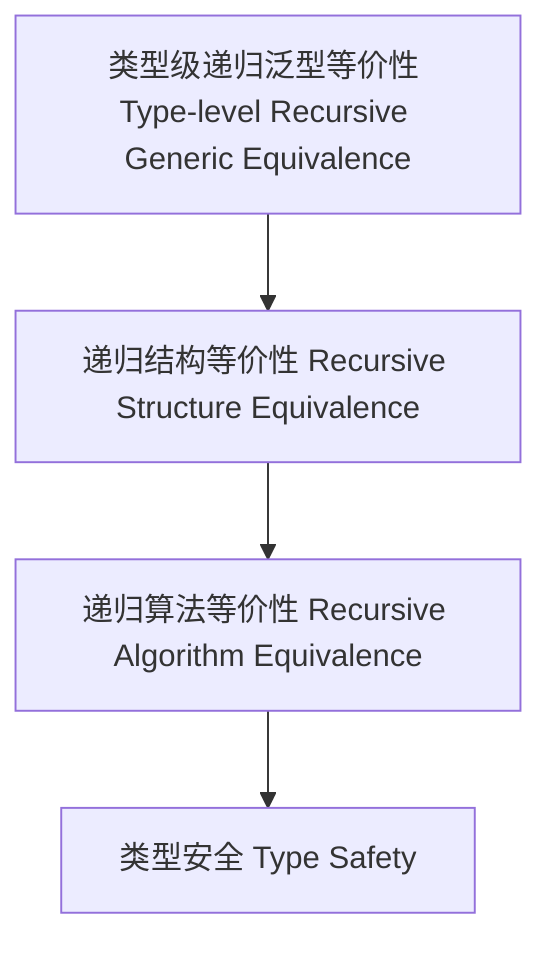

# 47-类型级递归泛型等价性（Type-Level Recursive Generic Equivalence in Haskell）

## 定义 Definition

- **中文**：类型级递归泛型等价性是指在类型系统层面对递归泛型结构、算法等进行类型级别等价性判定与证明的机制。
- **English**: Type-level recursive generic equivalence refers to mechanisms at the type system level for determining and proving the equivalence of recursive generic structures and algorithms in Haskell.

## Haskell 语法与实现 Syntax & Implementation

```haskell
{-# LANGUAGE TypeFamilies, DataKinds, GADTs, TypeOperators #-}

-- 递归泛型等价性示例：类型级树结构等价性

data Tree a = Leaf a | Node (Tree a) (Tree a)

type family EqTree (t1 :: Tree a) (t2 :: Tree a) :: Bool where
  EqTree ('Leaf x) ('Leaf y) = x == y
  EqTree ('Node l1 r1) ('Node l2 r2) = EqTree l1 l2 && EqTree r1 r2
  EqTree _ _ = 'False
```

## 递归泛型等价性机制 Recursive Generic Equivalence Mechanism

- 类型级递归结构等价性判定、递归算法等价性证明
- 支持复杂递归泛型结构的自动化等价性分析

## 形式化证明 Formal Reasoning

- **递归泛型等价性正确性证明**：归纳证明类型级等价性判定的可靠性
- **Proof of correctness for recursive generic equivalence**: Inductive proof of reliability for type-level equivalence checking

### 证明示例 Proof Example

- 对 `EqTree t1 t2` 递归归纳，结构相同递归比较，结构不同直接为假，归纳成立

## 工程应用 Engineering Application

- 类型安全保证、递归泛型结构等价性分析、自动化重构
- Type safety assurance, recursive generic structure equivalence analysis, automated refactoring

## 结构图 Structure Diagram



## 本地跳转 Local References

- [类型级递归等价性 Type-Level Recursive Equivalence](../70-Type-Level-Recursive-Equivalence/01-Type-Level-Recursive-Equivalence-in-Haskell.md)
- [类型级递归泛型验证 Type-Level Recursive Generic Verification](../91-Type-Level-Recursive-Generic-Verification/01-Type-Level-Recursive-Generic-Verification-in-Haskell.md)
- [类型安全 Type Safety](../14-Type-Safety/01-Type-Safety-in-Haskell.md)
