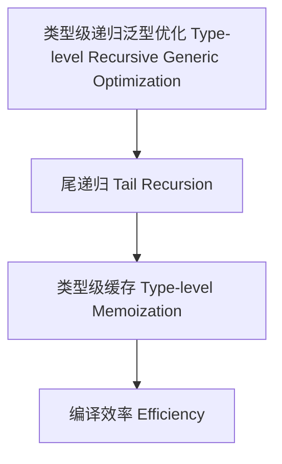

# 49-类型级递归泛型优化（Type-Level Recursive Generic Optimization in Haskell）

## 定义 Definition

- **中文**：类型级递归泛型优化是指在类型系统层面对递归泛型算法、数据结构等进行优化以提升编译效率和类型推断性能的技术。
- **English**: Type-level recursive generic optimization refers to techniques at the type system level for optimizing recursive generic algorithms and data structures to improve compilation efficiency and type inference performance in Haskell.

## Haskell 语法与实现 Syntax & Implementation

```haskell
{-# LANGUAGE TypeFamilies, DataKinds, TypeOperators, UndecidableInstances #-}
import GHC.TypeLits

-- 递归泛型优化示例：尾递归类型族

type family ReverseTR (xs :: [k]) (acc :: [k]) :: [k] where
  ReverseTR '[] acc = acc
  ReverseTR (x ': xs) acc = ReverseTR xs (x ': acc)

-- 封装为普通反转

type family Reverse (xs :: [k]) :: [k] where
  Reverse xs = ReverseTR xs '[]
```

## 递归泛型优化机制 Recursive Generic Optimization Mechanism

- 尾递归（Tail Recursion）、类型级缓存（Type-level Memoization）
- 递归深度限制与分治

## 形式化证明 Formal Reasoning

- **递归泛型优化终止性证明**：证明优化后的递归必然终止
- **Proof of termination for optimized recursive generic**: Show that the optimized recursion always terminates

### 证明示例 Proof Example

- 对 `ReverseTR xs acc`，对 `xs` 递归归纳，`xs = []` 时终止，`xs ≠ []` 时递归参数单调减小

## 工程应用 Engineering Application

- 提升类型推断速度、减少编译资源消耗、支持大规模类型级泛型计算
- Improve type inference speed, reduce compile-time resource usage, support large-scale type-level generic computation

## 结构图 Structure Diagram



## 本地跳转 Local References

- [类型级递归优化 Type-Level Recursive Optimization](../66-Type-Level-Recursive-Optimization/01-Type-Level-Recursive-Optimization-in-Haskell.md)
- [类型级递归泛型算法 Type-Level Recursive Generic Algorithm](../72-Type-Level-Recursive-Generic-Algorithm/01-Type-Level-Recursive-Generic-Algorithm-in-Haskell.md)
- [类型安全 Type Safety](../14-Type-Safety/01-Type-Safety-in-Haskell.md)
