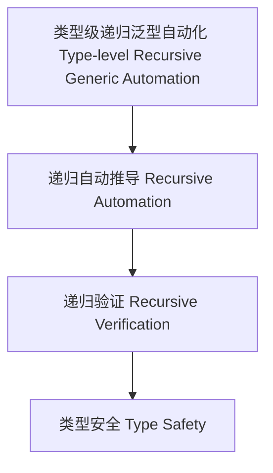

# 51-类型级递归泛型自动化（Type-Level Recursive Generic Automation in Haskell）

## 定义 Definition

- **中文**：类型级递归泛型自动化是指在类型系统层面对泛型类型和算法进行递归自动推导、验证和管理的机制，支持类型安全的泛型编程与自动化推理。
- **English**: Type-level recursive generic automation refers to mechanisms at the type system level for recursively automating inference, verification, and management of generic types and algorithms, supporting type-safe generic programming and automated reasoning in Haskell.

## Haskell 语法与实现 Syntax & Implementation

```haskell
{-# LANGUAGE TypeFamilies, DataKinds, TypeOperators, GADTs #-}

-- 类型级递归泛型自动化示例：类型级列表自动验证所有元素可显示

type family AllShow (xs :: [*]) :: Constraint where
  AllShow '[] = ()
  AllShow (x ': xs) = (Show x, AllShow xs)
```

## 递归泛型自动化机制 Recursive Generic Automation Mechanism

- 类型族递归定义、类型类递归约束
- 支持泛型类型和算法的递归自动推导、验证与管理

## 形式化证明 Formal Reasoning

- **递归泛型自动化正确性证明**：归纳证明 AllShow xs 能正确表达所有元素都可显示
- **Proof of correctness for recursive generic automation**: Inductive proof that AllShow xs correctly expresses that all elements are showable

### 证明示例 Proof Example

- 对 `AllShow xs`，对 `xs` 递归归纳：
  - 基础：`xs = []`，AllShow [] = () 成立
  - 归纳：假设 AllShow xs 成立，则 AllShow (x:xs) = (Show x, AllShow xs) 也成立

## 工程应用 Engineering Application

- 类型安全的递归泛型自动化、自动化推理、泛型库
- Type-safe recursive generic automation, automated reasoning, generic libraries

## 结构图 Structure Diagram



## 本地跳转 Local References

- [类型级递归泛型约束 Type-Level Recursive Generic Constraint](../78-Type-Level-Recursive-Generic-Constraint/01-Type-Level-Recursive-Generic-Constraint-in-Haskell.md)
- [类型级递归泛型实例 Type-Level Recursive Generic Instance](../77-Type-Level-Recursive-Generic-Instance/01-Type-Level-Recursive-Generic-Instance-in-Haskell.md)
- [类型安全 Type Safety](../14-Type-Safety/01-Type-Safety-in-Haskell.md)
