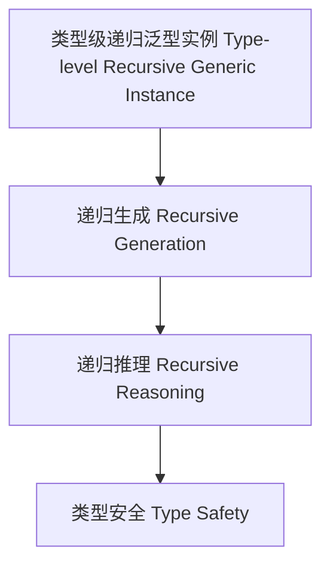

# 56-类型级递归泛型实例（Type-Level Recursive Generic Instance in Haskell）

## 定义 Definition

- **中文**：类型级递归泛型实例是指在类型系统层面对泛型类型类实例进行递归生成、推理和验证的机制，支持类型安全的泛型编程与自动化推理。
- **English**: Type-level recursive generic instance refers to mechanisms at the type system level for recursively generating, reasoning, and verifying generic typeclass instances, supporting type-safe generic programming and automated reasoning in Haskell.

## Haskell 语法与实现 Syntax & Implementation

```haskell
{-# LANGUAGE FlexibleInstances, UndecidableInstances #-}

-- 类型级递归泛型实例示例：所有元素都可序列化
class AllShow xs where
  showAll :: xs -> [String]

instance AllShow () where
  showAll () = []

instance (Show x, AllShow xs) => AllShow (x, xs) where
  showAll (x, xs) = show x : showAll xs
```

## 递归泛型实例机制 Recursive Generic Instance Mechanism

- 类型类递归实例、类型族递归约束
- 支持泛型类型类实例的递归生成、推理与验证

## 形式化证明 Formal Reasoning

- **递归泛型实例正确性证明**：归纳证明 showAll 能正确序列化所有元素
- **Proof of correctness for recursive generic instance**: Inductive proof that showAll correctly serializes all elements

### 证明示例 Proof Example

- 对 `AllShow xs`，对 `xs` 递归归纳：
  - 基础：`xs = ()`，showAll () = [] 成立
  - 归纳：递归序列化每个元素

## 工程应用 Engineering Application

- 类型安全的递归泛型实例、自动化推理、泛型库
- Type-safe recursive generic instances, automated reasoning, generic libraries

## 结构图 Structure Diagram



## 本地跳转 Local References

- [类型级递归类型类 Type-Level Recursive Typeclass](../74-Type-Level-Recursive-Typeclass/01-Type-Level-Recursive-Typeclass-in-Haskell.md)
- [类型级递归实例 Type-Level Recursive Instance](../75-Type-Level-Recursive-Instance/01-Type-Level-Recursive-Instance-in-Haskell.md)
- [类型安全 Type Safety](../14-Type-Safety/01-Type-Safety-in-Haskell.md)
