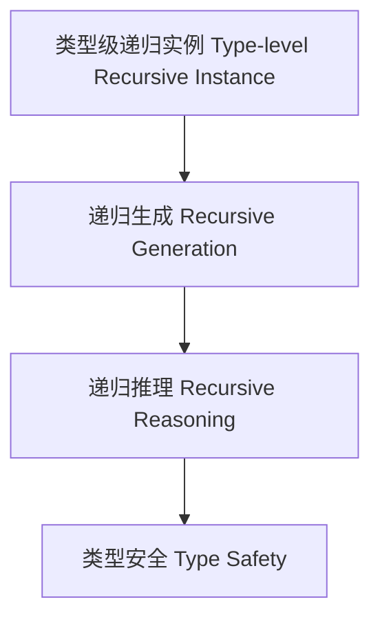

# 58-类型级递归实例（Type-Level Recursive Instance in Haskell）

## 定义 Definition

- **中文**：类型级递归实例是指在类型系统层面递归生成、推理和验证类型类实例的机制，支持类型安全的泛型编程与自动化推理。
- **English**: Type-level recursive instance refers to mechanisms at the type system level for recursively generating, reasoning, and verifying typeclass instances, supporting type-safe generic programming and automated reasoning in Haskell.

## Haskell 语法与实现 Syntax & Implementation

```haskell
{-# LANGUAGE FlexibleInstances, UndecidableInstances #-}

-- 类型级递归实例示例：所有元素都可比较
class AllEq xs where
  eqAll :: xs -> xs -> [Bool]

instance AllEq () where
  eqAll () () = []

instance (Eq x, AllEq xs) => AllEq (x, xs) where
  eqAll (x, xs) (y, ys) = (x == y) : eqAll xs ys
```

## 递归实例机制 Recursive Instance Mechanism

- 类型类递归实例、类型族递归约束
- 支持类型类实例的递归生成、推理与验证

## 形式化证明 Formal Reasoning

- **递归实例正确性证明**：归纳证明 eqAll 能正确比较所有元素
- **Proof of correctness for recursive instance**: Inductive proof that eqAll correctly compares all elements

### 证明示例 Proof Example

- 对 `AllEq xs`，对 `xs` 递归归纳：
  - 基础：`xs = ()`，eqAll () () = [] 成立
  - 归纳：递归比较每个元素

## 工程应用 Engineering Application

- 类型安全的递归实例、自动化推理、泛型库
- Type-safe recursive instances, automated reasoning, generic libraries

## 结构图 Structure Diagram



## 本地跳转 Local References

- [类型级递归类型类 Type-Level Recursive Typeclass](../74-Type-Level-Recursive-Typeclass/01-Type-Level-Recursive-Typeclass-in-Haskell.md)
- [类型级递归约束 Type-Level Recursive Constraint](../64-Type-Level-Recursive-Constraint/01-Type-Level-Recursive-Constraint-in-Haskell.md)
- [类型安全 Type Safety](../14-Type-Safety/01-Type-Safety-in-Haskell.md)
