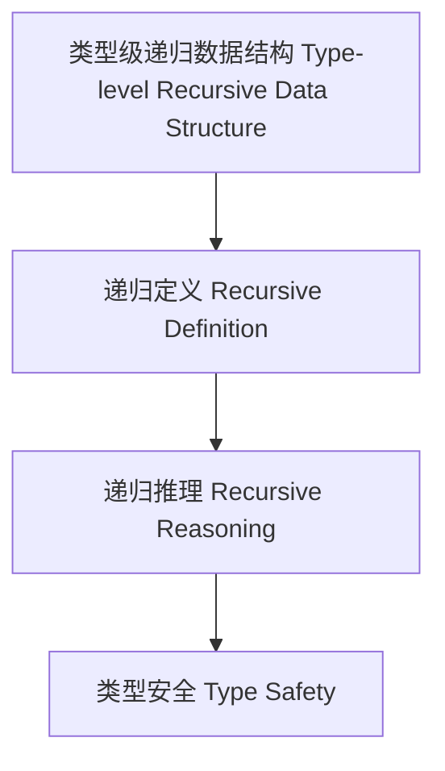

# 60-类型级递归数据结构（Type-Level Recursive Data Structure in Haskell）

## 定义 Definition

- **中文**：类型级递归数据结构是指在类型系统层面对数据结构进行递归定义、递归推理和递归验证的机制，支持类型安全的泛型编程与自动化推理。
- **English**: Type-level recursive data structure refers to mechanisms at the type system level for recursively defining, reasoning, and verifying data structures, supporting type-safe generic programming and automated reasoning in Haskell.

## Haskell 语法与实现 Syntax & Implementation

```haskell
{-# LANGUAGE DataKinds, TypeFamilies, GADTs, KindSignatures #-}

-- 类型级递归数据结构示例：类型级二叉树

data Tree a = Leaf a | Node (Tree a) (Tree a)

type family Size (t :: Tree a) :: Nat where
  Size ('Leaf a) = 1
  Size ('Node l r) = Size l + Size r
```

## 递归数据结构机制 Recursive Data Structure Mechanism

- GADT递归定义、类型族递归推理
- 支持数据结构的递归定义、推理与验证

## 形式化证明 Formal Reasoning

- **递归数据结构正确性证明**：归纳证明 Size t 能正确计算树的节点数
- **Proof of correctness for recursive data structure**: Inductive proof that Size t correctly computes the number of nodes in a tree

### 证明示例 Proof Example

- 对 `Size t`，对 `t` 递归归纳：
  - 基础：`t = Leaf a`，Size (Leaf a) = 1 成立
  - 归纳：递归计算左右子树节点数

## 工程应用 Engineering Application

- 类型安全的递归数据结构、自动化推理、泛型库
- Type-safe recursive data structures, automated reasoning, generic libraries

## 结构图 Structure Diagram



## 本地跳转 Local References

- [类型级数据结构 Type-Level Data Structure](../35-Type-Level-Data-Structure/01-Type-Level-Data-Structure-in-Haskell.md)
- [类型级递归推理 Type-Level Recursive Reasoning](../58-Type-Level-Recursive-Reasoning/01-Type-Level-Recursive-Reasoning-in-Haskell.md)
- [类型安全 Type Safety](../14-Type-Safety/01-Type-Safety-in-Haskell.md)
