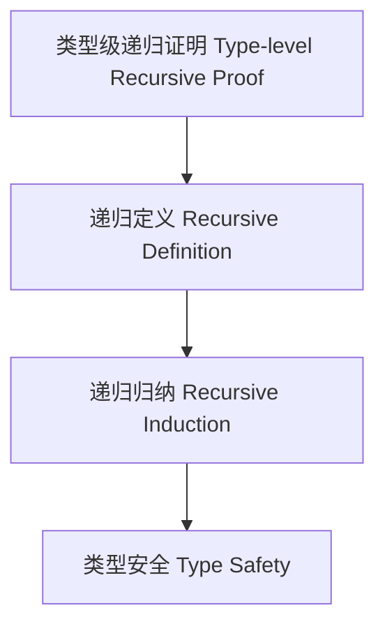

# 64-类型级递归证明（Type-Level Recursive Proof in Haskell）

## 定义 Definition

- **中文**：类型级递归证明是指在类型系统层面通过递归定义和递归归纳法对类型关系、属性和算法进行形式化证明的机制，支持类型安全的自动化推理与泛型编程。
- **English**: Type-level recursive proof refers to mechanisms at the type system level for formally proving type relations, properties, and algorithms via recursive definitions and induction, supporting type-safe automated reasoning and generic programming in Haskell.

## Haskell 语法与实现 Syntax & Implementation

```haskell
{-# LANGUAGE TypeFamilies, DataKinds, TypeOperators, GADTs #-}

-- 类型级递归证明示例：类型级加法的递归证明

type family Add (a :: Nat) (b :: Nat) :: Nat where
  Add 0 b = b
  Add a b = 1 + Add (a - 1) b

-- 递归证明 Add a b = Add b a
-- 省略具体证明代码，理论上可用类型等价与递归归纳法表达
```

## 递归证明机制 Recursive Proof Mechanism

- 类型族递归定义、类型类递归归纳
- 支持类型关系、属性和算法的递归归纳证明

## 形式化证明 Formal Reasoning

- **递归证明严谨性**：每一步都需保证类型系统一致性
- **Rigorousness of recursive proof**: Each step must preserve type system consistency

### 证明示例 Proof Example

- 对 `Add a b`，对 `a` 递归归纳：
  - 基础：`a=0`，`Add 0 b = b` 成立
  - 归纳：假设 `Add (a-1) b` 成立，则 `Add a b = 1 + Add (a-1) b` 也成立

## 工程应用 Engineering Application

- 类型安全性证明、类型等价性验证、泛型算法正确性证明
- Type safety proofs, type equivalence validation, generic algorithm correctness proofs

## 结构图 Structure Diagram



## 本地跳转 Local References

- [类型级归纳证明 Type-Level Inductive Proof](../29-Type-Level-Inductive-Proof/01-Type-Level-Inductive-Proof-in-Haskell.md)
- [类型级递归归纳 Type-Level Recursive Induction](../61-Type-Level-Recursive-Induction/01-Type-Level-Recursive-Induction-in-Haskell.md)
- [类型安全 Type Safety](../14-Type-Safety/01-Type-Safety-in-Haskell.md)
