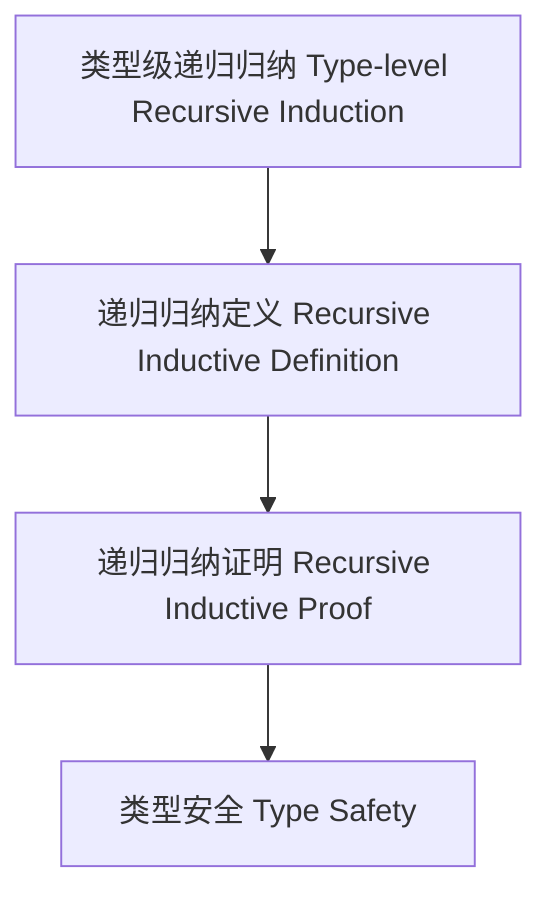

# 72-类型级递归归纳（Type-Level Recursive Induction in Haskell）

## 定义 Definition

- **中文**：类型级递归归纳是指在类型系统层面对类型关系、属性和算法进行递归归纳定义与归纳证明的机制，支持类型安全的自动化推理与泛型编程。
- **English**: Type-level recursive induction refers to mechanisms at the type system level for recursively and inductively defining and proving type relations, properties, and algorithms, supporting type-safe automated reasoning and generic programming in Haskell.

## Haskell 语法与实现 Syntax & Implementation

```haskell
{-# LANGUAGE TypeFamilies, DataKinds, TypeOperators, GADTs #-}

-- 类型级递归归纳示例：类型级列表最大值

type family Max (xs :: [Nat]) :: Nat where
  Max '[] = 0
  Max (x ': xs) = Max2 x (Max xs)

type family Max2 (a :: Nat) (b :: Nat) :: Nat where
  Max2 a b = If (a >= b) a b

-- 类型级条件表达式

type family If (cond :: Bool) (a :: k) (b :: k) :: k where
  If 'True  a b = a
  If 'False a b = b
```

## 递归归纳机制 Recursive Induction Mechanism

- 类型族递归归纳、类型类递归推理
- 支持类型关系、属性和算法的递归归纳定义与证明

## 形式化证明 Formal Reasoning

- **递归归纳正确性证明**：归纳证明 Max xs 能正确计算列表最大值
- **Proof of correctness for recursive induction**: Inductive proof that Max xs correctly computes the maximum of a list

### 证明示例 Proof Example

- 对 `Max xs`，对 `xs` 归纳：
  - 基础：`xs = []`，`Max [] = 0` 成立
  - 归纳：假设 `Max xs` 成立，则 `Max (x:xs) = Max2 x (Max xs)` 也成立

## 工程应用 Engineering Application

- 类型安全的递归归纳算法、自动化推理、泛型库
- Type-safe recursive induction algorithms, automated reasoning, generic libraries

## 结构图 Structure Diagram



## 本地跳转 Local References

- [类型级归纳与递归 Type-Level Induction & Recursion](../23-Type-Level-Induction/01-Type-Level-Induction-in-Haskell.md)
- [类型级递归推理 Type-Level Recursive Reasoning](../58-Type-Level-Recursive-Reasoning/01-Type-Level-Recursive-Reasoning-in-Haskell.md)
- [类型安全 Type Safety](../14-Type-Safety/01-Type-Safety-in-Haskell.md)
