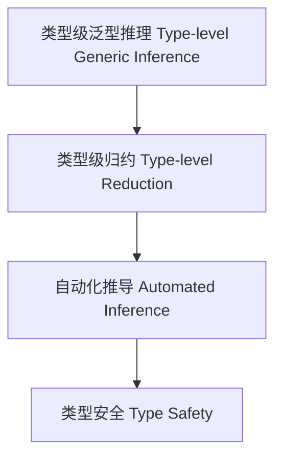

# 88-类型级泛型推理（Type-Level Generic Inference in Haskell）

## 定义 Definition

- **中文**：类型级泛型推理是指在类型系统层面对泛型类型和算法进行自动推理和类型归约的机制，支持类型安全的泛型编程与自动化推导。
- **English**: Type-level generic inference refers to mechanisms at the type system level for automatically inferring and reducing generic types and algorithms, supporting type-safe generic programming and automated inference in Haskell.

## Haskell 语法与实现 Syntax & Implementation

```haskell
{-# LANGUAGE TypeFamilies, DataKinds, TypeOperators, GADTs #-}

-- 类型级泛型推理示例：类型级映射

type family Map (f :: k -> l) (xs :: [k]) :: [l] where
  Map f '[] = '[]
  Map f (x ': xs) = f x ': Map f xs
```

## 泛型推理机制 Generic Inference Mechanism

- 类型族递归归约、类型类泛型约束
- 支持类型级泛型算法自动推理与归纳

## 形式化证明 Formal Reasoning

- **泛型推理正确性证明**：证明推理机制能正确归约泛型类型
- **Proof of correctness for generic inference**: Show that the inference mechanism correctly reduces generic types

### 证明示例 Proof Example

- 对 `Map f xs`，对 `xs` 归纳，推理归约后类型结构与原类型一致

## 工程应用 Engineering Application

- 类型安全的泛型库、自动化推导、DSL 框架
- Type-safe generic libraries, automated inference, DSL frameworks

## 结构图 Structure Diagram



## 本地跳转 Local References

- [类型级泛型 Type-level Generic](../24-Type-Level-Generic/01-Type-Level-Generic-in-Haskell.md)
- [类型级自动化 Type-Level Automation](../27-Type-Level-Automation/01-Type-Level-Automation-in-Haskell.md)
- [类型级递归优化 Type-Level Recursion Optimization](../31-Type-Level-Recursion-Optimization/01-Type-Level-Recursion-Optimization-in-Haskell.md)
