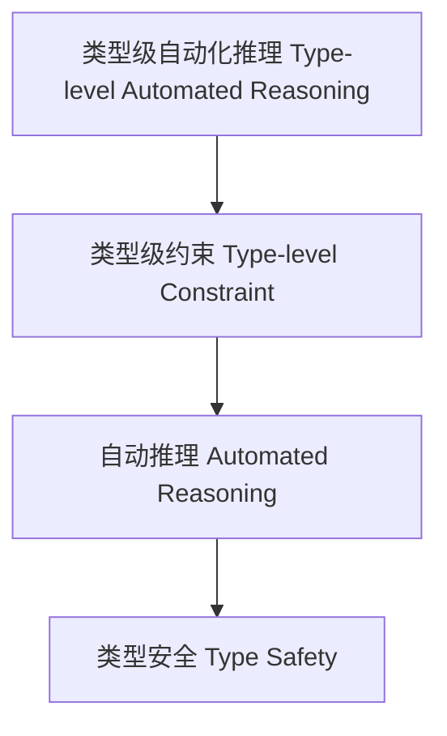

# 85-类型级自动化推理（Type-Level Automated Reasoning in Haskell）

## 定义 Definition

- **中文**：类型级自动化推理是指在类型系统层面自动推导类型关系、约束和结论的机制，支持类型安全的自动化证明与类型级编程。
- **English**: Type-level automated reasoning refers to mechanisms at the type system level for automatically inferring type relations, constraints, and conclusions, supporting type-safe automated proofs and type-level programming in Haskell.

## Haskell 语法与实现 Syntax & Implementation

```haskell
{-# LANGUAGE TypeFamilies, ConstraintKinds, TypeOperators, UndecidableInstances #-}
import GHC.Exts (Constraint)

-- 类型级自动化推理示例：类型级约束链式推理

type family Reason (a :: Constraint) (b :: Constraint) :: Constraint where
  Reason a b = (a, b)

class (a ~ b, Show a) => ReasonConstraint a b
```

## 自动化推理机制 Automated Reasoning Mechanism

- 类型族递归推理、类型类约束传播
- 支持类型级自动归约与结论生成

## 形式化证明 Formal Reasoning

- **自动化推理一致性证明**：证明推理过程与类型系统一致
- **Proof of reasoning consistency**: Show that the reasoning process is consistent with the type system

### 证明示例 Proof Example

- 对于 `Reason a b`，归纳证明 `(a, b)` 同时满足 `a` 和 `b` 的约束

## 工程应用 Engineering Application

- 类型安全的自动推理、类型级约束求解、泛型库
- Type-safe automated reasoning, type-level constraint solving, generic libraries

## 结构图 Structure Diagram



## 本地跳转 Local References

- [类型级推理引擎 Type-Level Inference Engine](../38-Type-Level-Inference-Engine/01-Type-Level-Inference-Engine-in-Haskell.md)
- [类型级自动化 Type-Level Automation](../27-Type-Level-Automation/01-Type-Level-Automation-in-Haskell.md)
- [类型级约束求解 Type-Level Constraint Solving](../22-Type-Level-Constraint-Solving/01-Type-Level-Constraint-Solving-in-Haskell.md)
