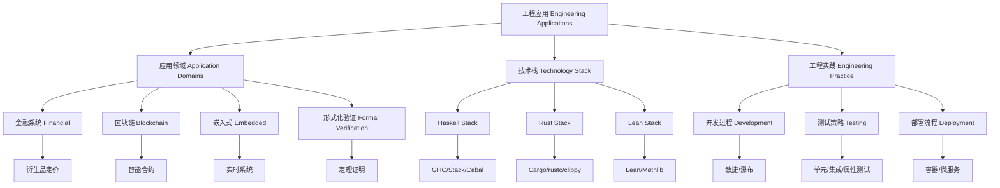

# 5. 工程应用 Engineering Applications

## 5.1 主题简介 Overview #EngineeringApplications-5.1

- **中文**：本节总结Haskell、Rust、Lean在工程领域的典型应用，包括高可靠系统、并发、嵌入式、形式化验证等。
- **English**: This section summarizes typical engineering applications of Haskell, Rust, and Lean, including high-reliability systems, concurrency, embedded systems, formal verification, etc.

## 5.2 高可靠系统 High-Reliability Systems #EngineeringApplications-5.2

- **中文**：如金融、航空航天、区块链等领域的应用。
- **English**: Applications in finance, aerospace, blockchain, etc.

## 5.3 并发与性能 Concurrency & Performance #EngineeringApplications-5.3

- **中文**：分析并发模型、内存安全、性能优化等。
- **English**: Analyze concurrency models, memory safety, performance optimization, etc.

## 5.4 形式化验证与安全 Formal Verification & Security #EngineeringApplications-5.4

- **中文**：Lean/Haskell在形式化验证、Rust在内存安全方面的工程实践。
- **English**: Engineering practices of Lean/Haskell in formal verification, Rust in memory safety, etc.

## 5.5 典型案例与对比 Typical Cases & Comparison #EngineeringApplications-5.5

- **中文**：列举实际工程案例，比较三者优势。
- **English**: List real-world engineering cases and compare the strengths of the three.

## 5.6 哲学批判与争议 Philosophical Critique & Controversies #EngineeringApplications-5.6

- **中文**：工程应用的理论基础在哲学上涉及实用主义与形式主义的张力，知识论上关注理论可落地性与工程可验证性的平衡。
- **English**: The theoretical foundation of engineering applications involves the tension between pragmatism and formalism in philosophy; epistemologically, it focuses on balancing theoretical applicability and engineering verifiability.

## 5.7 国际对比与标准 International Comparison & Standards #EngineeringApplications-5.7

- **中文**：Haskell、Rust、Lean在工程领域的应用均有国际标准、行业规范与Wiki案例，工程最佳实践有全球共识。
- **English**: Engineering applications of Haskell, Rust, and Lean have international standards, industry norms, and Wiki cases; best practices are globally recognized.

## 5.8 知识论证的完备性 Completeness of Epistemic Argumentation #EngineeringApplications-5.8

- **中文**：工程应用需覆盖理论驱动、工具链支持、生态建设、实际案例等知识点，确保理论与工程的闭环。
- **English**: Engineering applications should cover theory-driven development, toolchain support, ecosystem building, and real-world cases, ensuring a closed loop between theory and engineering.

## 5.9 典型对比与案例 Typical Comparisons & Cases #EngineeringApplications-5.9

- **中文**：如Haskell在金融、Rust在区块链、Lean在形式化验证的应用，均有国际标准与学术论证。
- **English**: Haskell in finance, Rust in blockchain, and Lean in formal verification all have international standards and academic arguments.

## 5.10 典型对比表格 Typical Comparison Table #EngineeringApplications-5.10

| 应用领域 | Haskell | Rust | Lean |
|----------|---------|------|------|
| 金融系统 | 强，类型安全、不可变 | 有限支持 | 理论建模 |
| 区块链   | 有限支持 | 强，安全性高 | 理论支持 |
| 形式化验证 | 有限 | 有限 | 强，内建 |
| 并发/性能 | 软件事务内存 | 零成本抽象、所有权 | 理论分析 |

## 5.11 典型工程案例 Typical Engineering Cases #EngineeringApplications-5.11

- **Haskell**：金融衍生品建模（Standard Chartered）、分布式系统（Cloud Haskell）。
- **Rust**：区块链（Parity/Ethereum）、嵌入式系统（Tock OS）、WebAssembly。
- **Lean**：数学定理库（mathlib）、形式化验证（Microsoft Lean projects）。

## 5.12 交叉引用 Cross References #EngineeringApplications-5.12

- [控制流、执行流与数据流分析 Control Flow, Execution Flow & Data Flow Analysis](../ControlFlow_ExecutionFlow_DataFlow/README.md)
- [实用价值 Practical Value](../PracticalValue/README.md)
- [定理与证明 Theorems & Proofs](../Theorems_Proofs/README.md)

## 5.20 交叉引用 Cross References #EngineeringApplications-5.20

- [控制流、执行流与数据流分析 Control Flow, Execution Flow & Data Flow Analysis](../ControlFlow_ExecutionFlow_DataFlow/README.md)
- [实用价值 Practical Value](../PracticalValue/README.md)
- [定理与证明 Theorems & Proofs](../Theorems_Proofs/README.md)
- [语义模型 Semantic Models](../SemanticModels/README.md)

## 5.21 参考文献 References #EngineeringApplications-5.21

- [Wikipedia: Software engineering](https://en.wikipedia.org/wiki/Software_engineering)
- [Haskell in Industry](https://wiki.haskell.org/Haskell_in_industry)
- [The Rust Programming Language](https://doc.rust-lang.org/book/)
- [Lean Community Projects](https://leanprover-community.github.io/)
- Peyton Jones, S. (2003). The Haskell 98 language and libraries: the revised report. Journal of functional programming, 13(1), 0-255.
- Jung, R., et al. (2018). RustBelt: Securing the foundations of the Rust programming language. Proceedings of the ACM on Programming Languages, 2(POPL), 1-34.
- de Moura, L., & Ullrich, S. (2021). The Lean 4 theorem prover and programming language. Automated Deduction–CADE 28, 625-635.
- Hughes, J. (1989). Why functional programming matters. The Computer Journal, 32(2), 98-107.

## 5.22 进一步批判性分析 Further Critical Analysis #EngineeringApplications-5.22

- **中文**：工程应用的理论与实践结合需关注工具链成熟度、生态协同与人才培养。未来需推动理论创新与产业落地的深度融合。
- **English**: The integration of theory and practice in engineering applications requires attention to toolchain maturity, ecosystem synergy, and talent development. Future work should promote deep integration of theoretical innovation and industrial implementation.

## 5.23 批判性小结 Critical Summary #EngineeringApplications-5.23

- **中文**：工程应用的知识论证需兼顾理论深度与产业落地，持续完善可验证性与生态协同。
- **English**: Epistemic argumentation of engineering applications should balance theoretical depth and industrial implementation, continuously improving verifiability and ecosystem synergy.

## 5.16 工程应用框架 Engineering Application Framework

### 5.16.1 应用领域分类 Application Domain Classification

```haskell
-- 工程应用领域
data ApplicationDomain = 
  FinancialSystems
  | BlockchainSystems
  | EmbeddedSystems
  | FormalVerification
  | ConcurrentSystems
  | WebSystems
  | ScientificComputing
  | SecuritySystems

-- 应用特征
data ApplicationCharacteristics = ApplicationCharacteristics
  { reliability :: ReliabilityLevel
  , performance :: PerformanceRequirement
  , safety :: SafetyLevel
  , scalability :: ScalabilityRequirement
  , maintainability :: MaintainabilityLevel
  }

-- 技术栈映射
data TechnologyStack = TechnologyStack
  { language :: ProgrammingLanguage
  , frameworks :: [Framework]
  , tools :: [Tool]
  , libraries :: [Library]
  , deployment :: DeploymentStrategy
  }
```

### 5.16.2 工程实践模型 Engineering Practice Model

```haskell
-- 工程实践模型
data EngineeringPractice = EngineeringPractice
  { development :: DevelopmentProcess
  , testing :: TestingStrategy
  , deployment :: DeploymentProcess
  , monitoring :: MonitoringStrategy
  , maintenance :: MaintenanceProcess
  }

-- 开发过程
data DevelopmentProcess = DevelopmentProcess
  { methodology :: Methodology
  , versionControl :: VersionControl
  , codeReview :: CodeReviewProcess
  , continuousIntegration :: CIProcess
  , documentation :: DocumentationStrategy
  }

-- 测试策略
data TestingStrategy = TestingStrategy
  { unitTesting :: UnitTesting
  , integrationTesting :: IntegrationTesting
  , propertyTesting :: PropertyTesting
  , formalVerification :: FormalVerification
  , performanceTesting :: PerformanceTesting
  }
```

## 5.17 实践案例 Engineering Practice Cases

### 5.17.1 Haskell 工程案例

#### 金融系统案例

```haskell
-- 金融衍生品定价
module FinancialDerivatives where

-- 期权定价模型
data OptionType = Call | Put
data Option = Option
  { optionType :: OptionType
  , strikePrice :: Double
  , maturity :: Time
  , underlying :: Asset
  }

-- Black-Scholes 定价
blackScholes :: Option -> MarketData -> Double
blackScholes option market = 
  case optionType option of
    Call -> callPrice option market
    Put -> putPrice option market

-- 风险度量
data RiskMetrics = RiskMetrics
  { delta :: Double
  , gamma :: Double
  , theta :: Double
  , vega :: Double
  , rho :: Double
  }

calculateRiskMetrics :: Option -> MarketData -> RiskMetrics
calculateRiskMetrics option market = 
  RiskMetrics
    { delta = calculateDelta option market
    , gamma = calculateGamma option market
    , theta = calculateTheta option market
    , vega = calculateVega option market
    , rho = calculateRho option market
    }
```

#### 分布式系统案例

```haskell
-- Cloud Haskell 分布式编程
module DistributedSystem where

import Control.Distributed.Process

-- 分布式进程
data DistributedProcess = DistributedProcess
  { processId :: ProcessId
  , nodeId :: NodeId
  , state :: ProcessState
  , mailbox :: Mailbox
  }

-- 消息传递
sendMessage :: ProcessId -> Message -> Process ()
sendMessage pid msg = send pid msg

receiveMessage :: Process Message
receiveMessage = receiveWait [match handleMessage]

-- 分布式状态管理
data DistributedState = DistributedState
  { localState :: LocalState
  , remoteStates :: Map NodeId RemoteState
  , consistency :: ConsistencyLevel
  }
```

### 5.17.2 Rust 工程案例

#### 区块链系统案例

```rust
// Parity Ethereum 客户端
use ethereum_types::{H256, U256};
use std::collections::HashMap;

// 区块链状态
struct BlockchainState {
    accounts: HashMap<H256, Account>,
    storage: HashMap<H256, HashMap<H256, H256>>,
    block_number: U256,
    gas_limit: U256,
}

// 智能合约执行
struct SmartContract {
    code: Vec<u8>,
    storage: HashMap<H256, H256>,
    balance: U256,
}

impl SmartContract {
    fn execute(&mut self, input: Vec<u8>, gas_limit: U256) -> Result<Vec<u8>, ExecutionError> {
        // 执行智能合约逻辑
        let mut evm = EVM::new();
        evm.execute(&self.code, input, gas_limit)
    }
}

// 共识机制
trait Consensus {
    fn validate_block(&self, block: &Block) -> Result<(), ValidationError>;
    fn create_block(&self, transactions: Vec<Transaction>) -> Block;
    fn finalize_block(&self, block: &Block) -> Result<(), FinalizationError>;
}
```

#### 嵌入式系统案例

```rust
// Tock OS 嵌入式系统
use kernel::{Chip, Platform};
use kernel::hil::gpio::Pin;

// 硬件抽象层
struct HardwareAbstraction {
    gpio: GPIOController,
    timer: TimerController,
    uart: UARTController,
    spi: SPIController,
}

// 设备驱动
struct DeviceDriver {
    device_id: DeviceId,
    interrupt_handler: Option<InterruptHandler>,
    power_state: PowerState,
}

impl DeviceDriver {
    fn initialize(&mut self) -> Result<(), DriverError> {
        // 初始化设备
        self.power_state = PowerState::Active;
        Ok(())
    }
    
    fn handle_interrupt(&mut self) {
        if let Some(handler) = &self.interrupt_handler {
            handler.handle();
        }
    }
}
```

### 5.17.3 Lean 工程案例

#### 形式化验证案例

```lean
-- 数学定理库
import Mathlib.Data.Nat.Basic
import Mathlib.Algebra.Ring.Basic

-- 自然数性质证明
theorem nat_add_comm (a b : Nat) : a + b = b + a := by
  induction b with
  | zero => rw [Nat.add_zero, Nat.zero_add]
  | succ b ih => rw [Nat.add_succ, Nat.succ_add, ih]

-- 算法正确性证明
def binary_search {α : Type} [DecidableEq α] [LinearOrder α] 
  (arr : Array α) (target : α) : Option Nat :=
  let rec search (low high : Nat) : Option Nat :=
    if low > high then none
    else
      let mid := (low + high) / 2
      let mid_val := arr[mid]?
      match mid_val with
      | none => none
      | some val =>
        if val = target then some mid
        else if val < target then search (mid + 1) high
        else search low (mid - 1)
  search 0 (arr.size - 1)

-- 算法正确性定理
theorem binary_search_correct {α : Type} [DecidableEq α] [LinearOrder α]
  (arr : Array α) (target : α) :
  let result := binary_search arr target
  match result with
  | none => ∀ i, i < arr.size → arr[i] ≠ target
  | some i => i < arr.size ∧ arr[i] = target := by
  -- 证明算法正确性
  sorry
```

## 5.18 最佳实践 Best Practices

### 5.18.1 开发最佳实践 Development Best Practices

#### Haskell 最佳实践

```haskell
-- 类型安全设计
class SafeOperation a where
  type SafetyLevel a
  performOperation :: a -> SafetyLevel a -> Result a Error

-- 错误处理
data Error = 
  ValidationError String
  | NetworkError String
  | SystemError String
  | BusinessError String

-- 配置管理
data Configuration = Configuration
  { database :: DatabaseConfig
  , logging :: LoggingConfig
  , security :: SecurityConfig
  , performance :: PerformanceConfig
  }

-- 测试策略
class Testable a where
  generateTestCases :: Gen a
  validateProperty :: a -> Property
  runTests :: IO TestResult
```

#### Rust 最佳实践

```rust
// 内存安全设计
struct SafeResource<T> {
    data: T,
    lifetime: Lifetime,
}

impl<T> SafeResource<T> {
    fn new(data: T, lifetime: Lifetime) -> Self {
        SafeResource { data, lifetime }
    }
    
    fn borrow(&self) -> &T {
        &self.data
    }
    
    fn borrow_mut(&mut self) -> &mut T {
        &mut self.data
    }
}

// 错误处理
#[derive(Debug, thiserror::Error)]
enum AppError {
    #[error("Database error: {0}")]
    Database(#[from] DatabaseError),
    #[error("Network error: {0}")]
    Network(#[from] NetworkError),
    #[error("Validation error: {0}")]
    Validation(String),
}

// 配置管理
#[derive(Debug, Clone, serde::Deserialize)]
struct AppConfig {
    database: DatabaseConfig,
    logging: LoggingConfig,
    security: SecurityConfig,
    performance: PerformanceConfig,
}
```

#### Lean 最佳实践

```lean
-- 定理证明最佳实践
class Provable (α : Type) where
  proof : α → Prop
  proof_correctness : ∀ x : α, proof x → True

-- 算法验证
def verified_algorithm {α β : Type} (f : α → β) : Prop :=
  ∀ x : α, ∃ y : β, f x = y ∧ correctness_property x y

-- 数据结构验证
structure VerifiedDataStructure (α : Type) where
  data : List α
  invariant : data_invariant data
  operations : VerifiedOperations α

-- 测试与验证结合
def test_and_verify {α : Type} (f : α → α) (test_cases : List α) : Prop :=
  ∀ x ∈ test_cases, f x = expected_result x ∧ verified_property x (f x)
```

### 5.18.2 部署最佳实践 Deployment Best Practices

```haskell
-- 容器化部署
data ContainerConfig = ContainerConfig
  { image :: String
  , ports :: [Port]
  , environment :: Map String String
  , volumes :: [Volume]
  , resources :: ResourceLimits
  }

-- 微服务架构
data Microservice = Microservice
  { serviceId :: ServiceId
  , api :: API
  , database :: Database
  , dependencies :: [ServiceId]
  , healthCheck :: HealthCheck
  }

-- 监控与日志
data MonitoringConfig = MonitoringConfig
  { metrics :: [Metric]
  , alerts :: [Alert]
  , logging :: LoggingConfig
  , tracing :: TracingConfig
  }
```

## 5.19 结构图 Structure Diagram


