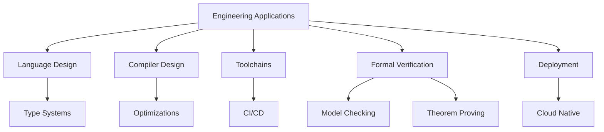

# 1.1 工程应用的定义 Definition of Engineering Applications #EngineeringApplications-1.1

## 定义 Definition

### 基本定义 Basic Definition

- **中文**：工程应用指将形式理论（类型、逻辑、范畴、信息论等）系统映射到工程实践（语言特性、库/框架、编译器、工具链、流程与标准），以实现可验证、高可靠、可维护与高性能的软件/系统。它是理论到实践的桥梁，确保形式化理论的工程价值。
- **English**: Engineering applications refer to systematically mapping formal theories (types, logic, category, information theory, etc.) to engineering practice (language features, libraries/frameworks, compilers, toolchains, processes, and standards) to achieve verifiable, reliable, maintainable, and high-performance software/systems. It serves as a bridge from theory to practice, ensuring the engineering value of formal theories.

### 形式化定义 Formal Definition

#### 工程应用映射 Engineering Application Mapping

一个工程应用映射 $A$ 是一个三元组 $(T, P, M)$，其中：

- $T$ 是形式理论集合
- $P$ 是工程实践集合
- $M: T \rightarrow P$ 是映射函数

#### 工程应用质量 Engineering Application Quality

对于工程应用 $A$，其质量定义为：

$$Q(A) = \alpha \cdot V(A) + \beta \cdot R(A) + \gamma \cdot M(A) + \delta \cdot P(A)$$

其中：

- $V(A)$ 是可验证性
- $R(A)$ 是可靠性
- $M(A)$ 是可维护性
- $P(A)$ 是性能
- $\alpha, \beta, \gamma, \delta$ 是权重系数

## 哲学背景 Philosophical Background

### 实用主义哲学 Pragmatic Philosophy

- **中文**：工程应用体现了实用主义哲学思想，强调理论的实际价值和工程效果，通过实践来验证和实现理论的价值。
- **English**: Engineering applications embody pragmatic philosophy, emphasizing the practical value and engineering effectiveness of theories, validating and realizing theoretical value through practice.

### 系统哲学 System Philosophy

- **中文**：工程应用体现了系统哲学思想，将软件系统视为复杂的工程系统，通过系统化的方法来设计和实现。
- **English**: Engineering applications embody system philosophy, viewing software systems as complex engineering systems, designed and implemented through systematic methods.

### 工程哲学 Engineering Philosophy

- **中文**：工程应用体现了工程哲学思想，强调工程实践中的可靠性、安全性和效率性，通过工程方法来实现理论目标。
- **English**: Engineering applications embody engineering philosophy, emphasizing reliability, safety, and efficiency in engineering practice, achieving theoretical goals through engineering methods.

## 核心概念 Core Concepts

### 语言设计 Language Design

#### 类型安全语言 Type-Safe Language

```haskell
-- 类型安全语言设计
data TypeSafeLanguage = TypeSafeLanguage
  { typeSystem :: TypeSystem
  , memoryModel :: MemoryModel
  , concurrencyModel :: ConcurrencyModel
  , safetyGuarantees :: [SafetyGuarantee]
  }

-- 内存安全
data MemoryModel = MemoryModel
  { ownership :: OwnershipModel
  , borrowing :: BorrowingModel
  , lifetime :: LifetimeModel
  }

-- Rust风格的所有权系统
data OwnershipModel = OwnershipModel
  { owner :: Variable -> Resource
  , transfer :: Variable -> Variable -> Resource
  , drop :: Resource -> ()
  }

-- 所有权检查
checkOwnership :: OwnershipModel -> Program -> Bool
checkOwnership model program = 
  all (checkOwnershipRule model) (ownershipRules program)
```

#### 并发安全语言 Concurrency-Safe Language

```haskell
-- 并发安全语言
data ConcurrencySafeLanguage = ConcurrencySafeLanguage
  { threadModel :: ThreadModel
  , synchronization :: SynchronizationModel
  , dataRacePrevention :: DataRacePrevention
  }

-- 线程模型
data ThreadModel = ThreadModel
  { spawn :: IO Thread
  , join :: Thread -> IO ()
  , cancel :: Thread -> IO ()
  }

-- 数据竞争预防
data DataRacePrevention = DataRacePrevention
  { mutex :: Mutex
  , rwlock :: RWLock
  , atomic :: Atomic
  }

-- 并发安全检查
checkConcurrencySafety :: ConcurrencySafeLanguage -> Program -> Bool
checkConcurrencySafety lang program = 
  checkDataRaces lang program &&
  checkDeadlocks lang program &&
  checkLivelocks lang program
```

### 编译器设计 Compiler Design

#### 类型检查编译器 Type-Checking Compiler

```haskell
-- 类型检查编译器
data TypeCheckingCompiler = TypeCheckingCompiler
  { lexer :: Lexer
  , parser :: Parser
  , typeChecker :: TypeChecker
  , codeGenerator :: CodeGenerator
  }

-- 词法分析器
data Lexer = Lexer
  { tokenize :: String -> [Token]
  , errorHandling :: LexerError -> Error
  }

-- 语法分析器
data Parser = Parser
  { parse :: [Token] -> AST
  , errorRecovery :: ParseError -> AST
  }

-- 类型检查器
data TypeChecker = TypeChecker
  { typeCheck :: AST -> Maybe Type
  , typeInference :: AST -> TypeScheme
  , errorReporting :: TypeError -> Error
  }

-- 代码生成器
data CodeGenerator = CodeGenerator
  { generate :: TypedAST -> ByteCode
  , optimize :: ByteCode -> ByteCode
  }
```

#### 优化编译器 Optimizing Compiler

```haskell
-- 优化编译器
data OptimizingCompiler = OptimizingCompiler
  { optimizations :: [Optimization]
  , analysis :: [Analysis]
  , transformation :: [Transformation]
  }

-- 优化策略
data Optimization = Optimization
  { constantFolding :: ConstantFolding
  , deadCodeElimination :: DeadCodeElimination
  , loopOptimization :: LoopOptimization
  , inlining :: Inlining
  }

-- 常量折叠
constantFolding :: AST -> AST
constantFolding (BinaryOp op (Literal a) (Literal b)) = 
  case op of
    "+" -> Literal (a + b)
    "-" -> Literal (a - b)
    "*" -> Literal (a * b)
    "/" -> Literal (a / b)
    _ -> BinaryOp op (Literal a) (Literal b)
constantFolding ast = ast
```

### 工具链设计 Toolchain Design

#### 构建系统 Build System

```haskell
-- 构建系统
data BuildSystem = BuildSystem
  { dependencyResolver :: DependencyResolver
  , buildExecutor :: BuildExecutor
  , artifactManager :: ArtifactManager
  }

-- 依赖解析器
data DependencyResolver = DependencyResolver
  { resolve :: [Dependency] -> DependencyGraph
  , conflictResolution :: [Conflict] -> Resolution
  }

-- 构建执行器
data BuildExecutor = BuildExecutor
  { execute :: BuildPlan -> BuildResult
  , parallelExecution :: [BuildTask] -> [BuildResult]
  , incrementalBuild :: BuildPlan -> BuildPlan
  }

-- 增量构建
incrementalBuild :: BuildSystem -> BuildPlan -> BuildPlan
incrementalBuild system plan = 
  let changedFiles = detectChanges system
      affectedTasks = findAffectedTasks system changedFiles
  in updateBuildPlan plan affectedTasks
```

#### 包管理系统 Package Management System

```haskell
-- 包管理系统
data PackageManagementSystem = PackageManagementSystem
  { packageResolver :: PackageResolver
  , versionManager :: VersionManager
  , securityScanner :: SecurityScanner
  }

-- 包解析器
data PackageResolver = PackageResolver
  { resolve :: PackageSpec -> Package
  , download :: Package -> IO Package
  , install :: Package -> IO ()
  }

-- 版本管理
data VersionManager = VersionManager
  { versionConstraint :: VersionConstraint
  , versionResolution :: [Version] -> Version
  , versionCompatibility :: Version -> Version -> Bool
  }

-- 安全扫描
securityScan :: SecurityScanner -> Package -> SecurityReport
securityScan scanner package = 
  let vulnerabilities = scanVulnerabilities scanner package
      licenses = scanLicenses scanner package
  in SecurityReport vulnerabilities licenses
```

### 验证系统 Verification System

#### 形式化验证 Formal Verification

```haskell
-- 形式化验证系统
data FormalVerificationSystem = FormalVerificationSystem
  { modelChecker :: ModelChecker
  , theoremProver :: TheoremProver
  , staticAnalyzer :: StaticAnalyzer
  }

-- 模型检查器
data ModelChecker = ModelChecker
  { modelCheck :: Model -> Property -> CheckResult
  , stateExploration :: Model -> [State]
  , counterexample :: CheckResult -> Counterexample
  }

-- 定理证明器
data TheoremProver = TheoremProver
  { prove :: Theorem -> Proof
  , tactic :: Tactic -> Proof -> Proof
  , automation :: Proof -> Proof
  }

-- 静态分析器
data StaticAnalyzer = StaticAnalyzer
  { analyze :: Program -> AnalysisResult
  , warning :: AnalysisResult -> [Warning]
  , error :: AnalysisResult -> [Error]
  }
```

#### 测试系统 Testing System

```haskell
-- 测试系统
data TestingSystem = TestingSystem
  { unitTester :: UnitTester
  , integrationTester :: IntegrationTester
  , propertyTester :: PropertyTester
  }

-- 单元测试器
data UnitTester = UnitTester
  { runTests :: [Test] -> TestResult
  , testDiscovery :: Module -> [Test]
  , testExecution :: Test -> TestResult
  }

-- 属性测试器
data PropertyTester = PropertyTester
  { quickCheck :: Property -> PropertyResult
  , shrink :: PropertyResult -> [PropertyResult]
  , coverage :: PropertyResult -> Coverage
  }

-- QuickCheck风格属性测试
quickCheck :: (Arbitrary a, Show a) => (a -> Bool) -> PropertyResult
quickCheck property = 
  let testCases = generate 100
      results = map property testCases
  in if all id results 
     then Passed 
     else Failed (findCounterexample testCases results)
```

### 部署系统 Deployment System

#### 容器化部署 Containerized Deployment

```haskell
-- 容器化部署系统
data ContainerizedDeployment = ContainerizedDeployment
  { containerBuilder :: ContainerBuilder
  , orchestration :: Orchestration
  , serviceMesh :: ServiceMesh
  }

-- 容器构建器
data ContainerBuilder = ContainerBuilder
  { buildImage :: Dockerfile -> Image
  , layerCaching :: Image -> Image
  , multiStageBuild :: [Stage] -> Image
  }

-- 编排系统
data Orchestration = Orchestration
  { deploy :: Service -> Deployment
  , scale :: Service -> Int -> Deployment
  , rollback :: Deployment -> Deployment
  }

-- 服务网格
data ServiceMesh = ServiceMesh
  { trafficManagement :: TrafficManagement
  , security :: Security
  , observability :: Observability
  }
```

#### 持续集成/持续部署 CI/CD

```haskell
-- CI/CD系统
data CICDSystem = CICDSystem
  { pipeline :: Pipeline
  , automation :: Automation
  , monitoring :: Monitoring
  }

-- 流水线
data Pipeline = Pipeline
  { stages :: [Stage]
  , triggers :: [Trigger]
  , artifacts :: [Artifact]
  }

-- 自动化
data Automation = Automation
  { build :: BuildTrigger -> BuildResult
  , test :: BuildResult -> TestResult
  , deploy :: TestResult -> DeployResult
  }

-- 监控
data Monitoring = Monitoring
  { metrics :: Metrics
  , logging :: Logging
  , alerting :: Alerting
  }
```

## 历史发展 Historical Development

### 理论基础 Theoretical Foundation

#### 工程应用的起源 (1960s-1970s)

- **Edsger Dijkstra** 研究结构化编程 (1968)
- **Tony Hoare** 发展程序验证 (1969)
- **Niklaus Wirth** 设计Pascal语言 (1970)

#### 工程应用的发展 (1980s-1990s)

- **Bjarne Stroustrup** 开发C++ (1983)
- **James Gosling** 设计Java (1995)
- **Kent Beck** 提出极限编程 (1999)

### 现代发展 Modern Development

#### 现代工程应用 (2000s-2020s)

```haskell
-- 现代工程应用
data ModernEngineeringApplications = ModernEngineeringApplications
  { cloudNative :: CloudNative
  , microservices :: Microservices
  , devOps :: DevOps
  , aiMl :: AIML
  }

-- 云原生
data CloudNative = CloudNative
  { containers :: Containerization
  , kubernetes :: Orchestration
  , serverless :: Serverless
  }

-- 微服务
data Microservices = Microservices
  { serviceDiscovery :: ServiceDiscovery
  , loadBalancing :: LoadBalancing
  , circuitBreaker :: CircuitBreaker
  }

-- DevOps
data DevOps = DevOps
  { automation :: Automation
  , monitoring :: Monitoring
  , collaboration :: Collaboration
  }
```

## 形式化语义 Formal Semantics

### 工程应用语义 Engineering Application Semantics

#### 应用质量语义

对于工程应用 $A$，其质量语义定义为：

$$[\![A]\!] = \{(q, p) \mid q \text{ is quality metric, } p \text{ is performance metric}\}$$

#### 可靠性语义

对于系统 $S$，其可靠性语义定义为：

$$[\![S]\!] = \{(t, r) \mid t \text{ is time, } r \text{ is reliability at time } t\}$$

### 性能语义 Performance Semantics

#### 性能模型

对于程序 $P$，其性能语义定义为：

$$[\![P]\!] = \{(i, t) \mid i \text{ is input, } t \text{ is execution time}\}$$

## 与其他理论的关系 Relationship to Other Theories

### 与软件工程的关系

- **中文**：工程应用为软件工程提供实践方法，软件工程为工程应用提供工程原则。
- **English**: Engineering applications provide practical methods for software engineering, while software engineering provides engineering principles for engineering applications.

### 与系统架构的关系

- **中文**：工程应用为系统架构提供实现技术，系统架构为工程应用提供设计模式。
- **English**: Engineering applications provide implementation technologies for system architecture, while system architecture provides design patterns for engineering applications.

### 与质量保证的关系

- **中文**：工程应用为质量保证提供验证工具，质量保证为工程应用提供质量标准。
- **English**: Engineering applications provide verification tools for quality assurance, while quality assurance provides quality standards for engineering applications.

## 交叉引用 Cross References

- [软件工程 Software Engineering](../SoftwareEngineering/README.md)
- [系统架构 System Architecture](../SystemArchitecture/README.md)
- [质量保证 Quality Assurance](../QualityAssurance/README.md)
- [形式化定义 Formal Definitions](../FormalDefinitions/README.md)
- [定理与证明 Theorems & Proofs](../Theorems_Proofs/README.md)

## 对比分析 Comparison

- **中文**：工程应用 vs 语义模型 vs 编译器 vs 程序验证
  - 工程应用关注“把理论落到工程产物与流程”；语义模型聚焦含义；编译器聚焦可实现与优化；程序验证聚焦正确性与证据。
- **English**: Engineering applications vs semantic models vs compilers vs program verification
  - Engineering focuses on translating theory into artifacts and processes; semantics on meaning; compilers on implementability and optimization; verification on correctness and evidence.

## 争议与批判 Controversies & Critique

- **中文**：
  - 形式化深度与交付效率的权衡；“证明驱动设计”与“经验驱动迭代”的张力；
  - 安全/合规成本与性能/上市时间之间的冲突；工具链锁定与可迁移性问题。
- **English**:
  - Trade-off between formal depth and delivery speed; tension between proof-driven design and experience-driven iteration;
  - Security/compliance cost vs performance/time-to-market; toolchain lock-in and portability.

## 前沿趋势 Frontier Trends

- **中文**：
  - 可验证编译（Vellvm/CompCert）、证明携带代码（PCC）、可验证基础设施（SeL4/Drive-by proofs）；
  - 依赖类型在工业（Lean/Idris/Coq extraction）、Rust 类型化资源模型在系统软件；
  - AI for SE：缺陷预测、自动修复与形式合成结合。
- **English**:
  - Verified compilation (Vellvm/CompCert), proof-carrying code (PCC), verified infrastructure (seL4/drive-by proofs);
  - Industrial dependent types (Lean/Idris/Coq extraction), Rust-typed resource models in systems software;
  - AI for SE: defect prediction, auto-fix with formal synthesis.

## 常见陷阱 Common Pitfalls

- **中文**：
  - 只做“概念映射”而缺少“端到端验证路径”；忽视非功能性需求（性能、可观测性、SLO）；
  - 形式化与实现的语义漂移；跨团队工具链与流程不一致。
- **English**:
  - Concept mapping without end-to-end verification path; ignoring non-functional requirements (performance, observability, SLO);
  - Semantic drift between formalization and implementation; cross-team tool/process inconsistency.

## 扩展交叉引用 Extended Cross References

- [语义模型 Semantic Models](../SemanticModels/README.md)
- [编译器理论 Compiler Theory](../CompilerTheory/README.md)
- [程序验证 Program Verification](../ProgramVerification/README.md)
- [系统架构 System Architecture](../SystemArchitecture/README.md)
- [质量保证 Quality Assurance](../QualityAssurance/README.md)

## 知识图谱 Knowledge Graph



## 参考文献 References

1. Dijkstra, E. W. (1968). Go to statement considered harmful. Communications of the ACM, 11(3), 147-148.
2. Hoare, C. A. R. (1969). An axiomatic basis for computer programming. Communications of the ACM, 12(10), 576-580.
3. Wirth, N. (1971). The programming language Pascal. Acta Informatica, 1(1), 35-63.
4. Stroustrup, B. (1986). The C++ programming language. Addison-Wesley.
5. Gosling, J., Joy, B., Steele, G., Bracha, G., & Buckley, A. (2014). The Java language specification. Addison-Wesley.
6. Beck, K. (1999). Extreme programming explained: Embrace change. Addison-Wesley.
7. Fowler, M. (2018). Refactoring: Improving the design of existing code. Addison-Wesley.
8. Martin, R. C. (2017). Clean architecture: A craftsman's guide to software structure and design. Prentice Hall.
